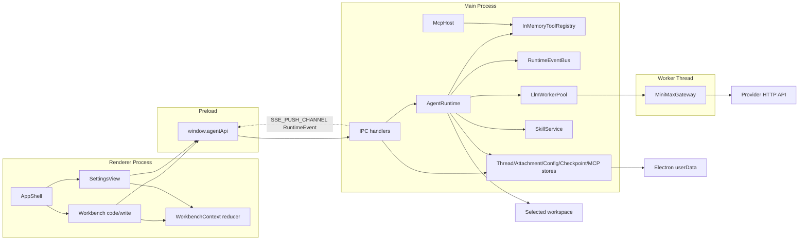

# Project Architecture

Diagram-first architecture reference for the current codebase. Detailed turn steps live in `docs/runtime-flow.md`; detailed storage shapes live in `docs/data-model.md`.

## Scope

Authoritative source areas:

- `src/main/`: Electron main process, runtime, tools, IPC, persistence, worker, gateway, MCP.
- `src/preload/`: secure `window.agentApi` bridge.
- `src/renderer/`: React UI and local preferences.
- `src/shared/`: cross-process contracts, channel constants, locale list, skills contracts.
- `tests/`: Vitest coverage.

External references are out of scope for implementation and build.

## System Overview



## Process Boundaries

```text
Renderer -> Preload: typed calls through window.agentApi
Preload -> Main: ipcRenderer.invoke(channel, payload)
Main -> Worker: worker_threads messages for chat/cancel
Worker -> Provider: HTTP/SSE fetch
Main -> Renderer: RuntimeEvent push through sse:push
```

Invariants:

- `src/main/index.ts` creates `BrowserWindow` with `contextIsolation: true` and `nodeIntegration: false`.
- `src/preload/index.ts` exposes only `window.agentApi`.
- Renderer code cannot access Node filesystem or import `src/main/*`.
- Main process owns filesystem access, workspace policy, external navigation, and persistence.
- `SSE_PUSH_CHANNEL` carries pushed `RuntimeEvent` payloads; preload validates them with `isRuntimeEvent()`.

## Composition Root

`src/main/index.ts` wires:

- `JsonlThreadStore`
- `AttachmentStore`
- `ModelConfigStore`
- `RuntimePreferencesStore`
- `CheckpointStore`
- `McpCacheStore`
- `RuntimeEventBus`
- `LlmWorkerPool`
- `InMemoryToolRegistry`
- `SkillService`
- `McpHost`
- `AgentRuntime`
- all IPC handlers
- Electron window, CSP, navigation policy, shutdown hooks

Built-in tool registration order:

1. `createPlanTool`
2. `createWorkspaceTools()`
3. `createCodingTools()`
4. `createCommandTools()`
5. `createSkillTools({ skillService })`
6. `createUserInputTools()`
7. `createGoalTools(...)`

MCP tools are added dynamically by `McpHost` to the same registry.

## Runtime Architecture

Runtime ownership:

- `AgentRuntime`: turn state machine, model profile selection, prompt/context assembly, worker calls, tool rounds, goal updates, interrupts.
- `ToolCallExecutor`: parent-turn tool item lifecycle, catalog/policy checks, approval and user-input suspension, live progress, active tool cleanup.
- `ToolCatalogService`: mode and availability filtering for model-visible tools.
- `ToolPolicyService` and `permission-policy.ts`: sandbox, approval policy, scoped grants, persisted permission rules.
- `ApprovalCoordinator`: pending approval state and timeline items.
- `UserInputCoordinator`: pending `request_user_input` state.
- `context-compaction.ts`: request-history budget handling.
- `runtime-event-persist.ts`: item/event persistence helpers.

Runtime invariants:

- `turns.start()` returns quickly with an in-flight `TurnRecord`.
- Renderer observes later updates through `RuntimeEvent`.
- One thread cannot have two concurrent in-flight turns.
- `messages.jsonl` is append-only; repeated item ids are updates.
- Tool calls do not bypass `ToolCallExecutor`.
- Tool budget comes from model profile autonomy and optional `AGENT_MAX_TOOL_ROUNDS`.

## Tool Architecture

Tool contracts:

- Tool interface: `AgentTool` in `src/main/domain/agent/types.ts`.
- Registry port: `ToolRegistry` in `src/main/domain/agent/ports.ts`.
- Built-in tool names: `RUNTIME_TOOL_NAMES` in `src/shared/agent-contracts.ts`.
- Read-only built-in names: `RUNTIME_READ_ONLY_TOOL_NAMES`.

Tool categories:

- Workspace read tools: `list_files`, `read_file`, `search_files`.
- Developer read tools: `rg_search`, symbols, diagnostics, package/git/session inspection.
- Coding write tools: `edit_file`, `multi_edit`, `write_file`, `delete_file`, `apply_patch`, `rollback_file`.
- Coordination tools: `create_plan`, `create_edit_plan`, `update_goal`.
- Command tools: foreground commands, shell-specific commands, package wrappers, git commands, command sessions.
- Skills: `list_skills`, `run_skill`.
- Interaction: `request_user_input`.
- MCP: dynamic `mcp__<server>__<tool>`.

Policy flow:

```text
model-visible catalog
  -> tool call
  -> ToolCallExecutor
  -> registered tool exists?
  -> catalog availability for thread/mode?
  -> input schema valid?
  -> sandbox / approvalPolicy hard denials
  -> scoped grants and RuntimePreferences.permissionRules
  -> approval gate if needed
  -> ToolRegistry.execute()
```

## Worker And Gateway

Build entries in `electron.vite.config.ts`:

- Main: `src/main/index.ts`
- Worker: `src/main/infrastructure/llm-worker/worker.ts`
- Preload: `src/preload/index.ts`
- Renderer root: `src/renderer`

Worker rules:

- `LlmWorkerPool` keeps `threadId -> worker` affinity.
- `cancel(threadId)` reaches the worker request through `AbortController`.
- Worker protocol lives in `src/main/infrastructure/llm-worker/protocol.ts`.
- `worker.ts` instantiates `MiniMaxGateway`.
- Worker exit clears stale affinity and creates a replacement.

Gateway rules:

- `MiniMaxGateway` implements `LlmGateway`.
- `request.protocol === "openai-compatible"` uses chat completions adapters.
- `request.protocol === "anthropic-compatible"` uses messages adapters.
- MiniMax and DeepSeek have provider-specific OpenAI-compatible request fields.
- API key fallback is resolved in gateway/common provider logic; renderer never receives real keys.

## Persistence Architecture

```text
userData/
  threads/
    index.json
    <threadId>/
      thread.json
      messages.jsonl
      events.jsonl
  attachments/
    index.json
    <attachmentId>.bin
  config
  checkpoints/
    <threadId>.jsonl
  mcp/
    cache.json
```

Store ownership:

- `JsonlThreadStore`: threads, items, events.
- `AttachmentStore`: image metadata and bytes.
- `ModelConfigStore`: model profile section of shared config.
- `RuntimePreferencesStore`: runtime preferences section of shared config.
- `CheckpointStore`: file snapshots and rewind records.
- `McpCacheStore`: public MCP schema/surface/startup cache.
- `AppConfigFile`: shared `userData/config` writer used by model config and runtime preferences.

Persistence invariants:

- JSON writes use temp file + fsync + rename.
- JSONL appends use fsync.
- Per-thread writes are serialized.
- Malformed JSONL replay lines warn and skip.
- Checkpoint restore re-checks workspace boundary and symlink constraints.

## Renderer Architecture

State center: `src/renderer/src/ui/store/WorkbenchContext.tsx`.

Main routes:

- `code`: chat/workbench for code threads.
- `write`: write workspace with Markdown file service.
- `settings`: settings panels.

Renderer modules:

- `AppShell.tsx`: route shell.
- `Workbench.tsx`: thread loading, SSE subscription, message send, interrupt, approval/user-input responses.
- `SettingsView.tsx`: model config, runtime preferences, MCP, skills, basic preferences.
- `workbench-*.ts`: IPC, runtime event, thread, and composer payload helpers.
- `components/chat/`: timeline, assistant markdown, approval panel, usage heatmap.
- `components/composer/`: floating composer and popover hooks.
- `components/write/`: write workspace and editor/assistant panels.
- `components/settings/`: settings sidebar and panels.

Renderer invariants:

- `useReducer` state only; no external state library.
- UI text goes through i18n JSON files.
- Tokens use `--ds-*` in `tokens.css`.
- Component layout/style details are documented in `docs/ui-layout-reference.md` and `docs/ui-design.md`.

## IPC Architecture

Contract path:

```text
src/shared/ipc.ts
src/shared/agent-contracts.ts
src/shared/agent-api.ts
  -> src/main/ipc/*-handlers.ts
  -> src/preload/index.ts
  -> src/renderer/src/global.d.ts + UI callers
```

Renderer-callable groups:

- `threads`
- `turns`
- `sse`
- `approvals`
- `userInput`
- `goals`
- `attachments`
- `usage`
- `checkpoints`
- `workspace`
- `write`
- `modelConfig`
- `runtimePreferences`
- `skills`
- `mcp`

Every invoked handler returns `IpcResult<T>`.

## Verification

For code changes:

```bash
npm run typecheck
npm run test
npm run build
```

For docs-only changes:

```bash
git diff --check -- <changed-docs>
```

Also verify referenced paths exist.
