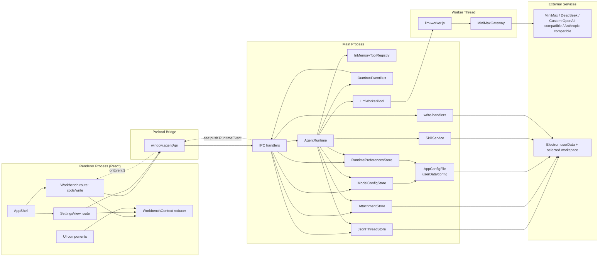
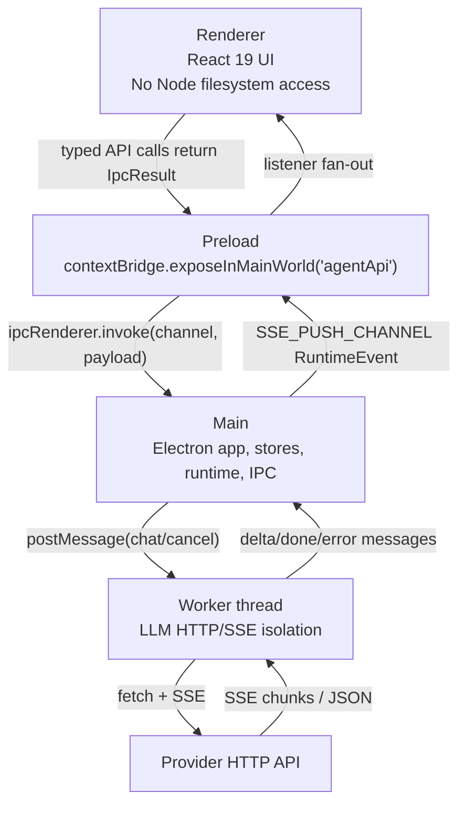
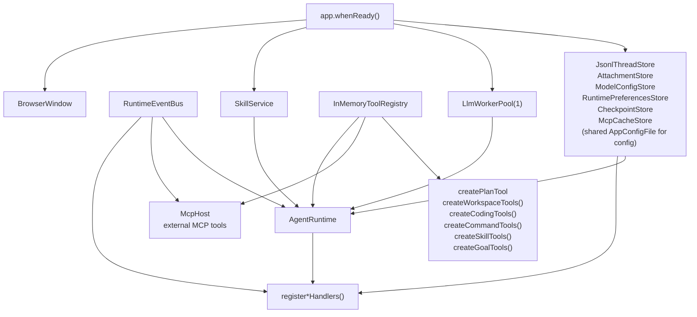
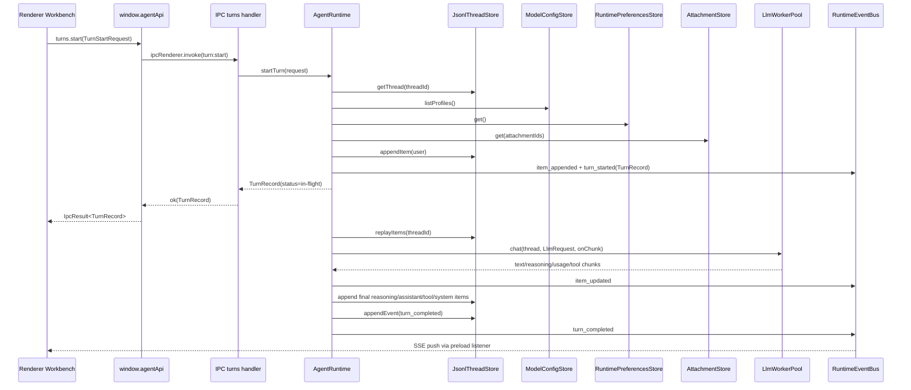
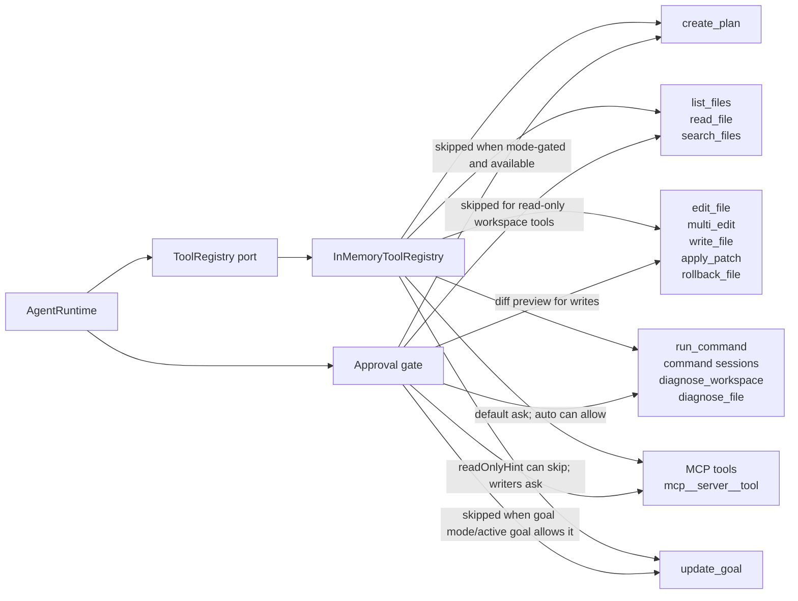
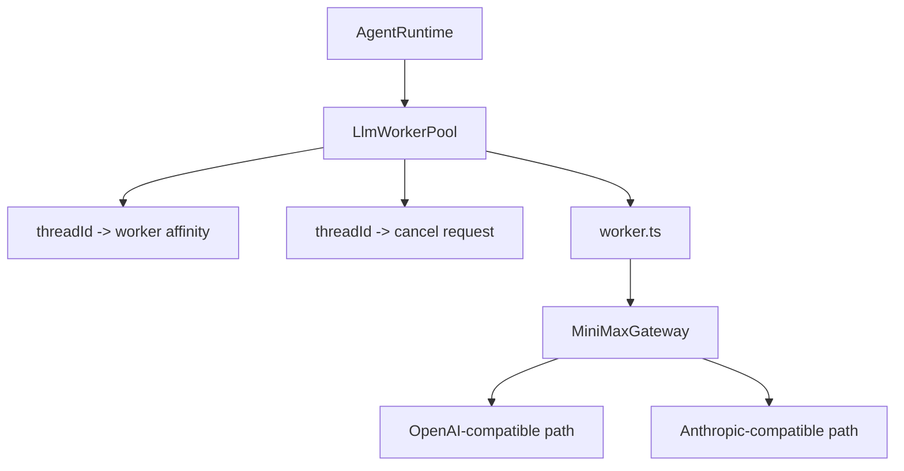
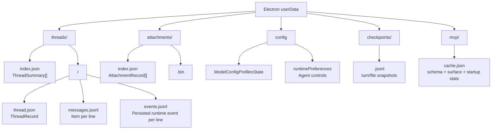
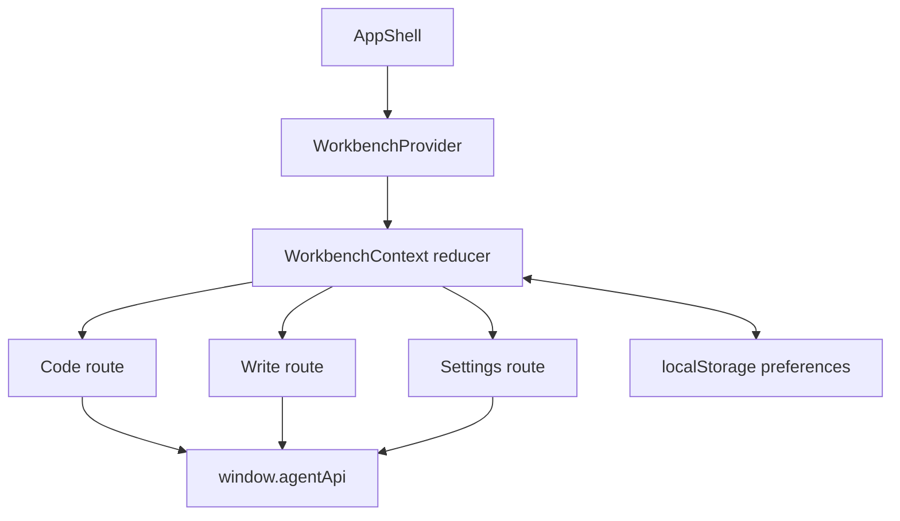
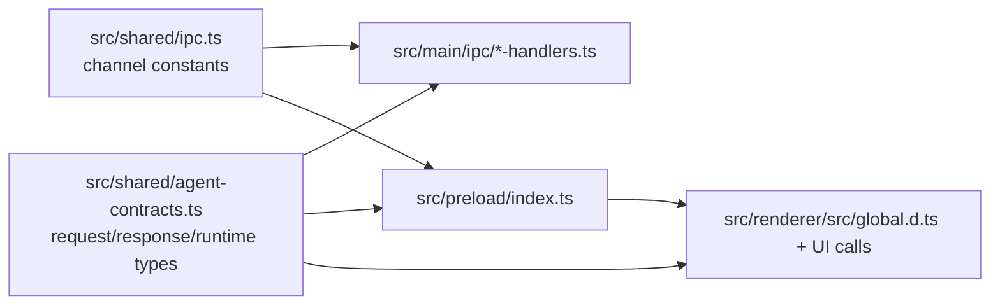

# Project Architecture

This document is a diagram-first map of the current `agent-pyramid-desktop`
implementation. It describes the real code path in this repository, not an
aspirational target architecture.

## Scope

Authoritative source areas:

- `src/main/`: Electron main process, runtime orchestration, IPC handlers,
  persistence, worker pool, LLM gateway, tools, and event bus.
- `src/preload/`: secure `window.agentApi` bridge.
- `src/renderer/`: React workbench UI and local UI preferences.
- `src/shared/`: cross-process contracts, IPC channel constants, locale list.
- `tests/`: Vitest coverage for contracts, runtime, IPC, persistence, worker,
  gateway, and renderer state helpers.

Out of scope:

- `/mnt/f/cc_src/DeepSeek` is a read-only design reference only when a task
  explicitly asks to inspect DeepSeek GUI; it is not project source, a
  dependency, an implementation input, or a build input.
- `docs/external-references/` is not project source or project documentation
  for normal search, audit, build, test, or documentation maintenance.

## System Overview



## Process Boundaries



Security invariants:

- Electron window keeps `contextIsolation: true` and `nodeIntegration: false`
  in `src/main/index.ts`.
- Renderer only uses `window.agentApi` and `src/shared/*` contracts.
- External links opened from renderer markdown are mediated by
  `configureExternalNavigation()` in `src/main/infrastructure/electron-window.ts`.
- Renderer CSP is installed by `installContentSecurityPolicy()` in
  `src/main/infrastructure/content-security-policy.ts`.
- File access stays in main process handlers and tools, with workspace/path
  boundary checks.

## Main Composition Root

`src/main/index.ts` creates and wires the application graph:

Window navigation guards and renderer CSP live in `src/main/infrastructure/`
platform helpers; `src/main/index.ts` passes the renderer entry file into the
window helper and keeps lifecycle registration at the composition root. The
current lifecycle has two independent `app.on("before-quit")` handlers: one
closes `McpHost`, and one destroys `LlmWorkerPool`.



Registered IPC groups:

- `threads`: list, create, get, update, delete, fork.
- `turns`: start, interrupt, get.
- `sse`: subscribe, unsubscribe, push runtime events.
- `approvals`: respond.
- `goals`: update.
- `attachments`: create, get, delete.
- `usage`: daily aggregation.
- `checkpoints`: list, code rewind, optional session rewind.
- `workspace`: pick directory.
- `write`: markdown list, get, put, create, rename, delete, inline complete.
- `modelConfig`: get/update and profile lifecycle.
- `runtimePreferences`: get/update runtime preference state.
- `mcp`: server status/connect/disconnect, tools refresh/list, surface refresh, prompts and resources.
- `skills`: read-only workspace skill catalog diagnostics.

## Runtime Turn Lifecycle



Key runtime responsibilities in `src/main/application/agent-runtime.ts`:

- Blocks concurrent in-flight turns for the same thread.
- Resolves model profile by `modelProfileId`, model string, or active profile.
- Injects attachments as `AgentContentBlock[]`.
- Builds runtime context for plan mode and goal mode.
- Applies request history hygiene and context compaction before LLM calls.
- Executes tool rounds until the model stops or tool budget is reached.
- Requests approval for non-read-only and non-mode-gated tools.
- Persists visible items/events and emits `RuntimeEvent` updates.
- Handles interrupt by cancelling worker request, denying pending approvals, and
  finishing with `interrupted`.

## Tool Architecture



Tool availability is decided at the runtime boundary:

- `create_plan`: only exposed in plan mode.
- `update_goal`: exposed in goal mode or active-goal threads.
- `list_files`, `read_file`, `search_files`: read-only workspace tools and do
  not require approval.
- `edit_file`, `multi_edit`, `write_file`, `apply_patch`, `rollback_file`: workspace write tools that
  require approval, strict UTF-8 text, fresh read-state for existing files, and
  workspace path validation. `multi_edit` applies ordered exact replacements in
  memory and writes once only after every step succeeds. `apply_patch` dry-runs
  all hunks before writing, preserves no-newline-at-end markers, and can show a
  multi-file diff preview. `rollback_file` restores the latest in-memory agent
  file history entry only when current content still matches that entry.
- `run_command`: foreground command tool that runs inside the workspace,
  returns stdout/stderr/exit status, requires approval, and is aborted when the
  turn is interrupted.
- `diagnose_workspace`: command-backed diagnostics tool that runs workspace
  typecheck and requires approval because package scripts can execute shell
  commands.
- `diagnose_file`: read-only diagnostics tool that uses TypeScript Language
  Service for one file and does not require approval.
- MCP tools are dynamically registered by `McpHost` from configured stdio or
  Streamable HTTP MCP servers. They use `mcp__<server>__<tool>` names, reuse the
  normal ToolRegistry/approval/sandbox/permission path, and are hidden from
  Write threads by the default tool access policy. Matching cached schema can
  register lazy placeholders before a live server is ready; the first call
  forces reconnect and then continues through the same ToolRegistry path.
  Refresh failures that clear live tools emit an empty `mcp_tool_list_changed`
  event so renderer and runtime consumers do not retain stale descriptors.
- Unknown or unavailable tool calls produce a visible `runtime_error` with
  `code: "tool_not_found"`.

## Worker And LLM Gateway



Worker rules:

- Same thread routes to the same worker while alive.
- `cancel(threadId)` posts a request-specific cancel message.
- Cancel post failures are logged and treated as best-effort so interruption can
  continue to persist the interrupted state.
- Request cleanup only clears the cancel handle it installed, so a settling old
  request cannot remove a newer same-thread cancel mapping.
- Worker exit clears stale thread affinity and creates a replacement worker.
- Initial worker `postMessage(chat)` failures clean request listeners and cancel
  state before surfacing `worker_crashed` to runtime.
- `destroy()` is idempotent while shutdown is in progress or already complete,
  so Electron shutdown paths cannot terminate the same worker entry twice.
- Worker stream chunks become `LlmStreamChunk` events for runtime consumption.
- Worker protocol errors keep their category through the pool and are mapped to
  runtime errors such as `provider_http`, `provider_error`, `schema_invalid`,
  and `worker_crashed`.
- Worker raw diagnostics are bounded stream summaries, not full retained chunk
  transcripts.

Gateway rules:

- `AgentRuntime` forwards the selected model profile `protocol` into
  `LlmRequest`, so OpenAI-compatible and Anthropic-compatible profiles use the
  same runtime path.
- Provider dialect is resolved from `LlmRequest.provider`.
- MiniMax and DeepSeek use provider-specific request body fields.
- Custom OpenAI-compatible providers use generic chat completions bodies.
- Anthropic-compatible providers use messages/tool_use/tool_result mapping.
- Anthropic-compatible streaming usage is merged across `message_start` and
  `message_delta` frames, including prompt cache read/create token fields.
- OpenAI-compatible and Anthropic-compatible SSE keep reading after terminal
  finish/stop signals until `[DONE]` or stream close so provider usage-only
  tail frames are preserved.
- Provider SSE `event: error` frames throw immediately instead of being treated
  as normal payload frames.
- SSE parsing flushes pending tool calls on terminal finish, `[DONE]`, or stream
  close.

## Persistence Architecture



Persistence invariants:

- JSON writes use temp file + fsync + rename.
- JSONL appends use fsync.
- Same-thread writes are serialized with a per-thread mutex.
- Malformed JSONL lines are warned and skipped during replay.
- Thread and attachment ids must be UUIDs before path construction.
- Attachment names are reduced with the shared basename/length contract before
  metadata is written or replayed.
- Model config keeps at least one profile and normalizes legacy single-config
  files into profile state.
- `userData/config` is the shared authority for model profiles and runtime
  preferences. `ModelConfigStore` and `RuntimePreferencesStore` use the shared
  config-file writer so one section update does not overwrite the other.
- The shared config writer encrypts non-empty model `OPENAI_API_KEY` values on
  disk through the main-process secret codec. Store callers, IPC, renderer state
  and runtime requests still use the plain `ModelConfig` contract in memory.
- Legacy `runtime-preferences.json` is read only to populate a missing
  `runtimePreferences` section; if the section already exists, it is
  authoritative.
- Checkpoint JSONL records are keyed by thread and are restore inputs only after
  workspace path and symlink boundary checks pass again.
- MCP cache stores public schema/surface descriptors and startup observations;
  it is never the user-editable server config authority.

## Renderer State Architecture



State center: `src/renderer/src/ui/store/WorkbenchContext.tsx`.

Important state slices:

- `route`: `code | write | settings`.
- `modelConfig` and `modelProfiles`.
- `workspaceRoot`, `threads`, `activeThread`, active-thread `items`.
- `inFlightTurnsByThreadId`, `activeTurnId`.
- `composer`: text, model, profile, reasoning effort, mode, goal mode,
  attachment ids.
- `rightPanelMode`: `changes | todo | plan | null`.
- `basicPreferences`: theme, startup, sidebar widths, inspector default,
  archive visibility, last workspace, code/reasoning display defaults, composer
  image upload and paste entry points.

## IPC Contract Map



Every renderer-invoked IPC handler returns:

- `ok(value)` for success.
- `err(code, message)` for failure.

The push event channel is separate:

- `SSE_PUSH_CHANNEL = "sse:push"` sends `RuntimeEvent` payloads from main to
  preload; preload validates each pushed payload with `isRuntimeEvent()` before
  forwarding it to renderer listeners.

## Module Ownership

| Area | Ownership |
| --- | --- |
| `src/main/application/agent-runtime.ts` | Turn state machine, tool loop, model request construction, runtime events. |
| `src/main/application/tool-call-executor.ts` | Parent-turn tool item lifecycle, catalog/policy checks, approval suspension, live progress, and interruption cleanup. |
| `src/main/application/tools/` | Tool registry and built-in tool implementations. |
| `src/main/infrastructure/minimax/` | Provider gateway routing, protocol adapters, shared HTTP/SSE helpers, and message/tool conversion. |
| `src/main/infrastructure/llm-worker/` | Worker isolation, worker affinity, cancellation, worker protocol. |
| `src/main/infrastructure/mcp/` | MCP client, host, cache/stats store, auth diagnostics, stdio and Streamable HTTP transports, protocol normalization. |
| `src/main/ipc/` | IPC envelope handlers and Electron-only services. |
| `src/main/persistence/` | userData persistence and migration/normalization. |
| `src/preload/index.ts` | Minimal bridge API and SSE listener fan-out. |
| `src/renderer/src/ui/` | Routes, UI components, reducer state, preferences, styles. |
| `src/shared/` | Cross-process authority for contracts, channels, locales. |

## Verification Commands

Use these after architecture-affecting code changes:

```bash
npm run typecheck
npm run test
npm run build
```

For documentation-only edits, at minimum verify referenced paths and Markdown
diff hygiene:

```bash
rg "src/main/index.ts|src/preload/index.ts|src/renderer/src/ui" docs/architecture.md
git diff --check
```
