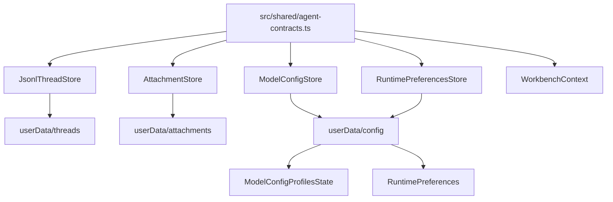
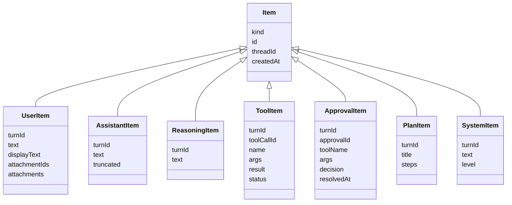

# Data Model

本文记录当前项目的数据权威来源、持久化布局、跨进程模型、append-only timeline 语义和迁移约束。它用于帮助 Agent 修改字段、状态或存储格式时理解哪些地方必须一起更新。

## Authoritative Sources

| Concern | Authority |
| --- | --- |
| Cross-process data contracts | `src/shared/agent-contracts.ts` |
| IPC channel names | `src/shared/ipc.ts` |
| Thread persistence | `src/main/persistence/index.ts` |
| Attachment persistence | `src/main/persistence/attachment-store.ts` |
| Application config persistence | `src/main/persistence/config-file.ts` |
| Model config access | `src/main/persistence/model-config-store.ts` |
| Runtime preferences access | `src/main/persistence/runtime-preferences-store.ts` |
| Runtime event emission | `src/main/application/agent-runtime.ts` and `src/main/event-bus.ts` |
| Renderer state shape | `src/renderer/src/ui/store/WorkbenchContext.tsx` |
| Renderer local preferences | `src/renderer/src/ui/preferences.ts` |

Rule of thumb:

If a field crosses process boundaries, start from `src/shared/agent-contracts.ts`, then update main handler/store/runtime, preload, renderer and tests.

## Storage Overview

Runtime data is stored under Electron `userData`, not inside the repository.

```text
userData/
  threads/
    index.json
    <threadId>/
      thread.json
      messages.jsonl
      events.jsonl
  attachments/
    index.json
    <attachmentId>.bin
  config
```



## Thread Model

`ThreadRecord` is the full persisted thread object.

Core fields:

- `id`
- `title`
- `workspace`
- `mode`: `"code" | "write"`
- `status`: `"active" | "archived"`
- `relation`: `"primary" | "fork" | "side"`
- `parentThreadId`
- `forkedAt`
- `createdAt`
- `updatedAt`
- `approvalPolicy`
- `sandboxMode`
- `goal`

`ThreadSummary` is the lightweight row stored in `threads/index.json`.

Summary fields:

- `id`
- `title`
- `workspace`
- `status`
- `relation`
- `mode`
- `updatedAt`

Thread persistence:

```text
threads/
  index.json              # ThreadSummary[]
  <threadId>/
    thread.json           # ThreadRecord
    messages.jsonl        # Item per line
    events.jsonl          # Persisted runtime event per line
```

Important semantics:

- Thread ids must be UUIDs.
- UUID validation uses shared `isUuidString()` in
  `src/shared/agent-contracts.ts`; thread and attachment persistence reuse this
  boundary before resolving filesystem paths.
- Thread/index timestamp fields (`createdAt`, `updatedAt`, `forkedAt`) and goal
  timestamps reuse shared `isIsoTimestampString()` on read; malformed timestamps
  fail at the persistence boundary before they can enter list sorting or
  activity-time comparison.
- Thread field domains are centralized in `src/shared/agent-contracts.ts`
  (`THREAD_RELATIONS`, `THREAD_MODES`, `THREAD_STATUSES`,
  `THREAD_APPROVAL_POLICIES`, `THREAD_SANDBOX_MODES`,
  `THREAD_GOAL_STATUSES`) and reused by IPC parsing and persistence
  normalization. Thread defaults are centralized in the same file as
  `DEFAULT_THREAD_*` constants.
- `JsonlThreadStore.createThread()` defaults `status` to `active`.
- `thread:create` applies `RuntimePreferences.defaultApprovalPolicy` and
  `RuntimePreferences.defaultSandboxMode` when the renderer does not provide
  explicit values. This affects new threads only; existing thread records are
  not retroactively rewritten.
- `ThreadRecord.workspace` must be an absolute path; create rejects relative workspace input before writing `thread.json` or `index.json`.
- Threads with `relation: "fork"` must carry `parentThreadId`; the dedicated
  `forkThread()` path supplies it and orphan fork records are rejected on read.
- Missing `status`, `approvalPolicy`, and `sandboxMode` in old thread records are normalized to `active`, `on-request`, and `workspace-write`.
- Missing `mode` in old thread records or summaries is normalized to `code`;
  invalid stored mode values still fail instead of being silently accepted.
- Persisted thread records and index summaries validate required text fields,
  UUID ids, absolute workspace paths, status, relation, policy, sandbox mode,
  and goal shape on read; invalid stored values fail instead of entering
  runtime policy decisions.
- Thread list filters validate `includeArchived` and `archivedOnly` as booleans
  before applying status visibility rules.
- Thread update patches must contain at least one supported field; empty or
  unknown-only updates fail instead of only refreshing `updatedAt`.
- Same-thread writes are serialized with a per-thread mutex.
- Appending an `Item` updates `ThreadRecord.updatedAt` and the matching
  `ThreadSummary.updatedAt` when the item timestamp is newer, so list sorting
  follows visible thread activity.
- `index.json` writes use an index queue.
- Thread deletion removes the thread directory before removing its index row. If
  recursive directory deletion fails, the index row remains as the retry handle
  so the session directory does not become an unreachable orphan.
- JSON writes use temp file + fsync + rename.
- JSONL appends use fsync.
- Malformed JSONL lines are warned and skipped during replay. This includes
  lines that parse as JSON but fail the shared `Item` / `RuntimeEvent` shape
  guards, and lines whose record or nested `turn` / `item` ownership does not
  match the replayed thread.

## Goal Model

`ThreadGoal` lives on `ThreadRecord.goal`.

Fields:

- `text`
- `status`: `"active" | "complete" | "blocked"`
- `createdAt`
- `updatedAt`
- `completedAt`
- `blockedAt`
- `summary`

Update path:

```text
renderer
  -> agentApi.goals.update()
  -> GOAL_UPDATE_CHANNEL
  -> registerGoalHandlers()
  -> AgentRuntime.updateThreadGoal()
  -> JsonlThreadStore.updateThread()
  -> RuntimeEventBus.emit("goal_updated")
```

Goal clearing is represented as `goal: null` at the patch boundary and becomes
`undefined` in persisted `ThreadRecord`; `thread.json` must not store
`goal: null`.
Goal updates must include at least one effective field. Empty updates, blank
goal/summary text, and clear operations combined with status or summary fail
before persistence so goal timestamps are not refreshed by no-op requests.
Complete `ThreadGoal` objects supplied through lower-level thread update paths
must also use non-blank `text`; optional `summary` must be non-blank when
present.

## Turn Model

`TurnRecord` describes one assistant run.

Fields:

- `id`
- `threadId`
- `status`
- `startedAt`
- `completedAt`
- `model`
- `reasoningEffort`
- `modelProfileId`
- `mode`
- `goalMode`
- `usage`

`goalMode` is optional but must be boolean when present. JSONL runtime event
replay rejects `turn_started.turn` records where `goalMode` has another shape.

`TurnStatus` values:

- `in-flight`
- `completed`
- `failed`
- `interrupted`
- `needs_continuation`

Turn records are not currently stored as a separate file. Their lifecycle is reconstructed from:

- in-memory `AgentRuntime.inFlight`
- `Item.turnId` in `messages.jsonl`
- persisted lifecycle events in `events.jsonl` (`turn_completed`, `turn_failed`, and tool budget audit events)

## Item Model

Timeline data is an append-only stream of `Item` values in `messages.jsonl`.

Item kinds:

- `user`
- `assistant`
- `reasoning`
- `tool`
- `compaction`
- `approval`
- `user_input`
- `plan`
- `system`



Append-only update rule:

- `JsonlThreadStore.appendItem()` / `appendEvent()` validate the shared
  `Item` / `RuntimeEvent` shape and require the record `threadId` to match the
  target thread before writing JSONL.
- Runtime events that carry nested thread-owned records, such as
  `turn_started.turn` and `item_appended.item`, must keep those nested
  `threadId` values aligned with the target thread before writing or replaying
  JSONL.
- `Item.createdAt` and runtime event timestamp fields must use the
  `Date.prototype.toISOString()` shape validated by shared
  `isIsoTimestampString()`.
- Streaming assistant/reasoning items emit `item_updated` before final persistence.
- Tool and approval status updates are appended as a new JSONL row with the same item id.
- Replay consumers dedupe by `item.id` and keep the latest row.
- Do not rewrite old JSONL rows for normal updates.

## Attachment Model

`AttachmentRecord` metadata:

- `id`
- `name`
- `mimeType`
- `size`
- `createdAt`

Creation request:

- `name`
- `mimeType`
- `dataBase64`

Storage:

```text
attachments/
  index.json          # AttachmentRecord[]
  <attachmentId>.bin  # binary data
```

Rules:

- Attachment ids must be UUIDs.
- File names are normalized with `path.basename()`.
- Supported mime types are defined by
  `SUPPORTED_ATTACHMENT_MIME_TYPES` in `src/shared/agent-contracts.ts`:
  `image/png`, `image/jpeg`, `image/webp`, `image/gif`.
- Maximum size is `MAX_ATTACHMENT_BYTES` in `src/shared/agent-contracts.ts`
  (12 MB).
- Attachment metadata validation is centralized in shared `isAttachmentRecord()`;
  both `AttachmentStore` index reads and `UserItem.attachments` replay guards use
  this contract. `AttachmentRecord.createdAt` uses the same shared ISO timestamp
  boundary as item and event records.
- `AttachmentStore.get()` returns metadata plus `dataBase64`.
- Attachment deletion removes the blob before removing its index entry. If blob
  deletion fails, the index entry remains as the retry handle so the file does
  not become an unreachable orphan.
- `UserItem` stores attachment ids and metadata, not image bytes.
- Runtime reads attachment bytes and sends them to the LLM as `AgentContentBlock[]`.

## Write File Service Model

Write-mode document files are not stored in Electron `userData`. They live in
the active thread workspace and are accessed only through `window.agentApi.write`
IPC methods.

Current request models:

- `WriteListRequest`: workspace plus optional case-insensitive substring search.
- `WriteGetRequest`: workspace plus workspace-relative Markdown path.
- `WritePutRequest`: workspace, workspace-relative Markdown path, and UTF-8 content.
- `WriteCreateRequest`: workspace, workspace-relative Markdown path, and optional UTF-8 content.
- `WriteRenameRequest`: workspace, current workspace-relative Markdown path, and new workspace-relative Markdown path.
- `WriteDeleteRequest`: workspace plus workspace-relative Markdown path.
- `WriteCompleteRequest`: workspace, path, prefix, and suffix around the current editor selection.

Rules:

- `workspace` must be absolute.
- Document paths are workspace-relative and use forward slashes in renderer state.
- Document paths must target `.md`, `.mdx`, or `.markdown`.
- Access reuses the shared workspace path policy and realpath checks from
  `workspace-policy.ts`; Write IPC adds only the Markdown extension constraint.
- `write.create` uses exclusive create semantics and does not overwrite an
  existing document.
- `write.rename` rejects same-path renames and does not overwrite an existing
  target document.
- `write.delete` removes one Markdown document after the same policy checks.
- `write.get` reads strict UTF-8 Markdown; invalid bytes fail instead of
  entering renderer document state with replacement characters.
- `write.complete` is local Markdown pattern completion, not persisted data and
  not an LLM request.

## Runtime Event Model

Runtime events are pushed to renderer through SSE IPC. `events.jsonl` is the audit log for persisted lifecycle/usage events; timeline content is persisted as `Item` rows in `messages.jsonl`, then surfaced to renderer as `item_appended` / `item_updated` events.

Current event kinds:

- `turn_started`
- `turn_completed`
- `turn_failed`
- `item_appended`
- `item_updated`
- `approval_requested`
- `tool_progress`
- `tool_budget_reached`
- `goal_updated`
- `runtime_error`

`tool_progress` carries `{ threadId, turnId, toolCallId, chunk, stream, seq }`
for live stdout/stderr chunks from a still-running tool. It is a live UI event
only: command stdout/stderr remain persisted through the final `ToolItem.result`
in `messages.jsonl`, and progress chunks are not appended to `events.jsonl`.

`runtime_error.code` is one of `worker_crashed`, `worker_timeout`,
`provider_http`, `provider_error`, `schema_invalid`, `tool_not_found`,
`tool_failed`, `approval_timeout`, `persistence_error`, or `internal`.

`turn_started` carries the complete runtime-created `TurnRecord` as `turn`.
The shared `isRuntimeEvent()` guard requires repeated top-level fields to stay
aligned with nested records: `turn_started.threadId/turnId/startedAt` must match
`turn.threadId/id/startedAt`, and `item_appended` / `item_updated` must match
the nested `item.threadId/turnId`.
Usage data lives on `turn_completed.usage` and is aggregated by `usage:daily`.
Daily usage buckets use local calendar-date stepping instead of fixed 24-hour
millisecond offsets, so daylight-saving time transitions cannot duplicate or
skip date labels.
Runtime event timestamps such as `startedAt`, `completedAt`, `failedAt`, and
`reachedAt` must use `Date.prototype.toISOString()` format.
Persisted event replay validates `usage` as a `TokenUsage` object when present;
token count fields must be non-negative integers, `cacheHitRate` must be
`null` or a `0..1` ratio, and malformed token fields are skipped with the rest
of the bad event row.

`RUNTIME_EVENT_KINDS` is the single event-kind authority used by
`RuntimeEventBus.onThread()`, `RuntimeEventKind`, and `isRuntimeEventKind()`.
Adding an event kind must update that shared list and the event guard.

## Model Config Model

Active model config contract:

- `ModelConfig`
- `ModelConfig.protocol` is the per-profile LLM request dialect:
  `openai-compatible` uses chat-completions shape and
  `anthropic-compatible` uses messages shape.

Profile state contract:

- `ModelConfigProfilesState`
- `ModelConfigProfile`
- `ModelConfigUpdate` is a partial update payload; stores merge it with the
  active, default, or existing profile config and persist a complete
  `ModelConfig`.

Storage file:

```text
userData/config
```

Key semantics:

- `userData/config` is the shared application config file. It persists
  `activeProfileId`, `profiles[]`, and the Agent control section
  `runtimePreferences`.
- `ModelConfigStore` persists profile state through the shared config file, not
  just a single `ModelConfig`.
- `ModelConfigStore.get()` returns the active profile's `ModelConfig`.
- `ModelConfigStore.listProfiles()` returns all profiles.
- Model profile writes preserve `runtimePreferences`; runtime preference writes
  preserve model profiles. Both stores use a shared config-file write queue.
- Non-empty `OPENAI_API_KEY` values stay plain text only in the in-memory
  `ModelConfig` contract. The `userData/config` representation is encrypted via
  the main-process secret codec, and legacy plain-text config files are migrated
  on the next normalized write.
- Deleting a model profile clears Code/Write default profile ids in
  `runtimePreferences` when they point at the deleted profile, avoiding
  persisted dangling profile references.
- Shared config normalization also clears stored Code/Write default profile ids
  that do not match any normalized profile in `profiles[]`.
- Store normalizes older single-config files into profile state.
- Store deduplicates persisted `profiles[]` by profile id while preserving the
  first valid record, so hand-edited or damaged config files cannot make later
  profile mutations ambiguous.
- Store normalizes missing profile `protocol` to `openai-compatible`.
- Stored profile `createdAt` / `updatedAt` values use the shared
  `isIsoTimestampString()` boundary; missing or malformed legacy values are
  normalized to the current ISO timestamp when the config file is read.
- At least one profile must remain.
- Profile creation treats `activate` as a strict boolean; non-boolean values are
  rejected instead of being interpreted by truthiness.
- Active config updates and profile updates must include at least one recognized
  config field; profile updates may alternatively include a non-empty name.
  Empty or unknown-only update payloads fail instead of only refreshing
  `updatedAt`.
- `model_auto_compact_token_limit <= model_context_window`.
- `max_tokens < model_context_window`.
- `OPENAI_API_KEY` is a generic field name; provider fallback may use
  environment variables in the gateway/runtime path.

Default configs are defined in `src/shared/agent-contracts.ts`:

- `DEFAULT_MODEL_CONFIG`
- `DEFAULT_DEEPSEEK_MODEL_CONFIG`

## Runtime Preferences Model

Runtime preferences are main-process Agent controls that influence runtime
behavior and therefore live in shared contracts, not renderer localStorage.

Contracts:

- `RuntimePreferences`
- `RuntimePreferencesUpdate`
- `RuntimeToolAvailabilityPreferences`
- `RuntimeApprovalExperiencePreferences`
- `RuntimeCommandPreferences`
- `RuntimeCompactionPreferences`
- `RuntimePermissionRule`
- `McpServerConfig`
- `McpServerStatusRecord`

Storage file:

```text
userData/config
  runtimePreferences
```

Key semantics:

- `RuntimePreferencesStore` reads and writes the `runtimePreferences` section
  inside the shared `userData/config` file.
- A legacy `userData/runtime-preferences.json` file is read only when
  `userData/config` has no `runtimePreferences` section. If both exist, the
  config section wins so stale legacy data cannot overwrite newer Agent
  controls.
- Missing or malformed stored preference groups normalize to
  `DEFAULT_RUNTIME_PREFERENCES`.
- Updates must include at least one recognized field; unknown-only or malformed
  update payloads fail before persistence.
- Updates that set Code/Write default profile ids must reference existing
  `profiles[]` entries or use `null`; stale stored values are normalized on read.
- `toolAvailability` updates must include at least one concrete tool toggle in
  every provided mode object, so `{ code: {} }` cannot persist as a successful
  no-op update.
- `toolAvailability` is currently consumed by `AgentRuntime` as a catalog-level
  tool switch. Disabled tools are omitted from LLM tool definitions and forced
  calls to disabled tools produce failed tool items.
- `permissionRules` is an ordered array of `{ id, tool, pattern, effect }`
  records where `tool` is `command | write | mcp` and `effect` is
  `allow | ask | deny`. Updates replace the full rule array and must contain
  unique non-empty ids, non-empty patterns without NUL bytes, and valid enum
  values. If the persisted field exists but is malformed, config loading fails
  instead of silently dropping a security rule.
- Runtime evaluates `permissionRules` after hard `read-only` sandbox and
  `approvalPolicy: never` denials. Command rules match raw `command` arguments
  for shell-like command tools; write rules match `path` arguments or
  `apply_patch` target paths; MCP rules match `server/tool` derived from
  `mcp__<server>__<tool>` names. Matching effects resolve by
  `deny > ask > allow`; no match falls back to normal approval logic.
- `mcpServers` is an array of external MCP server configs. Each config stores
  `id`, `name`, `transport`, optional stdio fields (`command`, `args`, `env`,
  `cwd`), optional Streamable HTTP fields (`url`, `headers`), `enabled`,
  `readOnlyTools`, and timestamps. The parser requires unique ids/names,
  `command` for `stdio`, an HTTP(S) `url` for `streamable-http`, string record
  env/header values and no NUL bytes.
- MCP server status, tool descriptors, prompts and resources are runtime
  surface state exposed through `McpServerStatusRecord` over IPC.
  `status` can be `disconnected`, `connecting`, `cached`, `lazy`,
  `connected`, or `failed`. `lastStartupDurationMs`,
  `startupSuccessCount`, and `startupFailureCount` are runtime observations
  from the MCP cache/stats store.
- `McpCacheStore` persists an optimization cache at `userData/mcp/cache.json`.
  It stores public tool schemas, prompt/resource descriptors, capability
  snapshots and startup stats keyed by a fingerprint of the server runtime
  config. It is not the config authority, and malformed or stale cache entries
  are ignored in favor of a live MCP handshake.
- Mode default profile ids are consumed by `AgentRuntime` when a turn request
  does not specify `modelProfileId`.
- `defaultApprovalPolicy` and `defaultSandboxMode` are consumed by thread
  creation as defaults when the create request omits explicit values.
- `command.timeoutMs` and `command.maxOutputBytes` are consumed by foreground
  command-backed tools, package/task wrappers, Git wrappers that spawn `git`,
  and `diagnose_workspace` when a tool call does not provide a stricter
  override.
- `compaction.enabled` and `compaction.strategy` are consumed by
  `AgentRuntime.prepareMessagesForRequest()` before every model request.
- `approvalExperience` is consumed by renderer presentation only; it controls
  approval diff expansion, pending-approval scrolling, read-only tool record
  visibility and failure toasts without bypassing runtime approval enforcement.
  Read-only tool record visibility uses shared `RUNTIME_READ_ONLY_TOOL_NAMES`,
  which is tested against built-in tool metadata.

## Renderer State Model

`WorkbenchContext.tsx` owns renderer UI state through `useReducer`.

Important state:

- `route`: `"code" | "write" | "settings"`
- `modelConfig`
- `modelProfiles`
- `runtimePreferences`
- `workspaceRoot`
- `showArchivedThreads`
- `threads`
- `activeThread`
- `activeThreadId`
- `activeTurnId`
- `items`
- `inFlightTurnsByThreadId`
- `rightPanelMode`
- `composer`
- `errorMessage`
- sidebar widths
- `basicPreferences`

Renderer state is not persistence authority for runtime data. It is a projection of:

- IPC results
- runtime event stream
- local UI preferences

MCP Settings keeps live `mcpServerStatuses` in component state. It is refreshed
from `agentApi.mcp.listServers()` and process-level MCP runtime events; the
persisted config authority remains `RuntimePreferences.mcpServers`, while
`userData/mcp/cache.json` is only the schema/stats acceleration cache.

## Local Preferences

Renderer-only preferences are defined in `src/renderer/src/ui/preferences.ts`.

They are stored in localStorage, not main process userData.

Examples:

- default startup route
- theme/language preferences
- sidebar width persistence
- default inspector mode
- archived thread visibility
- restore last workspace
- code block fold threshold
- completed reasoning default-open behavior
- composer image upload and paste entry points

If a preference must influence Agent runtime behavior, do not hide it in renderer localStorage. Promote it into `RuntimePreferences`, the `userData/config` runtime preferences section and a typed IPC API.

## Field Change Checklist

When adding, removing or renaming a cross-process field:

1. Update `src/shared/agent-contracts.ts`.
2. Update type guards or normalization code if present.
3. Update persistence store normalization and migration behavior.
4. Update IPC request/response types and handlers.
5. Update preload API typing if method shape changes.
6. Update renderer state and UI call sites.
7. Update tests.
8. Update docs that mention the field.

Search first:

```bash
rg "FieldName|fieldName" src tests docs
```

## Migration And Compatibility Rules

Current compatibility examples:

- Thread `status` missing from old records is normalized to `active`.
- Thread `mode` missing from old records or summaries is normalized to `code`.
- Model single-config format is normalized to the shared config shape
  (`ModelConfigProfilesState` plus `runtimePreferences`).
- Missing `runtimePreferences` in `userData/config` is filled from legacy
  `userData/runtime-preferences.json` when present, otherwise from
  `DEFAULT_RUNTIME_PREFERENCES`.
- If both `userData/config.runtimePreferences` and legacy
  `runtime-preferences.json` exist, the config section is authoritative.
- Malformed JSONL lines are skipped with a warning.

Preferred migration style:

- Normalize once at store boundary.
- Keep one authoritative current shape in shared contracts.
- Avoid spreading historical format support throughout renderer and runtime.
- Do not add read-side compatibility for every old shape unless there is a clear migration reason.

## Data Integrity Risks

- Writing the same concept in multiple places without a single authority.
- Updating `ThreadRecord` but forgetting `ThreadSummary`.
- Persisting live stream updates without item id dedupe semantics.
- Returning raw attachment bytes inside timeline items.
- Allowing path escape in workspace or write-mode APIs.
- Changing model config constraints without updating settings UI and tests.
- Writing model profiles and runtime preferences through independent
  read-modify-write paths instead of the shared config-file queue.
- Adding event kinds without updating `RUNTIME_EVENT_KINDS` and
  `isRuntimeEvent()`.

## Verification

For data model code changes:

```bash
npm run typecheck
npm run test
npm run build
```

Targeted tests:

- `tests/shared/agent-contracts.test.ts`
- `tests/main/persistence/jsonl-thread-store.test.ts`
- `tests/main/persistence/attachment-store.test.ts`
- `tests/main/persistence/model-config-store.test.ts`
- `tests/main/persistence/runtime-preferences-store.test.ts`
- `tests/main/application/agent-runtime.test.ts`
- affected renderer tests

For documentation-only updates:

```bash
git diff --check -- docs/data-model.md
```
