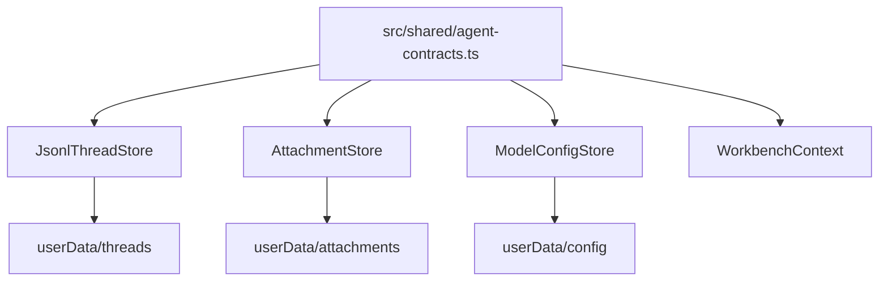
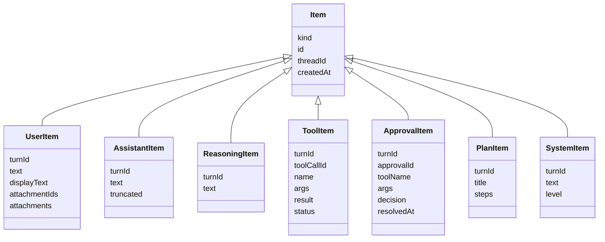

# Data Model

本文记录当前项目的数据权威来源、持久化布局、跨进程模型、append-only timeline 语义和迁移约束。它用于帮助 Agent 修改字段、状态或存储格式时理解哪些地方必须一起更新。

## Authoritative Sources

| Concern | Authority |
| --- | --- |
| Cross-process data contracts | `src/shared/agent-contracts.ts` |
| IPC channel names | `src/shared/ipc.ts` |
| Thread persistence | `src/main/persistence/index.ts` |
| Attachment persistence | `src/main/persistence/attachment-store.ts` |
| Model config persistence | `src/main/persistence/model-config-store.ts` |
| Runtime event emission | `src/main/application/agent-runtime.ts` and `src/main/event-bus.ts` |
| Renderer state shape | `src/renderer/src/ui/store/WorkbenchContext.tsx` |
| Renderer local preferences | `src/renderer/src/ui/preferences.ts` |

Rule of thumb:

If a field crosses process boundaries, start from `src/shared/agent-contracts.ts`, then update main handler/store/runtime, preload, renderer and tests.

## Storage Overview

Runtime data is stored under Electron `userData`, not inside the repository.

```text
userData/
  threads/
    index.json
    <threadId>/
      thread.json
      messages.jsonl
      events.jsonl
  attachments/
    index.json
    <attachmentId>.bin
  config
```



## Thread Model

`ThreadRecord` is the full persisted thread object.

Core fields:

- `id`
- `title`
- `workspace`
- `mode`: `"code" | "write"`
- `status`: `"active" | "archived"`
- `relation`: `"primary" | "fork" | "side"`
- `parentThreadId`
- `forkedAt`
- `createdAt`
- `updatedAt`
- `approvalPolicy`
- `sandboxMode`
- `goal`

`ThreadSummary` is the lightweight row stored in `threads/index.json`.

Summary fields:

- `id`
- `title`
- `workspace`
- `status`
- `relation`
- `mode`
- `updatedAt`

Thread persistence:

```text
threads/
  index.json              # ThreadSummary[]
  <threadId>/
    thread.json           # ThreadRecord
    messages.jsonl        # Item per line
    events.jsonl          # RuntimeEvent per line
```

Important semantics:

- Thread ids must be UUIDs.
- `JsonlThreadStore.createThread()` defaults `status` to `active`.
- Missing `status` in old thread records is normalized to `active`.
- Same-thread writes are serialized with a per-thread mutex.
- `index.json` writes use an index queue.
- JSON writes use temp file + fsync + rename.
- JSONL appends use fsync.
- Malformed JSONL lines are warned and skipped during replay.

## Goal Model

`ThreadGoal` lives on `ThreadRecord.goal`.

Fields:

- `text`
- `status`: `"active" | "complete" | "blocked"`
- `createdAt`
- `updatedAt`
- `completedAt`
- `blockedAt`
- `summary`

Update path:

```text
renderer
  -> agentApi.goals.update()
  -> GOAL_UPDATE_CHANNEL
  -> registerGoalHandlers()
  -> AgentRuntime.updateThreadGoal()
  -> JsonlThreadStore.updateThread()
  -> RuntimeEventBus.emit("goal_updated")
```

Goal clearing is represented as `goal: null` at the patch boundary and becomes `undefined` in persisted `ThreadRecord`.

## Turn Model

`TurnRecord` describes one assistant run.

Fields:

- `id`
- `threadId`
- `status`
- `startedAt`
- `completedAt`
- `model`
- `reasoningEffort`
- `modelProfileId`
- `mode`
- `goalMode`
- `usage`

`TurnStatus` values:

- `in-flight`
- `completed`
- `failed`
- `interrupted`
- `needs_continuation`

Turn records are not currently stored as a separate file. Their lifecycle is reconstructed from:

- in-memory `AgentRuntime.inFlight`
- `Item.turnId` in `messages.jsonl`
- `turn_started`, `turn_completed`, `turn_failed` events in `events.jsonl`

## Item Model

Timeline data is an append-only stream of `Item` values in `messages.jsonl`.

Item kinds:

- `user`
- `assistant`
- `reasoning`
- `tool`
- `compaction`
- `approval`
- `user_input`
- `plan`
- `system`



Append-only update rule:

- Streaming assistant/reasoning items emit `item_updated` before final persistence.
- Tool and approval status updates are appended as a new JSONL row with the same item id.
- Replay consumers dedupe by `item.id` and keep the latest row.
- Do not rewrite old JSONL rows for normal updates.

## Attachment Model

`AttachmentRecord` metadata:

- `id`
- `name`
- `mimeType`
- `size`
- `createdAt`

Creation request:

- `name`
- `mimeType`
- `dataBase64`

Storage:

```text
attachments/
  index.json          # AttachmentRecord[]
  <attachmentId>.bin  # binary data
```

Rules:

- Attachment ids must be UUIDs.
- File names are normalized with `path.basename()`.
- Supported mime types: `image/png`, `image/jpeg`, `image/webp`, `image/gif`.
- Maximum size is 12 MB.
- `AttachmentStore.get()` returns metadata plus `dataBase64`.
- `UserItem` stores attachment ids and metadata, not image bytes.
- Runtime reads attachment bytes and sends them to the LLM as `AgentContentBlock[]`.

## Runtime Event Model

Runtime events are persisted to `events.jsonl` and pushed to renderer through SSE IPC.

Current event kinds:

- `turn_started`
- `turn_completed`
- `turn_failed`
- `item_appended`
- `item_updated`
- `approval_requested`
- `tool_budget_reached`
- `goal_updated`
- `runtime_error`

Usage data lives on `turn_completed.usage` and is aggregated by `usage:daily`.

`RuntimeEventBus.onThread()` must include every thread-scoped event kind that renderer subscribers need to receive.

## Model Config Model

Active model config contract:

- `ModelConfig`

Profile state contract:

- `ModelConfigProfilesState`
- `ModelConfigProfile`

Storage file:

```text
userData/config
```

Key semantics:

- Store persists profile state, not just a single `ModelConfig`.
- `ModelConfigStore.get()` returns the active profile's `ModelConfig`.
- `ModelConfigStore.listProfiles()` returns all profiles.
- Store normalizes older single-config files into profile state.
- At least one profile must remain.
- `model_auto_compact_token_limit <= model_context_window`.
- `max_tokens < model_context_window`.
- `OPENAI_API_KEY` is a generic field name; provider fallback may use environment variables in the gateway/runtime path.

Default configs are defined in `src/shared/agent-contracts.ts`:

- `DEFAULT_MODEL_CONFIG`
- `DEFAULT_DEEPSEEK_MODEL_CONFIG`

## Renderer State Model

`WorkbenchContext.tsx` owns renderer UI state through `useReducer`.

Important state:

- `route`: `"code" | "write" | "settings"`
- `modelConfig`
- `modelProfiles`
- `workspaceRoot`
- `showArchivedThreads`
- `threads`
- `activeThread`
- `activeThreadId`
- `activeTurnId`
- `items`
- `inFlightTurnsByThreadId`
- `rightPanelMode`
- `composer`
- `errorMessage`
- sidebar widths
- `basicPreferences`

Renderer state is not persistence authority for runtime data. It is a projection of:

- IPC results
- runtime event stream
- local UI preferences

## Local Preferences

Renderer-only preferences are defined in `src/renderer/src/ui/preferences.ts`.

They are stored in localStorage, not main process userData.

Examples:

- default startup route
- theme/language preferences
- sidebar width persistence
- default inspector mode
- archived thread visibility
- delete confirmation behavior
- restore last workspace

If a preference must influence Agent runtime behavior, do not hide it in renderer localStorage. Promote it into a shared contract and main process persistence/API.

## Field Change Checklist

When adding, removing or renaming a cross-process field:

1. Update `src/shared/agent-contracts.ts`.
2. Update type guards or normalization code if present.
3. Update persistence store normalization and migration behavior.
4. Update IPC request/response types and handlers.
5. Update preload API typing if method shape changes.
6. Update renderer state and UI call sites.
7. Update tests.
8. Update docs that mention the field.

Search first:

```bash
rg "FieldName|fieldName" src tests docs
```

## Migration And Compatibility Rules

Current compatibility examples:

- Thread `status` missing from old records is normalized to `active`.
- Model single-config format is normalized to `ModelConfigProfilesState`.
- Malformed JSONL lines are skipped with a warning.

Preferred migration style:

- Normalize once at store boundary.
- Keep one authoritative current shape in shared contracts.
- Avoid spreading historical format support throughout renderer and runtime.
- Do not add read-side compatibility for every old shape unless there is a clear migration reason.

## Data Integrity Risks

- Writing the same concept in multiple places without a single authority.
- Updating `ThreadRecord` but forgetting `ThreadSummary`.
- Persisting live stream updates without item id dedupe semantics.
- Returning raw attachment bytes inside timeline items.
- Allowing path escape in workspace or write-mode APIs.
- Changing model config constraints without updating settings UI and tests.
- Adding event kinds without updating `RuntimeEventBus.onThread()`.

## Verification

For data model code changes:

```bash
npm run typecheck
npm run test
npm run build
```

Targeted tests:

- `tests/shared/agent-contracts.test.ts`
- `tests/main/persistence/jsonl-thread-store.test.ts`
- `tests/main/persistence/attachment-store.test.ts`
- `tests/main/persistence/model-config-store.test.ts`
- `tests/main/application/agent-runtime.test.ts`
- affected renderer tests

For documentation-only updates:

```bash
git diff --check -- docs/data-model.md
```
