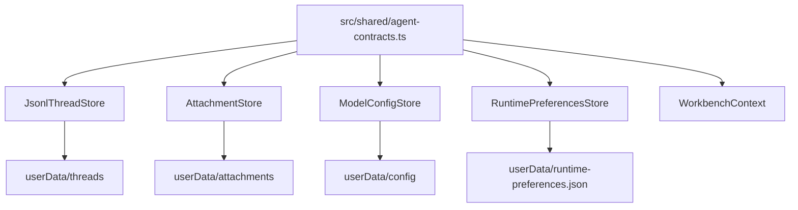
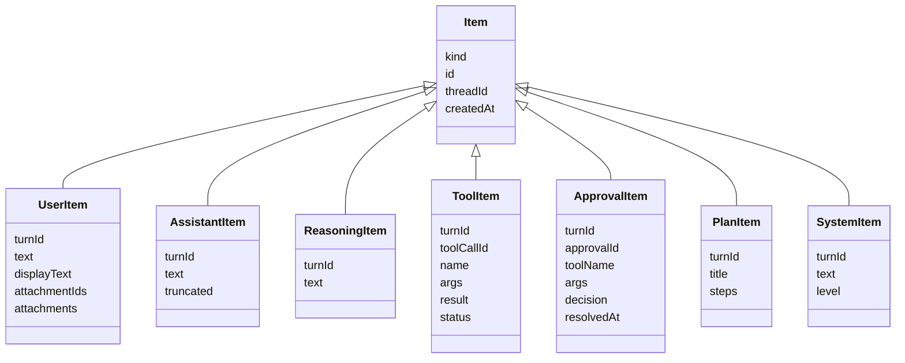

# Data Model

本文记录当前项目的数据权威来源、持久化布局、跨进程模型、append-only timeline 语义和迁移约束。它用于帮助 Agent 修改字段、状态或存储格式时理解哪些地方必须一起更新。

## Authoritative Sources

| Concern | Authority |
| --- | --- |
| Cross-process data contracts | `src/shared/agent-contracts.ts` |
| IPC channel names | `src/shared/ipc.ts` |
| Thread persistence | `src/main/persistence/index.ts` |
| Attachment persistence | `src/main/persistence/attachment-store.ts` |
| Model config persistence | `src/main/persistence/model-config-store.ts` |
| Runtime preferences persistence | `src/main/persistence/runtime-preferences-store.ts` |
| Runtime event emission | `src/main/application/agent-runtime.ts` and `src/main/event-bus.ts` |
| Renderer state shape | `src/renderer/src/ui/store/WorkbenchContext.tsx` |
| Renderer local preferences | `src/renderer/src/ui/preferences.ts` |

Rule of thumb:

If a field crosses process boundaries, start from `src/shared/agent-contracts.ts`, then update main handler/store/runtime, preload, renderer and tests.

## Storage Overview

Runtime data is stored under Electron `userData`, not inside the repository.

```text
userData/
  threads/
    index.json
    <threadId>/
      thread.json
      messages.jsonl
      events.jsonl
  attachments/
    index.json
    <attachmentId>.bin
  config
  runtime-preferences.json
```



## Thread Model

`ThreadRecord` is the full persisted thread object.

Core fields:

- `id`
- `title`
- `workspace`
- `mode`: `"code" | "write"`
- `status`: `"active" | "archived"`
- `relation`: `"primary" | "fork" | "side"`
- `parentThreadId`
- `forkedAt`
- `createdAt`
- `updatedAt`
- `approvalPolicy`
- `sandboxMode`
- `goal`

`ThreadSummary` is the lightweight row stored in `threads/index.json`.

Summary fields:

- `id`
- `title`
- `workspace`
- `status`
- `relation`
- `mode`
- `updatedAt`

Thread persistence:

```text
threads/
  index.json              # ThreadSummary[]
  <threadId>/
    thread.json           # ThreadRecord
    messages.jsonl        # Item per line
    events.jsonl          # Persisted runtime event per line
```

Important semantics:

- Thread ids must be UUIDs.
- UUID validation uses shared `isUuidString()` in
  `src/shared/agent-contracts.ts`; thread and attachment persistence reuse this
  boundary before resolving filesystem paths.
- Thread/index timestamp fields (`createdAt`, `updatedAt`, `forkedAt`) and goal
  timestamps reuse shared `isIsoTimestampString()` on read; malformed timestamps
  fail at the persistence boundary before they can enter list sorting or
  activity-time comparison.
- Thread field domains are centralized in `src/shared/agent-contracts.ts`
  (`THREAD_RELATIONS`, `THREAD_MODES`, `THREAD_STATUSES`,
  `THREAD_APPROVAL_POLICIES`, `THREAD_SANDBOX_MODES`,
  `THREAD_GOAL_STATUSES`) and reused by IPC parsing and persistence
  normalization. Thread defaults are centralized in the same file as
  `DEFAULT_THREAD_*` constants.
- `JsonlThreadStore.createThread()` defaults `status` to `active`.
- `thread:create` applies `RuntimePreferences.defaultApprovalPolicy` and
  `RuntimePreferences.defaultSandboxMode` when the renderer does not provide
  explicit values. This affects new threads only; existing thread records are
  not retroactively rewritten.
- `ThreadRecord.workspace` must be an absolute path; create rejects relative workspace input before writing `thread.json` or `index.json`.
- Threads with `relation: "fork"` must carry `parentThreadId`; the dedicated
  `forkThread()` path supplies it and orphan fork records are rejected on read.
- Missing `status`, `approvalPolicy`, and `sandboxMode` in old thread records are normalized to `active`, `on-request`, and `workspace-write`.
- Missing `mode` in old thread records or summaries is normalized to `code`;
  invalid stored mode values still fail instead of being silently accepted.
- Persisted thread records and index summaries validate required text fields,
  UUID ids, absolute workspace paths, status, relation, policy, sandbox mode,
  and goal shape on read; invalid stored values fail instead of entering
  runtime policy decisions.
- Thread list filters validate `includeArchived` and `archivedOnly` as booleans
  before applying status visibility rules.
- Thread update patches must contain at least one supported field; empty or
  unknown-only updates fail instead of only refreshing `updatedAt`.
- Same-thread writes are serialized with a per-thread mutex.
- Appending an `Item` updates `ThreadRecord.updatedAt` and the matching
  `ThreadSummary.updatedAt` when the item timestamp is newer, so list sorting
  follows visible thread activity.
- `index.json` writes use an index queue.
- JSON writes use temp file + fsync + rename.
- JSONL appends use fsync.
- Malformed JSONL lines are warned and skipped during replay. This includes
  lines that parse as JSON but fail the shared `Item` / `RuntimeEvent` shape
  guards.

## Goal Model

`ThreadGoal` lives on `ThreadRecord.goal`.

Fields:

- `text`
- `status`: `"active" | "complete" | "blocked"`
- `createdAt`
- `updatedAt`
- `completedAt`
- `blockedAt`
- `summary`

Update path:

```text
renderer
  -> agentApi.goals.update()
  -> GOAL_UPDATE_CHANNEL
  -> registerGoalHandlers()
  -> AgentRuntime.updateThreadGoal()
  -> JsonlThreadStore.updateThread()
  -> RuntimeEventBus.emit("goal_updated")
```

Goal clearing is represented as `goal: null` at the patch boundary and becomes
`undefined` in persisted `ThreadRecord`; `thread.json` must not store
`goal: null`.
Goal updates must include at least one effective field. Empty updates, blank
goal/summary text, and clear operations combined with status or summary fail
before persistence so goal timestamps are not refreshed by no-op requests.

## Turn Model

`TurnRecord` describes one assistant run.

Fields:

- `id`
- `threadId`
- `status`
- `startedAt`
- `completedAt`
- `model`
- `reasoningEffort`
- `modelProfileId`
- `mode`
- `goalMode`
- `usage`

`goalMode` is optional but must be boolean when present. JSONL runtime event
replay rejects `turn_started.turn` records where `goalMode` has another shape.

`TurnStatus` values:

- `in-flight`
- `completed`
- `failed`
- `interrupted`
- `needs_continuation`

Turn records are not currently stored as a separate file. Their lifecycle is reconstructed from:

- in-memory `AgentRuntime.inFlight`
- `Item.turnId` in `messages.jsonl`
- persisted lifecycle events in `events.jsonl` (`turn_completed`, `turn_failed`, and tool budget audit events)

## Item Model

Timeline data is an append-only stream of `Item` values in `messages.jsonl`.

Item kinds:

- `user`
- `assistant`
- `reasoning`
- `tool`
- `compaction`
- `approval`
- `user_input`
- `plan`
- `system`



Append-only update rule:

- `JsonlThreadStore.appendItem()` / `appendEvent()` validate the shared
  `Item` / `RuntimeEvent` shape and require the record `threadId` to match the
  target thread before writing JSONL.
- `Item.createdAt` and runtime event timestamp fields must use the
  `Date.prototype.toISOString()` shape validated by shared
  `isIsoTimestampString()`.
- Streaming assistant/reasoning items emit `item_updated` before final persistence.
- Tool and approval status updates are appended as a new JSONL row with the same item id.
- Replay consumers dedupe by `item.id` and keep the latest row.
- Do not rewrite old JSONL rows for normal updates.

## Attachment Model

`AttachmentRecord` metadata:

- `id`
- `name`
- `mimeType`
- `size`
- `createdAt`

Creation request:

- `name`
- `mimeType`
- `dataBase64`

Storage:

```text
attachments/
  index.json          # AttachmentRecord[]
  <attachmentId>.bin  # binary data
```

Rules:

- Attachment ids must be UUIDs.
- File names are normalized with `path.basename()`.
- Supported mime types are defined by
  `SUPPORTED_ATTACHMENT_MIME_TYPES` in `src/shared/agent-contracts.ts`:
  `image/png`, `image/jpeg`, `image/webp`, `image/gif`.
- Maximum size is `MAX_ATTACHMENT_BYTES` in `src/shared/agent-contracts.ts`
  (12 MB).
- Attachment metadata validation is centralized in shared `isAttachmentRecord()`;
  both `AttachmentStore` index reads and `UserItem.attachments` replay guards use
  this contract. `AttachmentRecord.createdAt` uses the same shared ISO timestamp
  boundary as item and event records.
- `AttachmentStore.get()` returns metadata plus `dataBase64`.
- `UserItem` stores attachment ids and metadata, not image bytes.
- Runtime reads attachment bytes and sends them to the LLM as `AgentContentBlock[]`.

## Runtime Event Model

Runtime events are pushed to renderer through SSE IPC. `events.jsonl` is the audit log for persisted lifecycle/usage events; timeline content is persisted as `Item` rows in `messages.jsonl`, then surfaced to renderer as `item_appended` / `item_updated` events.

Current event kinds:

- `turn_started`
- `turn_completed`
- `turn_failed`
- `item_appended`
- `item_updated`
- `approval_requested`
- `tool_budget_reached`
- `goal_updated`
- `runtime_error`

`runtime_error.code` is one of `worker_crashed`, `worker_timeout`,
`provider_http`, `schema_invalid`, `tool_not_found`, `tool_failed`,
`approval_timeout`, `persistence_error`, or `internal`.

`turn_started` carries the complete runtime-created `TurnRecord` as `turn`.
Usage data lives on `turn_completed.usage` and is aggregated by `usage:daily`.
Runtime event timestamps such as `startedAt`, `completedAt`, `failedAt`, and
`reachedAt` must use `Date.prototype.toISOString()` format.
Persisted event replay validates `usage` as a `TokenUsage` object when present;
token count fields must be non-negative integers, `cacheHitRate` must be
`null` or a `0..1` ratio, and malformed token fields are skipped with the rest
of the bad event row.

`RuntimeEventBus.onThread()` must include every thread-scoped event kind that renderer subscribers need to receive.

## Model Config Model

Active model config contract:

- `ModelConfig`
- `ModelConfig.protocol` is the per-profile LLM request dialect:
  `openai-compatible` uses chat-completions shape and
  `anthropic-compatible` uses messages shape.

Profile state contract:

- `ModelConfigProfilesState`
- `ModelConfigProfile`
- `ModelConfigUpdate` is a partial update payload; stores merge it with the
  active, default, or existing profile config and persist a complete
  `ModelConfig`.

Storage file:

```text
userData/config
```

Key semantics:

- Store persists profile state, not just a single `ModelConfig`.
- `ModelConfigStore.get()` returns the active profile's `ModelConfig`.
- `ModelConfigStore.listProfiles()` returns all profiles.
- Store normalizes older single-config files into profile state.
- Store normalizes missing profile `protocol` to `openai-compatible`.
- Stored profile `createdAt` / `updatedAt` values use the shared
  `isIsoTimestampString()` boundary; missing or malformed legacy values are
  normalized to the current ISO timestamp when the config file is read.
- At least one profile must remain.
- Profile creation treats `activate` as a strict boolean; non-boolean values are
  rejected instead of being interpreted by truthiness.
- Active config updates and profile updates must include at least one recognized
  config field; profile updates may alternatively include a non-empty name.
  Empty or unknown-only update payloads fail instead of only refreshing
  `updatedAt`.
- `model_auto_compact_token_limit <= model_context_window`.
- `max_tokens < model_context_window`.
- `OPENAI_API_KEY` is a generic field name; provider fallback may use environment variables in the gateway/runtime path.

Default configs are defined in `src/shared/agent-contracts.ts`:

- `DEFAULT_MODEL_CONFIG`
- `DEFAULT_DEEPSEEK_MODEL_CONFIG`

## Runtime Preferences Model

Runtime preferences are main-process Agent controls that influence runtime
behavior and therefore live in shared contracts, not renderer localStorage.

Contracts:

- `RuntimePreferences`
- `RuntimePreferencesUpdate`
- `RuntimeToolAvailabilityPreferences`
- `RuntimeApprovalExperiencePreferences`
- `RuntimeCommandPreferences`
- `RuntimeCompactionPreferences`

Storage file:

```text
userData/runtime-preferences.json
```

Key semantics:

- Missing or malformed stored preference groups normalize to
  `DEFAULT_RUNTIME_PREFERENCES`.
- Updates must include at least one recognized field; unknown-only or malformed
  update payloads fail before persistence.
- `toolAvailability` is currently consumed by `AgentRuntime` as a catalog-level
  tool switch. Disabled tools are omitted from LLM tool definitions and forced
  calls to disabled tools produce failed tool items.
- Mode default profile ids are consumed by `AgentRuntime` when a turn request
  does not specify `modelProfileId`.
- `defaultApprovalPolicy` and `defaultSandboxMode` are consumed by thread
  creation as defaults when the create request omits explicit values.
- `command.timeoutMs` and `command.maxOutputBytes` are consumed by
  `run_command` and `diagnose_workspace` when a tool call does not provide a
  stricter override.
- `compaction.enabled` and `compaction.strategy` are consumed by
  `AgentRuntime.prepareMessagesForRequest()` before every model request.
- `approvalExperience` is consumed by renderer presentation only; it controls
  approval diff expansion, pending-approval scrolling, read-only tool record
  visibility and failure toasts without bypassing runtime approval enforcement.

## Renderer State Model

`WorkbenchContext.tsx` owns renderer UI state through `useReducer`.

Important state:

- `route`: `"code" | "write" | "settings"`
- `modelConfig`
- `modelProfiles`
- `runtimePreferences`
- `workspaceRoot`
- `showArchivedThreads`
- `threads`
- `activeThread`
- `activeThreadId`
- `activeTurnId`
- `items`
- `inFlightTurnsByThreadId`
- `rightPanelMode`
- `composer`
- `errorMessage`
- sidebar widths
- `basicPreferences`

Renderer state is not persistence authority for runtime data. It is a projection of:

- IPC results
- runtime event stream
- local UI preferences

## Local Preferences

Renderer-only preferences are defined in `src/renderer/src/ui/preferences.ts`.

They are stored in localStorage, not main process userData.

Examples:

- default startup route
- theme/language preferences
- sidebar width persistence
- default inspector mode
- archived thread visibility
- delete confirmation behavior
- restore last workspace

If a preference must influence Agent runtime behavior, do not hide it in renderer localStorage. Promote it into `RuntimePreferences`, main-process persistence and a typed IPC API.

## Field Change Checklist

When adding, removing or renaming a cross-process field:

1. Update `src/shared/agent-contracts.ts`.
2. Update type guards or normalization code if present.
3. Update persistence store normalization and migration behavior.
4. Update IPC request/response types and handlers.
5. Update preload API typing if method shape changes.
6. Update renderer state and UI call sites.
7. Update tests.
8. Update docs that mention the field.

Search first:

```bash
rg "FieldName|fieldName" src tests docs
```

## Migration And Compatibility Rules

Current compatibility examples:

- Thread `status` missing from old records is normalized to `active`.
- Thread `mode` missing from old records or summaries is normalized to `code`.
- Model single-config format is normalized to `ModelConfigProfilesState`.
- Malformed JSONL lines are skipped with a warning.

Preferred migration style:

- Normalize once at store boundary.
- Keep one authoritative current shape in shared contracts.
- Avoid spreading historical format support throughout renderer and runtime.
- Do not add read-side compatibility for every old shape unless there is a clear migration reason.

## Data Integrity Risks

- Writing the same concept in multiple places without a single authority.
- Updating `ThreadRecord` but forgetting `ThreadSummary`.
- Persisting live stream updates without item id dedupe semantics.
- Returning raw attachment bytes inside timeline items.
- Allowing path escape in workspace or write-mode APIs.
- Changing model config constraints without updating settings UI and tests.
- Adding event kinds without updating `RuntimeEventBus.onThread()`.

## Verification

For data model code changes:

```bash
npm run typecheck
npm run test
npm run build
```

Targeted tests:

- `tests/shared/agent-contracts.test.ts`
- `tests/main/persistence/jsonl-thread-store.test.ts`
- `tests/main/persistence/attachment-store.test.ts`
- `tests/main/persistence/model-config-store.test.ts`
- `tests/main/application/agent-runtime.test.ts`
- affected renderer tests

For documentation-only updates:

```bash
git diff --check -- docs/data-model.md
```
