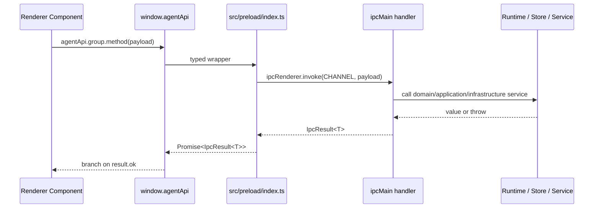
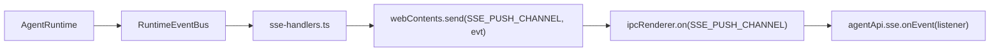

# IPC Contracts

本文记录当前 renderer 到 main 的 IPC 契约、handler 映射、preload 暴露面和错误返回规则。它的目标是防止跨进程改动只更新一层，造成 runtime、preload、renderer 类型或 channel 不一致。

## Authoritative Sources

- IPC channel constants: `src/shared/ipc.ts`
- Request/response contracts: `src/shared/agent-contracts.ts`
- Main handlers: `src/main/ipc/*-handlers.ts`
- Preload API: `src/preload/index.ts`
- Renderer global type: `src/renderer/src/global.d.ts`
- Runtime events: `src/shared/agent-contracts.ts` and `src/main/event-bus.ts`

Renderer must call main through `window.agentApi`; it must not import or invoke `src/main/*` directly.

## IPC Shape

All renderer-invoked handlers return:

```ts
IpcResult<T> = { ok: true; value: T } | { ok: false; code: string; message: string }
```

Helpers are defined in `src/shared/agent-contracts.ts`:

- `ok(value)`
- `err(code, message)`

Error rules:

- Handler failures must return `err(code, message)`.
- Errors must remain traceable through a stable code and a concrete message.
- Runtime events may additionally emit `runtime_error`, `turn_failed` or other typed events.
- Do not use silent `catch {}` or return ambiguous success values for failed work.

## End-To-End IPC Path



## Channel Registry

`RENDERER_TO_MAIN_CHANNELS` in `src/shared/ipc.ts` is the renderer-callable allowlist. Any new renderer-invoked channel must be added there.

Current groups:

| Group | Preload Namespace | Main Handler File |
| --- | --- | --- |
| Threads | `agentApi.threads.*` | `src/main/ipc/threads-handlers.ts` |
| Turns | `agentApi.turns.*` | `src/main/ipc/turns-handlers.ts` |
| SSE | `agentApi.sse.*` | `src/main/ipc/sse-handlers.ts` |
| Approvals | `agentApi.approvals.*` | `src/main/ipc/approvals-handlers.ts` |
| Goals | `agentApi.goals.*` | `src/main/ipc/goals-handlers.ts` |
| Attachments | `agentApi.attachments.*` | `src/main/ipc/attachments-handlers.ts` |
| Usage | `agentApi.usage.*` | `src/main/ipc/usage-handlers.ts` |
| Workspace | `agentApi.workspace.*` | `src/main/ipc/workspace-handlers.ts` |
| Write mode | `agentApi.write.*` | `src/main/ipc/write-handlers.ts` |
| Model config | `agentApi.modelConfig.*` | `src/main/ipc/model-config-handlers.ts` |

## Contract Table

### Threads

| Channel | Preload Method | Request | Success Value | Error Codes |
| --- | --- | --- | --- | --- |
| `thread:list` | `threads.list(filter)` | `ThreadListFilter` | `ThreadSummary[]` | `THREAD_LIST_FAILED` |
| `thread:create` | `threads.create(input)` | `ThreadCreateInput` | `ThreadRecord` | `THREAD_CREATE_FAILED` |
| `thread:get` | `threads.get(id)` | `string` | `ThreadRecord` | `THREAD_NOT_FOUND`, `THREAD_GET_FAILED` |
| `thread:update` | `threads.update(id, patch)` | `string`, `ThreadUpdatePatch` | `ThreadRecord` | `THREAD_NOT_FOUND`, `THREAD_STATUS_INVALID`, `THREAD_ARCHIVE_BUSY`, `THREAD_UPDATE_FAILED` |
| `thread:delete` | `threads.delete(id)` | `string` | `{ id: string }` | `THREAD_NOT_FOUND`, `THREAD_DELETE_BUSY`, `THREAD_DELETE_FAILED` |
| `thread:fork` | `threads.fork(parentId)` | `string` | `ThreadRecord` | `THREAD_FORK_FAILED` |

Notes:

- `thread:update` blocks archiving an in-flight thread.
- `thread:delete` blocks deleting an in-flight thread.
- `JsonlThreadStore` validates thread ids, patch fields, and boolean list
  filters such as `includeArchived` / `archivedOnly`.

### Turns

| Channel | Preload Method | Request | Success Value | Error Codes |
| --- | --- | --- | --- | --- |
| `turn:start` | `turns.start(request)` | `TurnStartRequest` | `TurnRecord` | `RUNTIME_TURN_BUSY`, `TURN_START_FAILED` |
| `turn:interrupt` | `turns.interrupt(turnId)` | `string` | `{ turnId: string }` | `TURN_INTERRUPT_FAILED` |
| `turn:get` | `turns.get(threadId)` | `string` | `{ threadId: string; items: Item[] }` | `TURN_GET_FAILED` |

Notes:

- `turn:start` returns while the turn is still running.
- Completion and streamed output are delivered through SSE runtime events.
- `turn:get` replays JSONL and dedupes by item id, keeping the latest version.
- `turn:start` validates request field shapes before a turn is created:
  `text` must be string, `mode` must be `agent | plan`, `reasoningEffort` must
  be supported, `attachmentIds` must be `string[]`, and `goalMode` must be
  boolean.

### SSE Runtime Events

| Channel | Preload Method | Request | Success Value | Error Codes |
| --- | --- | --- | --- | --- |
| `sse:subscribe` | `sse.subscribe(request)` | `SseSubscribeRequest` | `{ subscribed: string }` | `SSE_SUBSCRIBE_FAILED` |
| `sse:unsubscribe` | `sse.unsubscribe(request)` | `SseUnsubscribeRequest` | `{ unsubscribed: boolean }` | `SSE_NOT_SUBSCRIBED`, `SSE_UNSUBSCRIBE_FAILED` |
| `sse:push` | `sse.onEvent(listener)` | main push only | `RuntimeEvent` payload | not invoke-based |

Notes:

- One `webContents` can keep multiple thread subscriptions at the same time.
  Re-subscribing the same thread replaces that thread's existing subscription
  without dropping other subscribed threads.
- New subscribe drops the previous subscription for the same `webContents`.
- Subscriptions are live-only; the current handler does not replay historical events.

### Approvals

| Channel | Preload Method | Request | Success Value | Error Codes |
| --- | --- | --- | --- | --- |
| `approval:respond` | `approvals.respond(request)` | `ApprovalRespondRequest` | `{ approvalId; decision }` | `APPROVAL_RESPOND_FAILED` |

Notes:

- Pending approval state is in-memory in `AgentRuntime`.
- If the approval id is not pending, runtime throws and handler returns `APPROVAL_RESPOND_FAILED`.

### Goals

| Channel | Preload Method | Request | Success Value | Error Codes |
| --- | --- | --- | --- | --- |
| `goal:update` | `goals.update(request)` | `GoalUpdateRequest` | `ThreadRecord` | `GOAL_UPDATE_FAILED` |

Notes:

- `request.clear === true` maps to `goal: null`; non-boolean `clear` values return
  `GOAL_UPDATE_FAILED` instead of using JavaScript truthiness.
- Handler validates `threadId`, `goal`, `status` and `summary` before calling
  runtime; `status` must be `active`, `complete` or `blocked`.
- Runtime emits `goal_updated` after persistence succeeds.
- Archived threads cannot update goals through runtime.

### Attachments

| Channel | Preload Method | Request | Success Value | Error Codes |
| --- | --- | --- | --- | --- |
| `attachment:create` | `attachments.create(request)` | `AttachmentCreateRequest` | `AttachmentRecord` | `ATTACHMENT_CREATE_FAILED` |
| `attachment:get` | `attachments.get(id)` | `string` | `AttachmentRecord & { dataBase64: string }` | `ATTACHMENT_NOT_FOUND`, `ATTACHMENT_GET_FAILED` |
| `attachment:delete` | `attachments.delete(id)` | `{ id }` via preload | `AttachmentDeleteResponse` | `ATTACHMENT_DELETE_FAILED` |

Notes:

- Store accepts only image mime types: PNG, JPEG, WebP, GIF.
- Attachment data is stored as binary files, not in `UserItem.attachments`.

### Usage

| Channel | Preload Method | Request | Success Value | Error Codes |
| --- | --- | --- | --- | --- |
| `usage:daily` | `usage.daily(request?)` | `UsageDailyRequest?` | `UsageDailyBucket[]` | `USAGE_DAILY_FAILED` |

Notes:

- Default window is 30 days.
- Maximum window is 180 days.
- Handler uses a 10-second cache per store and day count.
- Data comes from persisted `turn_completed` runtime events.

### Workspace

| Channel | Preload Method | Request | Success Value | Error Codes |
| --- | --- | --- | --- | --- |
| `workspace:pick-directory` | `workspace.pickDirectory()` | none | `WorkspacePickDirectoryResponse` | `WORKSPACE_PICK_DIRECTORY_FAILED` |

Notes:

- Main process owns the Electron directory picker.
- Response is `{ canceled, path }`.
- Canceled selection returns `ok({ canceled: true, path: null })`; a non-canceled
  picker result without a selected path is treated as
  `WORKSPACE_PICK_DIRECTORY_FAILED`.

### Write Mode

| Channel | Preload Method | Request | Success Value | Error Codes |
| --- | --- | --- | --- | --- |
| `write:list` | `write.list(request)` | `WriteListRequest` | `WriteFileEntry[]` | `WRITE_LIST_FAILED` |
| `write:get` | `write.get(request)` | `WriteGetRequest` | `{ path; content }` | `WRITE_GET_FAILED` |
| `write:put` | `write.put(request)` | `WritePutRequest` | `{ path; bytes }` | `WRITE_PUT_FAILED` |
| `write:complete` | `write.complete(request)` | `WriteCompleteRequest` | `WriteCompleteResponse` | `WRITE_COMPLETE_FAILED` |

Notes:

- `write.get` reads Markdown as strict UTF-8 and fails instead of returning replacement characters for invalid bytes.
- `write.put` performs a plain UTF-8 file write after workspace path validation.

- Write `workspace` must be an absolute path.
- Write file paths are workspace-relative.
- Write file paths must target `.md`, `.mdx`, or `.markdown` files.
- Access uses workspace path checks and realpath checks to prevent path escape.
- Skipped directories include dot directories, `DeepSeek`, `dist`, `node_modules`, and `out`.
- Inline complete is currently local Markdown pattern completion, not an LLM request.

### Model Config

| Channel | Preload Method | Request | Success Value | Error Codes |
| --- | --- | --- | --- | --- |
| `config:model:get` | `modelConfig.get()` | none | `ModelConfig` | `MODEL_CONFIG_GET_FAILED` |
| `config:model:update` | `modelConfig.update(update)` | `ModelConfigUpdate` | `ModelConfig` | `MODEL_CONFIG_UPDATE_FAILED` |
| `config:model:profiles:list` | `modelConfig.listProfiles()` | none | `ModelConfigProfilesState` | `MODEL_CONFIG_PROFILES_LIST_FAILED` |
| `config:model:profiles:create` | `modelConfig.createProfile(request)` | `ModelConfigProfileCreateRequest` | `ModelConfigProfilesState` | `MODEL_CONFIG_PROFILES_CREATE_FAILED` |
| `config:model:profiles:update` | `modelConfig.updateProfile(request)` | `ModelConfigProfileUpdateRequest` | `ModelConfigProfile` | `MODEL_CONFIG_PROFILES_UPDATE_FAILED` |
| `config:model:profiles:delete` | `modelConfig.deleteProfile(request)` | `ModelConfigProfileDeleteRequest` | `ModelConfigProfilesState` | `MODEL_CONFIG_PROFILES_DELETE_FAILED` |
| `config:model:profiles:activate` | `modelConfig.activateProfile(request)` | `ModelConfigProfileActivateRequest` | `ModelConfigProfilesState` | `MODEL_CONFIG_PROFILES_ACTIVATE_FAILED` |

Notes:

- Store always keeps at least one profile.
- `ModelConfigStore.get()` returns only the active profile config.
- Runtime resolves a turn profile by explicit id, model match, active profile, then first profile.
- Profile creation validates `activate` as a strict boolean; non-boolean truthy
  values return `MODEL_CONFIG_PROFILES_CREATE_FAILED` and cannot change the active
  profile.

## Runtime Event Push Contract

`RuntimeEvent` is not returned from `ipcRenderer.invoke()`. Main process pushes it through `SSE_PUSH_CHANNEL`.



Current `RuntimeEvent.kind` values:

- `turn_started`
- `turn_completed`
- `turn_failed`
- `item_appended`
- `item_updated`
- `approval_requested`
- `tool_budget_reached`
- `goal_updated`
- `runtime_error`

`turn_started` carries `turn: TurnRecord` in addition to `threadId`, `turnId`,
and `startedAt`; renderer consumers should use `event.turn` as the authoritative
in-flight turn metadata.

When adding a runtime event, update:

- `src/shared/agent-contracts.ts`
- `src/main/event-bus.ts`
- producer code in runtime or related service
- renderer consumer logic, if user-visible
- tests

## Adding A New IPC

Required sequence:

1. Define request/response types in `src/shared/agent-contracts.ts` when a typed payload is needed.
2. Add channel constant to `src/shared/ipc.ts`.
3. Add the constant to `RENDERER_TO_MAIN_CHANNELS`.
4. Add or update a handler in `src/main/ipc/*-handlers.ts`.
5. Ensure handler returns `ok(...)` or `err(code, message)`.
6. Register the handler in `src/main/index.ts`.
7. Expose a minimal wrapper in `src/preload/index.ts`.
8. Confirm `src/renderer/src/global.d.ts` still derives `AgentDesktopApi` from preload.
9. Update renderer call sites.
10. Add or update tests.

Search checklist:

```bash
rg "new-channel-name|NewRequestType|agentApi\\.newGroup" src tests docs
```

## IPC Change Risks

- Adding a channel constant but forgetting `RENDERER_TO_MAIN_CHANNELS`.
- Updating handler return shape without updating preload and renderer expectations.
- Throwing from handler instead of returning `IpcResult.err`.
- Creating a renderer API that exposes broader main process access than needed.
- Returning raw binary payloads through timeline item metadata instead of dedicated attachment/file services.
- Adding a path-taking API without realpath/path escape checks.

## Verification

For IPC code changes:

```bash
npm run typecheck
npm run test
npm run build
```

For documentation-only IPC updates:

```bash
git diff --check -- docs/ipc-contracts.md
```

Also verify all referenced channel constants and methods still exist with `rg`.
