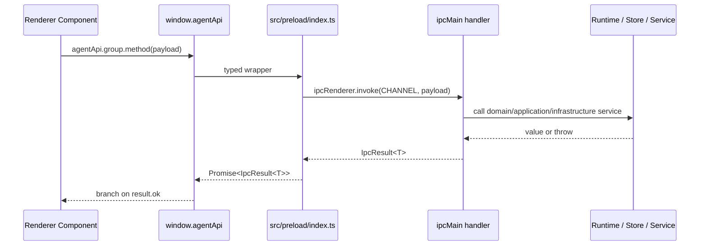
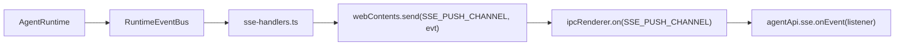

# IPC Contracts

本文记录当前 renderer 到 main 的 IPC 契约、handler 映射、preload 暴露面和错误返回规则。它的目标是防止跨进程改动只更新一层，造成 runtime、preload、renderer 类型或 channel 不一致。

## Authoritative Sources

- IPC channel constants: `src/shared/ipc.ts`
- Request/response contracts: `src/shared/agent-contracts.ts`
- Main handlers: `src/main/ipc/*-handlers.ts`
- Preload API: `src/preload/index.ts`
- Renderer global type: `src/renderer/src/global.d.ts`
- Runtime events: `src/shared/agent-contracts.ts` and `src/main/event-bus.ts`

Renderer must call main through `window.agentApi`; it must not import or invoke `src/main/*` directly.

## IPC Shape

All renderer-invoked handlers return:

```ts
IpcResult<T> = { ok: true; value: T } | { ok: false; code: IpcErrorCode; message: string }
```

Helpers are defined in `src/shared/agent-contracts.ts`:

- `ok(value)`
- `err(code, message)`

Stable error-code values are defined in `src/shared/ipc-errors.ts` and consumed
by main handlers plus renderer-side IPC fallbacks. New handler errors must add a
code there first instead of writing a new string literal directly at the call
site.

Error rules:

- Handler failures must return `err(code, message)`.
- Errors must remain traceable through a stable code and a concrete message.
- Runtime events may additionally emit `runtime_error`, `turn_failed` or other typed events.
- Do not use silent `catch {}` or return ambiguous success values for failed work.

## End-To-End IPC Path



## Channel Registry

`RENDERER_TO_MAIN_CHANNELS` in `src/shared/ipc.ts` is the renderer-callable allowlist. Any new renderer-invoked channel must be added there.

Current groups:

| Group | Preload Namespace | Main Handler File |
| --- | --- | --- |
| Threads | `agentApi.threads.*` | `src/main/ipc/threads-handlers.ts` |
| Turns | `agentApi.turns.*` | `src/main/ipc/turns-handlers.ts` |
| SSE | `agentApi.sse.*` | `src/main/ipc/sse-handlers.ts` |
| Approvals | `agentApi.approvals.*` | `src/main/ipc/approvals-handlers.ts` |
| Goals | `agentApi.goals.*` | `src/main/ipc/goals-handlers.ts` |
| Attachments | `agentApi.attachments.*` | `src/main/ipc/attachments-handlers.ts` |
| Usage | `agentApi.usage.*` | `src/main/ipc/usage-handlers.ts` |
| Workspace | `agentApi.workspace.*` | `src/main/ipc/workspace-handlers.ts` |
| Write mode | `agentApi.write.*` | `src/main/ipc/write-handlers.ts` |
| Model config | `agentApi.modelConfig.*` | `src/main/ipc/model-config-handlers.ts` |
| Runtime preferences | `agentApi.runtimePreferences.*` | `src/main/ipc/runtime-preferences-handlers.ts` |
| MCP | `agentApi.mcp.*` | `src/main/ipc/mcp-handlers.ts` |
| Skills | `agentApi.skills.*` | `src/main/ipc/skills-handlers.ts` |

## Contract Table

### Threads

| Channel | Preload Method | Request | Success Value | Error Codes |
| --- | --- | --- | --- | --- |
| `thread:list` | `threads.list(filter)` | `ThreadListFilter` | `ThreadSummary[]` | `THREAD_LIST_FAILED` |
| `thread:create` | `threads.create(input)` | `ThreadCreateInput` | `ThreadRecord` | `THREAD_CREATE_FAILED` |
| `thread:get` | `threads.get(id)` | `string` | `ThreadRecord` | `THREAD_NOT_FOUND`, `THREAD_GET_FAILED` |
| `thread:update` | `threads.update(id, patch)` | `string`, `ThreadUpdatePatch` | `ThreadRecord` | `THREAD_NOT_FOUND`, `THREAD_STATUS_INVALID`, `THREAD_ARCHIVE_BUSY`, `THREAD_UPDATE_FAILED` |
| `thread:delete` | `threads.delete(id)` | `string` | `{ id: string }` | `THREAD_NOT_FOUND`, `THREAD_DELETE_BUSY`, `THREAD_DELETE_FAILED` |
| `thread:fork` | `threads.fork(parentId)` | `string` | `ThreadRecord` | `THREAD_FORK_FAILED` |

Notes:

- Thread IPC handlers validate request objects, ids, simple enum fields, and
  booleans before store/runtime access; malformed payloads return the existing
  `THREAD_*_FAILED` envelope, with invalid update status preserving
  `THREAD_STATUS_INVALID`.
- `thread:create` rejects `relation: "fork"` without `parentThreadId` and
  rejects `parentThreadId` unless the relation is `fork`; normal fork creation
  should use the dedicated `thread:fork` channel.
- `thread:create` applies `RuntimePreferences.defaultApprovalPolicy` and
  `RuntimePreferences.defaultSandboxMode` when those fields are omitted from
  the request. Explicit request values still win.
- `thread:update` rejects empty patches before store access and blocks
  archiving an in-flight thread.
- `thread:update` accepts `goal` patches only as a complete `ThreadGoal` object
  or `null`; malformed goal objects, including blank `text` or `summary`,
  fail before store access.
- `thread:delete` blocks deleting an in-flight thread.
- `JsonlThreadStore` validates thread ids, patch fields, and boolean list
  filters such as `includeArchived` / `archivedOnly`.

### Turns

| Channel | Preload Method | Request | Success Value | Error Codes |
| --- | --- | --- | --- | --- |
| `turn:start` | `turns.start(request)` | `TurnStartRequest` | `TurnRecord` | `RUNTIME_TURN_BUSY`, `TURN_START_FAILED` |
| `turn:interrupt` | `turns.interrupt(turnId)` | `string` | `{ turnId: string }` | `TURN_INTERRUPT_FAILED` |
| `turn:get` | `turns.get(threadId)` | `string` | `{ threadId: string; items: Item[] }` | `TURN_GET_FAILED` |

Notes:

- `turn:start` returns while the turn is still running.
- Completion and streamed output are delivered through SSE runtime events.
- `turn:get` replays JSONL and dedupes by item id, keeping the latest version.
- `turn:start` delegates to `AgentRuntime.startTurn()`, whose request
  normalization validates field shapes before a turn is created: `threadId`
  and `text` must be non-empty strings, `mode` must be `agent | plan`,
  `reasoningEffort` must be supported, `attachmentIds` must be `string[]`, and
  `goalMode` must be boolean.
- `turn:interrupt` validates that the renderer payload is a non-empty string
  before calling runtime; malformed payloads return `TURN_INTERRUPT_FAILED`.
- `turn:interrupt` also returns `TURN_INTERRUPT_FAILED` when the requested
  turn id is not currently in flight, rather than reporting a stale interrupt
  as success.
- `turn:get` validates that the renderer payload is a non-empty string
  `threadId` before replaying store items; malformed payloads return
  `TURN_GET_FAILED`.

### SSE Runtime Events

| Channel | Preload Method | Request | Success Value | Error Codes |
| --- | --- | --- | --- | --- |
| `sse:subscribe` | `sse.subscribe(request)` | `SseSubscribeRequest` | `{ subscribed: string }` | `SSE_SUBSCRIBE_FAILED` |
| `sse:unsubscribe` | `sse.unsubscribe(request)` | `SseUnsubscribeRequest` | `{ unsubscribed: boolean }` | `SSE_NOT_SUBSCRIBED`, `SSE_UNSUBSCRIBE_FAILED` |
| `sse:subscribe-global` | `sse.subscribeGlobal()` | none | `{ subscribed: true }` | `SSE_SUBSCRIBE_FAILED` |
| `sse:unsubscribe-global` | `sse.unsubscribeGlobal()` | none | `{ unsubscribed: boolean }` | `SSE_NOT_SUBSCRIBED`, `SSE_UNSUBSCRIBE_FAILED` |
| `sse:push` | `sse.onEvent(listener)` | main push only | `RuntimeEvent` payload | not invoke-based |

Notes:

- One `webContents` can keep multiple thread subscriptions at the same time.
  Re-subscribing the same thread replaces that thread's existing subscription
  without dropping other subscribed threads.
- One `webContents` can also keep a global subscription for process-level events
  that do not have a `threadId`; this is how Settings receives MCP status and
  surface updates even when no thread is subscribed.
- Subscribe and unsubscribe trim `threadId` before using it as the subscription key.
- Subscriptions are live-only; the current handler does not replay historical events.

### Approvals

| Channel | Preload Method | Request | Success Value | Error Codes |
| --- | --- | --- | --- | --- |
| `approval:respond` | `approvals.respond(request)` | `ApprovalRespondRequest` | `{ approvalId; decision }` | `APPROVAL_RESPOND_FAILED` |

Notes:

- Pending approval state is in-memory in `AgentRuntime`.
- Handler validates that `approvalId` is a non-empty string and `decision` is
  `allow` or `deny` before touching runtime pending-approval state.
- If the approval id is not pending, runtime throws and handler returns `APPROVAL_RESPOND_FAILED`.

### Goals

| Channel | Preload Method | Request | Success Value | Error Codes |
| --- | --- | --- | --- | --- |
| `goal:update` | `goals.update(request)` | `GoalUpdateRequest` | `ThreadRecord` | `GOAL_UPDATE_FAILED` |

Notes:

- `request.clear === true` maps to `goal: null`; non-boolean `clear` values return
  `GOAL_UPDATE_FAILED` instead of using JavaScript truthiness.
- `goal:update` rejects empty updates, blank goal/summary text, and `clear`
  combined with `goal`, `status`, or `summary`.
- Handler validates `threadId`, `goal`, `status` and `summary` before calling
  runtime; `status` must be `active`, `complete` or `blocked`.
- Runtime emits `goal_updated` after persistence succeeds.
- Archived threads cannot update goals through runtime.

### Attachments

| Channel | Preload Method | Request | Success Value | Error Codes |
| --- | --- | --- | --- | --- |
| `attachment:create` | `attachments.create(request)` | `AttachmentCreateRequest` | `AttachmentRecord` | `ATTACHMENT_CREATE_FAILED` |
| `attachment:get` | `attachments.get(id)` | `string` | `AttachmentRecord & { dataBase64: string }` | `ATTACHMENT_NOT_FOUND`, `ATTACHMENT_GET_FAILED` |
| `attachment:delete` | `attachments.delete(id)` | `{ id }` via preload | `AttachmentDeleteResponse` | `ATTACHMENT_DELETE_FAILED` |

Notes:

- Attachment IPC handlers validate request objects and id/string fields before
  store access so malformed create/get/delete payloads return the existing
  `ATTACHMENT_*_FAILED` envelope without touching persistence.
- Store and renderer composer share `SUPPORTED_ATTACHMENT_MIME_TYPES` from
  `src/shared/agent-contracts.ts`; accepted image mime types are PNG, JPEG,
  WebP, and GIF.
- Store and renderer composer share `MAX_ATTACHMENT_BYTES` from
  `src/shared/agent-contracts.ts`; the renderer pre-check avoids reading or
  uploading images over the same 12 MB limit that the store enforces.
- Attachment data is stored as binary files, not in `UserItem.attachments`.

### Usage

| Channel | Preload Method | Request | Success Value | Error Codes |
| --- | --- | --- | --- | --- |
| `usage:daily` | `usage.daily(request?)` | `UsageDailyRequest?` | `UsageDailyBucket[]` | `USAGE_DAILY_FAILED` |

Notes:

- Omitted request uses the default window; a present request must be an object,
  and `days`, when provided, must be a positive integer before aggregation starts.
- Default window is 30 days.
- Maximum window is `MAX_USAGE_DAYS` from `src/main/application/constants.ts`
  (currently 180 days).
- Handler uses a 10-second cache per store and day count.
- Daily buckets are generated by local calendar dates, so daylight-saving time
  transitions do not duplicate or skip bucket labels.
- Data comes from persisted `turn_completed` runtime events.

### Workspace

| Channel | Preload Method | Request | Success Value | Error Codes |
| --- | --- | --- | --- | --- |
| `workspace:pick-directory` | `workspace.pickDirectory()` | none | `WorkspacePickDirectoryResponse` | `WORKSPACE_PICK_DIRECTORY_FAILED` |

Notes:

- Main process owns the Electron directory picker.
- Response is `{ canceled, path }`.
- Canceled selection returns `ok({ canceled: true, path: null })`; a non-canceled
  picker result without a selected path is treated as
  `WORKSPACE_PICK_DIRECTORY_FAILED`.

### Write Mode

| Channel | Preload Method | Request | Success Value | Error Codes |
| --- | --- | --- | --- | --- |
| `write:list` | `write.list(request)` | `WriteListRequest` | `WriteFileEntry[]` | `WRITE_LIST_FAILED` |
| `write:get` | `write.get(request)` | `WriteGetRequest` | `{ path; content }` | `WRITE_GET_FAILED` |
| `write:put` | `write.put(request)` | `WritePutRequest` | `{ path; bytes }` | `WRITE_PUT_FAILED` |
| `write:create` | `write.create(request)` | `WriteCreateRequest` | `{ path; content; bytes }` | `WRITE_CREATE_FAILED` |
| `write:rename` | `write.rename(request)` | `WriteRenameRequest` | `{ path; newPath }` | `WRITE_RENAME_FAILED` |
| `write:delete` | `write.delete(request)` | `WriteDeleteRequest` | `{ path }` | `WRITE_DELETE_FAILED` |
| `write:complete` | `write.complete(request)` | `WriteCompleteRequest` | `WriteCompleteResponse` | `WRITE_COMPLETE_FAILED` |

Notes:

- Write IPC handlers validate request objects and string field types before
  entering filesystem access, then return the existing `WRITE_*_FAILED`
  envelope for malformed payloads.
- `write.get` reads Markdown as strict UTF-8 through the shared no-follow
  final-component open boundary and fails instead of returning replacement
  characters for invalid bytes or following a symlink swapped in after path
  validation.
- `write.put` performs a plain UTF-8 file write after workspace path validation,
  then revalidates the path after parent directory creation so a newly created
  parent cannot be swapped to a symlink outside the workspace before commit.
- `write.create` creates Markdown files with exclusive create semantics and
  never overwrites an existing document.
- `write.rename` rejects identical source/target paths, reads the source through
  the same no-follow Markdown text boundary, writes an exclusive no-follow
  target, and removes the source only after the target write succeeds.
- `write.delete` removes a single Markdown file after the same workspace and
  extension policy checks.

- Write `workspace` must be an absolute path.
- Write file paths are workspace-relative.
- Write file paths must target `.md`, `.mdx`, or `.markdown` files.
- Access uses the shared workspace path policy and realpath checks to prevent
  path escape; Write IPC adds only the Markdown file constraint on top.
- Skipped directories include dot directories, `DeepSeek`, `dist`, `external-references`, `node_modules`, and `out`.
- Inline complete is currently local Markdown pattern completion, not an LLM request.

### Model Config

| Channel | Preload Method | Request | Success Value | Error Codes |
| --- | --- | --- | --- | --- |
| `config:model:get` | `modelConfig.get()` | none | `ModelConfig` | `MODEL_CONFIG_GET_FAILED` |
| `config:model:update` | `modelConfig.update(update)` | `ModelConfigUpdate` | `ModelConfig` | `MODEL_CONFIG_UPDATE_FAILED` |
| `config:model:profiles:list` | `modelConfig.listProfiles()` | none | `ModelConfigProfilesState` | `MODEL_CONFIG_PROFILES_LIST_FAILED` |
| `config:model:profiles:create` | `modelConfig.createProfile(request)` | `ModelConfigProfileCreateRequest` | `ModelConfigProfilesState` | `MODEL_CONFIG_PROFILES_CREATE_FAILED` |
| `config:model:profiles:update` | `modelConfig.updateProfile(request)` | `ModelConfigProfileUpdateRequest` | `ModelConfigProfile` | `MODEL_CONFIG_PROFILES_UPDATE_FAILED` |
| `config:model:profiles:delete` | `modelConfig.deleteProfile(request)` | `ModelConfigProfileDeleteRequest` | `ModelConfigProfilesState` | `MODEL_CONFIG_PROFILES_DELETE_FAILED` |
| `config:model:profiles:activate` | `modelConfig.activateProfile(request)` | `ModelConfigProfileActivateRequest` | `ModelConfigProfilesState` | `MODEL_CONFIG_PROFILES_ACTIVATE_FAILED` |

Notes:

- Store always keeps at least one profile.
- `ModelConfigStore.get()` returns only the active profile config.
- Model config profiles and runtime preferences are stored in the same
  `userData/config` file; the IPC namespaces stay split so callers only touch
  the section they need.
- Non-empty `OPENAI_API_KEY` values are encrypted by the main-process config
  persistence boundary before they are written to `userData/config`; IPC and
  renderer code still receive the existing plain `ModelConfig` shape.
- Runtime resolves a turn profile by explicit id, Code/Write default profile id
  from `RuntimePreferences`, model match, active profile, then first profile.
- Deleting a profile also clears Code/Write default profile ids in
  `RuntimePreferences` when they reference the deleted profile.
- Profile creation validates `activate` as a strict boolean; non-boolean truthy
  values return `MODEL_CONFIG_PROFILES_CREATE_FAILED` and cannot change the active
  profile.
- Profile update/delete/activate handlers validate non-empty profile ids before
  store access. Profile update rejects non-object `config` payloads instead of
  treating them as no-op updates.
- `config:model:update` and profile `config` payloads validate primitive field
  types at the IPC boundary, including `thinking`, `OPENAI_API_KEY`, reasoning
  effort, autonomy, `protocol` and positive integer token settings.
- `protocol` accepts only `openai-compatible` or `anthropic-compatible`.
  Unsupported values return the existing model-config error envelope and are
  not persisted.
- Store-level active config and profile updates run the same primitive field
  validation and also reject empty or unknown-only payloads, so direct
  persistence calls cannot silently default malformed values or report a save
  that only changes `updatedAt`.

### Runtime Preferences

| Channel | Preload Method | Request | Success Value | Error Codes |
| --- | --- | --- | --- | --- |
| `runtime-preferences:get` | `runtimePreferences.get()` | none | `RuntimePreferences` | `RUNTIME_PREFERENCES_GET_FAILED` |
| `runtime-preferences:update` | `runtimePreferences.update(update)` | `RuntimePreferencesUpdate` | `RuntimePreferences` | `RUNTIME_PREFERENCES_UPDATE_FAILED` |

Notes:

- Preferences are persisted by `RuntimePreferencesStore` in the
  `runtimePreferences` section of `userData/config`.
- Legacy `userData/runtime-preferences.json` is a migration input only when
  `userData/config` has no runtime preferences section; config data wins if
  both are present.
- Update payloads must be objects and include at least one recognized field.
- `defaultApprovalPolicy` / `defaultSandboxMode` reuse shared thread enum
  guards; model profile ids are trimmed non-empty strings or `null`, and
  non-null Code/Write defaults must reference existing profiles.
- `toolAvailability` validates mode names, tool names and boolean values before
  persistence. AgentRuntime uses it to filter tool definitions sent to the model
  and to reject forced calls to disabled tools.
- `command.timeoutMs` and `command.maxOutputBytes` must stay within shared
  integer bounds from `src/shared/agent-contracts.ts`; command-backed shell,
  Git, package/task, session-start, and workspace diagnostics tools consume
  those defaults.
- `skills.extraRoots` update entries are trimmed, empty entries are dropped,
  NUL bytes are rejected, and duplicates collapse by first occurrence before
  persistence.
- `approvalExperience` and `compaction` are persisted runtime preference
  contracts. `approvalExperience` controls renderer presentation only, while
  `compaction` is consumed by runtime message preparation before model
  requests. Unsupported stored shapes normalize to defaults on read and
  malformed update payloads fail before store access.
- `mcpServers` stores external MCP server configs. `stdio` servers require a
  command; `streamable-http` servers require an HTTP(S) URL and may carry
  request headers. Server `id` / `name` values must be unique, and `name` values
  must also produce unique MCP namespace segments after `toMcpNameSegment()`, so
  `/mcp__<server>__...` and `@<server>:...` aliases cannot point at multiple
  servers. Any present `url` field must be HTTP(S), even when the selected
  transport is `stdio`. Env/header records reject NUL bytes and duplicate keys
  after trimming, so malformed config cannot silently overwrite a value.
  Settings writes the config through this same preferences channel, then the
  main composition root reconfigures `McpHost`.

### Skills

| Channel | Preload Method | Request | Success Value | Error Codes |
| --- | --- | --- | --- | --- |
| `skills:list` | `skills.list(request)` | `SkillListRequest` | `SkillListResponse` | `SKILL_LIST_FAILED` |

Notes:

- `skills:list` is a read-only Settings diagnostics surface. It loads the active
  workspace catalog with the current `RuntimePreferences.skills` values and
  returns discovered skill summaries, scan roots and validation warnings.
- The response intentionally excludes full `SKILL.md` bodies and
  `references/*.md` contents. Full inline skill instructions remain available
  only through runtime context injection or the `run_skill` tool path.
- The request must be an object with a non-empty `workspace` string and no NUL
  bytes; malformed payloads return `SKILL_LIST_FAILED`.

### MCP

| Channel | Preload Method | Request | Success Value | Error Codes |
| --- | --- | --- | --- | --- |
| `mcp:servers:list` | `mcp.listServers()` | none | `McpServerListResponse` | `MCP_SERVER_LIST_FAILED` |
| `mcp:servers:connect` | `mcp.connect(request)` | `McpServerConnectRequest` | `McpServerStatusRecord` | `MCP_SERVER_CONNECT_FAILED` |
| `mcp:servers:disconnect` | `mcp.disconnect(request)` | `McpServerDisconnectRequest` | `McpServerStatusRecord` | `MCP_SERVER_DISCONNECT_FAILED` |
| `mcp:tools:list` | `mcp.listTools(request?)` | `McpServerToolsRequest?` | `McpServerToolsResponse` | `MCP_TOOL_LIST_FAILED` |
| `mcp:tools:refresh` | `mcp.refreshTools(request)` | `McpServerRefreshToolsRequest` | `McpServerStatusRecord` | `MCP_TOOL_REFRESH_FAILED` |
| `mcp:surface:refresh` | `mcp.refreshSurface(request)` | `McpServerRefreshToolsRequest` | `McpServerStatusRecord` | `MCP_SURFACE_REFRESH_FAILED` |
| `mcp:prompts:list` | `mcp.listPrompts(request?)` | `McpServerPromptsRequest?` | `McpServerPromptsResponse` | `MCP_PROMPT_LIST_FAILED` |
| `mcp:prompts:get` | `mcp.getPrompt(request)` | `McpPromptGetRequest` | `McpPromptResult` | `MCP_PROMPT_GET_FAILED` |
| `mcp:resources:list` | `mcp.listResources(request?)` | `McpServerResourcesRequest?` | `McpServerResourcesResponse` | `MCP_RESOURCE_LIST_FAILED` |
| `mcp:resources:read` | `mcp.readResource(request)` | `McpResourceReadRequest` | `McpResourceReadResult` | `MCP_RESOURCE_READ_FAILED` |

Notes:

- `McpHost` is main-process only. Renderer access is limited to status,
  connect/disconnect, tools, prompts and resources through `agentApi.mcp.*`.
- `McpClient` supports `stdio` and Streamable HTTP transports. Streamable HTTP
  preserves `Mcp-Session-Id` across requests and accepts JSON or SSE JSON-RPC
  responses.
- MCP tools are registered into the existing `ToolRegistry` as
  `mcp__<server>__<tool>`, then flow through runtime tool availability,
  sandbox, approval and `permissionRules` like other tools. A live tools/list
  response must not contain two raw tool names that normalize to the same
  namespaced tool id.
- `McpServerStatusRecord.status` includes `cached` and `lazy` in addition to
  disconnected/connecting/connected/failed. `cached` means matching schema was
  loaded from `McpCacheStore`; `lazy` means a live reconnect failed but cached
  tool schema remains registered for a later retry.
- `McpServerStatusRecord.lastStartupDurationMs`,
  `startupSuccessCount`, and `startupFailureCount` expose startup stats from
  the MCP cache store. They are observations, not user-editable config.
- MCP prompt and resource surface APIs are separate from model tool calls.
  The Code composer resolves `/mcp__<server>__<prompt>` and
  `@<server>:<uri>` before `turn:start`, preserving the visible input in
  `displayText` while sending resolved prompt/resource context as `text`.
  A live prompt surface must not contain two prompt names that normalize to the
  same slash-command segment, and each prompt descriptor must expose non-empty
  argument names that stay unique after trimming. `mcp:prompts:get` prompt
  arguments must be a string record whose trimmed keys are unique and contain no
  NUL bytes.
  Resource URI parsing preserves punctuation inside the non-whitespace URI token
  and trims only surrounding prose punctuation before `mcp:resources:read`.
- Prompt/resource list results may come from cached surface descriptors.
  `mcp:prompts:get` and `mcp:resources:read` force a live lazy connect before
  returning content.
- MCP prompt/resource surface refresh is auxiliary. A surface refresh failure
  records `lastError` on the server status but does not unregister already
  connected MCP tools.
- Streamable HTTP transport returns bounded status-only failures. 401/403
  responses add auth diagnostics that mention whether credentials are present
  in headers, env or URL without echoing credential values or response bodies.
- MCP request parsers reject malformed objects, blank required strings and NUL
  bytes before touching `McpHost`.

## Runtime Event Push Contract

`RuntimeEvent` is not returned from `ipcRenderer.invoke()`. Main process pushes it through `SSE_PUSH_CHANNEL`.
The preload bridge validates each pushed payload with `isRuntimeEvent()` before
notifying renderer listeners, so malformed push payloads are dropped instead of
entering renderer state.



`sse-handlers.ts` keeps thread-scoped events on per-thread subscriptions. A
`runtime_error` without `threadId` is treated as a global process-level error.
Global process-level events are forwarded once per window with either an active
thread subscription or an explicit global subscription, even if that window has
multiple active thread subscriptions.

Current `RuntimeEvent.kind` values:

- `turn_started`
- `turn_completed`
- `turn_failed`
- `item_appended`
- `item_updated`
- `approval_requested`
- `tool_progress`
- `mcp_server_connection`
- `mcp_tool_list_changed`
- `mcp_surface_changed`
- `tool_budget_reached`
- `goal_updated`
- `runtime_error`

`tool_progress` is pushed through the existing `sse:push` channel, not a new
renderer-invoked IPC channel. Its payload identifies the running tool by
`toolCallId`, separates `stdout` and `stderr`, and carries a monotonically
increasing `seq` scoped to that tool call.

`turn_started` carries `turn: TurnRecord` in addition to `threadId`, `turnId`,
and `startedAt`; renderer consumers should use `event.turn` as the authoritative
in-flight turn metadata. The shared runtime event guard requires those repeated
top-level fields to match `turn.threadId`, `turn.id`, and `turn.startedAt`; for
`item_appended` / `item_updated`, `event.threadId` and `event.turnId` must match
the nested `item.threadId` and `item.turnId`.

MCP runtime events are process-level events without `threadId`. `sse-handlers.ts`
forwards `mcp_server_connection`, `mcp_tool_list_changed`, and
`mcp_surface_changed` once per window with either a thread subscription or a
global subscription; `Workbench` ignores them for chat timelines, while Settings
uses `sse.subscribeGlobal()` and refreshes MCP server status from the MCP IPC
surface.

When adding a runtime event, update:

- `src/shared/agent-contracts.ts`
- `src/main/event-bus.ts`
- producer code in runtime or related service
- renderer consumer logic, if user-visible
- tests

## Adding A New IPC

Required sequence:

1. Define request/response types in `src/shared/agent-contracts.ts` when a typed payload is needed.
2. Add channel constant to `src/shared/ipc.ts`.
3. Add the constant to `RENDERER_TO_MAIN_CHANNELS`.
4. Add any new error-code value to `src/shared/ipc-errors.ts`.
5. Add or update a handler in `src/main/ipc/*-handlers.ts`.
6. Ensure handler returns `ok(...)` or `err(IPC_ERROR_CODES.*, message)`.
7. Register the handler in `src/main/index.ts`.
8. Expose a minimal wrapper in `src/preload/index.ts`.
9. Confirm `src/renderer/src/global.d.ts` still derives `AgentDesktopApi` from preload.
10. Update renderer call sites.
11. Add or update tests.

Search checklist:

```bash
rg "new-channel-name|NewRequestType|agentApi\\.newGroup" src tests docs
```

## IPC Change Risks

- Adding a channel constant but forgetting `RENDERER_TO_MAIN_CHANNELS`.
- Updating handler return shape without updating preload and renderer expectations.
- Throwing from handler instead of returning `IpcResult.err`.
- Creating a renderer API that exposes broader main process access than needed.
- Returning raw binary payloads through timeline item metadata instead of dedicated attachment/file services.
- Adding a path-taking API without realpath/path escape checks.

## Verification

For IPC code changes:

```bash
npm run typecheck
npm run test
npm run build
```

For documentation-only IPC updates:

```bash
git diff --check -- docs/ipc-contracts.md
```

Also verify all referenced channel constants and methods still exist with `rg`.
