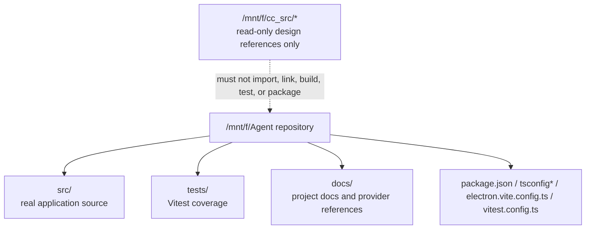
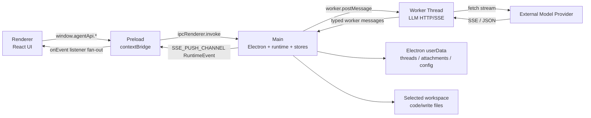
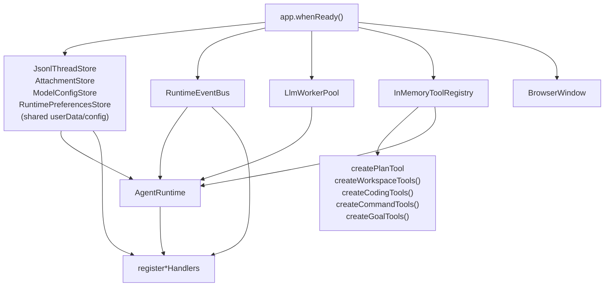

# Project Map

本文是给后续 Agent 和维护者使用的项目快速地图。它回答三个问题：

- 这个项目是什么。
- 代码从哪里进、沿哪些边界流动。
- 修改某类能力时必须先看哪些文件。

本文描述当前仓库真实实现，不描述目标态或外部参考项目。

## One-Page Summary

`agent-pyramid-desktop` 是一个 Electron + Vite + React + TypeScript 桌面 Agent Workbench。当前主路径是：

```text
renderer React
  -> window.agentApi
  -> preload contextBridge
  -> ipcMain handlers
  -> AgentRuntime / stores / event bus / tool registry
  -> LlmWorkerPool
  -> worker_threads
  -> MiniMaxGateway
  -> provider HTTP API
```

核心事实：

- 桌面进程边界是 `main / preload / renderer / worker` 四层。
- 跨进程契约权威来源是 `src/shared/agent-contracts.ts`。
- IPC channel 权威来源是 `src/shared/ipc.ts`。
- Agent 运行时唯一主入口是 `src/main/application/agent-runtime.ts`。
- Electron 组合根是 `src/main/index.ts`。
- Renderer 状态中心是 `src/renderer/src/ui/store/WorkbenchContext.tsx`。
- Preload 只暴露 `window.agentApi`，renderer 不直接访问 Node 或 `src/main/`。
- 持久化写入 Electron `userData`，不是仓库目录。

## Repository Boundaries



允许作为当前项目实现依据的区域：

- `src/main/`
- `src/preload/`
- `src/renderer/`
- `src/shared/`
- `tests/`
- `docs/`
- 根目录构建与测试配置文件

禁止误判：

- `/mnt/f/cc_src/*` 不是本项目源码、依赖或构建输入。
- `docs/minimax/` 是本地协议资料，不是运行时代码。
- `out/`、`dist/`、`node_modules/` 是生成物或依赖目录，不应作为实现权威来源。

## Process Map



安全边界：

- `src/main/index.ts` 创建 `BrowserWindow` 时保持 `contextIsolation: true` 和 `nodeIntegration: false`。
- `src/preload/index.ts` 是 renderer 到 main 的唯一桥。
- 文件系统访问留在 main process handlers、stores 和 workspace tools。
- 外部 URL 导航由 main process 拦截并通过 `shell.openExternal()` 打开。

## Module Responsibility Map

| Area | Primary Files | Responsibility |
| --- | --- | --- |
| Main composition | `src/main/index.ts` | 创建 stores、event bus、worker pool、tool registry、AgentRuntime，注册 IPC handlers，创建窗口。 |
| Runtime orchestration | `src/main/application/agent-runtime.ts` | 多 turn 编排、模型 profile 解析、附件注入、上下文预算、LLM worker 调用、工具循环、approval gate、中断和事件广播。 |
| Tool system | `src/main/application/tools/*`、`src/main/domain/agent/ports.ts` | 工具定义、注册、执行接口和内置工具。 |
| LLM worker | `src/main/infrastructure/llm-worker/*` | main 到 worker 的请求路由、流式 chunk 转发和取消。 |
| Provider gateway | `src/main/infrastructure/minimax/*` | MiniMax、DeepSeek、自定义 OpenAI-compatible 请求适配；Anthropic-compatible 映射保留在 gateway 层并有单元测试，但当前 runtime profile 仍固定发送 OpenAI-compatible 请求。 |
| Persistence | `src/main/persistence/*` | 线程 JSONL、附件、模型配置 profiles、runtime preferences 的 userData 持久化。 |
| IPC handlers | `src/main/ipc/*-handlers.ts` | 将 renderer 调用映射到 runtime、stores 和文件服务，统一返回 `IpcResult<T>`。 |
| Preload bridge | `src/preload/index.ts` | 暴露 `window.agentApi`，隐藏 Electron IPC 细节。 |
| Shared contracts | `src/shared/agent-contracts.ts`、`src/shared/ipc.ts`、`src/shared/locale.ts` | 跨进程类型、IPC channel 常量和语言列表权威来源。 |
| Renderer shell | `src/renderer/src/ui/AppShell.tsx`、`src/renderer/src/ui/Workbench.tsx`、`src/renderer/src/ui/SettingsView.tsx` | 路由、工作台、设置页和主要交互流程。 |
| Renderer state | `src/renderer/src/ui/store/WorkbenchContext.tsx` | `useReducer` 状态中心，不使用外部状态库。 |
| UI components | `src/renderer/src/ui/components/**` | sidebar、topbar、composer、timeline、inspector、write、settings 和 primitives。 |
| UI styles | `src/renderer/src/ui/styles/tokens.css`、`src/renderer/src/ui/styles/shell.css` | `--ds-*` design token 与 shell layout 样式入口。 |
| i18n | `src/renderer/src/i18n/**`、`src/shared/locale.ts` | 中英文资源、语言初始化和可选语言列表。 |
| Tests | `tests/**` | runtime、IPC、persistence、gateway、shared contracts、renderer reducer/components 的 Vitest 覆盖。 |

## Main Composition Root

`src/main/index.ts` 是应用对象图的组合根。



新增主进程能力时，先判断它属于哪一类：

- Agent turn 行为：优先看 `AgentRuntime`。
- 持久化格式：优先看 `src/shared/agent-contracts.ts` 和 `src/main/persistence/*`。
- renderer 可调用能力：必须经过 `src/shared/ipc.ts`、`src/main/ipc/*`、`src/preload/index.ts`、`src/renderer/src/global.d.ts`。
- LLM 请求协议：优先看 `src/main/domain/agent/types.ts` 和 `src/main/infrastructure/minimax/minimax-gateway.ts`。
- UI 交互状态：优先看 `WorkbenchContext.tsx`，再看调用组件。

## Feature Entry Points

| Feature | Start Here | Then Check |
| --- | --- | --- |
| Start a turn | `src/renderer/src/ui/Workbench.tsx` | `src/preload/index.ts`、`src/main/ipc/turns-handlers.ts`、`src/main/application/agent-runtime.ts` |
| Stream runtime events | `src/main/event-bus.ts` | `src/main/ipc/sse-handlers.ts`、`src/preload/index.ts`、`Workbench.tsx` |
| Add or change IPC | `src/shared/ipc.ts` | `src/shared/agent-contracts.ts`、`src/main/ipc/*`、`src/preload/index.ts`、`src/renderer/src/global.d.ts` |
| Add tool | `src/main/domain/agent/types.ts` | `src/main/application/tools/*`、`src/main/index.ts`、`AgentRuntime.listToolDefinitionsForTurn()`、`AgentRuntime` tool access policy、`AgentRuntime.resolveToolPolicy()` |
| Change thread data | `src/shared/agent-contracts.ts` | `src/main/persistence/index.ts`、IPC handlers、renderer state and tests |
| Change model config | `src/shared/agent-contracts.ts` | `src/main/persistence/model-config-store.ts`、`src/main/ipc/model-config-handlers.ts`、`SettingsView.tsx` |
| Change runtime preferences | `src/shared/agent-contracts.ts` | `src/main/persistence/runtime-preferences-store.ts`、`src/main/ipc/runtime-preferences-handlers.ts`、`src/preload/index.ts`、`AgentRuntime` |
| Change attachments | `src/shared/agent-contracts.ts` | `src/main/persistence/attachment-store.ts`、`src/main/ipc/attachments-handlers.ts`、composer/runtime attachment injection |
| Change write mode | `src/main/ipc/write-handlers.ts` | `src/renderer/src/ui/components/write/WriteWorkspaceView.tsx`、write IPC contracts |
| Change base UI layout | `docs/ui-design.md` | `docs/ui-layout-reference.md`、`tokens.css`、`shell.css`、component tests |
| Add i18n text | `src/renderer/src/i18n/locales/zh-CN/translation.json` | English translation file and any consuming component |

## Current Runtime Facts

- There is one primary Agent runtime path: `AgentRuntime`.
- `turns.start()` returns quickly with an in-flight `TurnRecord`.
- Completion, failure, streamed text and tool updates arrive through `RuntimeEvent`.
- `RuntimeEvent` values are emitted by `RuntimeEventBus` and forwarded through `SSE_PUSH_CHANNEL`.
- Tools are exposed to the model through `ToolRegistry.listDefinitions()`.
- Tool execution goes through `ToolRegistry.execute()`; direct tool bypass is not part of the architecture.
- Read-only workspace tools skip approval.
- `edit_file` / `write_file` / `apply_patch` require approval, strict UTF-8 text, and fresh read-state before writing existing files.
- `rollback_file` uses in-memory runtime file history to undo the latest agent write when the current file still matches that history entry.
- `run_command` runs foreground workspace commands with timeout, output truncation, interrupt cancellation, and approval.
- `diagnose_workspace` runs workspace TypeScript/typecheck diagnostics through command execution and therefore requires approval; `diagnose_file` uses TypeScript Language Service for file-level diagnostics and remains read-only.
- Write threads use `AgentRuntime` tool access policy and persisted
  `RuntimePreferences.toolAvailability` to hide and reject Code-only
  coding/command tools by default; policy overrides can allow or deny
  individual tool names per thread mode before approval/sandbox checks run.
- `create_plan` is only available in plan mode.
- `update_goal` is only available in goal mode or when a thread has an active goal.
- Model configuration profiles are persisted by `ModelConfigStore`; runtime
  receives only the selected `ModelConfig`.
- Runtime preferences are persisted by `RuntimePreferencesStore` in the same
  `userData/config` file; runtime uses them for thread-mode default profile
  selection and known-tool availability.

## Data Ownership

| Concept | Authority | Persisted By |
| --- | --- | --- |
| Thread and turn contracts | `src/shared/agent-contracts.ts` | `JsonlThreadStore` |
| Timeline items | `src/shared/agent-contracts.ts` | `JsonlThreadStore.messages.jsonl` |
| Runtime events | `src/shared/agent-contracts.ts` | `JsonlThreadStore.events.jsonl` |
| Attachment metadata | `src/shared/agent-contracts.ts` | `AttachmentStore.index.json` |
| Attachment bytes | `AttachmentStore` | `attachments/<id>.bin` |
| Model config profiles | `src/shared/agent-contracts.ts` | `ModelConfigStore` via `userData/config` |
| Runtime preferences | `src/shared/agent-contracts.ts` | `RuntimePreferencesStore` via `userData/config` |
| IPC channel names | `src/shared/ipc.ts` | Not persisted |
| Renderer basic preferences | `src/renderer/src/ui/preferences.ts` | `localStorage` |
| Supported locales | `src/shared/locale.ts` | Not persisted |

## Test Map

| Change Area | Relevant Tests |
| --- | --- |
| Shared contracts | `tests/shared/agent-contracts.test.ts` |
| Runtime turn loop | `tests/main/application/agent-runtime.test.ts` |
| Tools | `tests/main/application/tools.test.ts` |
| Event bus | `tests/main/event-bus.test.ts` |
| Worker pool | `tests/main/infrastructure/worker-pool.test.ts` |
| Provider gateway | `tests/main/infrastructure/minimax-gateway.test.ts`、`tests/main/infrastructure/minimax-types.test.ts` |
| Thread persistence | `tests/main/persistence/jsonl-thread-store.test.ts` |
| Attachments | `tests/main/persistence/attachment-store.test.ts` |
| Model config | `tests/main/persistence/model-config-store.test.ts` |
| Runtime preferences / shared config migration | `tests/main/persistence/runtime-preferences-store.test.ts` |
| IPC handlers | `tests/main/ipc/*-handlers.test.ts` |
| Renderer state/components | `tests/renderer/*.test.ts`、`tests/renderer/*.test.tsx` |

For code changes, the normal verification suite is:

```bash
npm run typecheck
npm run test
npm run build
```

For documentation-only changes, verify:

```bash
git diff --check -- docs/<changed-file>.md
```

and confirm referenced paths exist.

## Common Agent Mistakes To Avoid

- Do not reintroduce an old single-turn runtime path.
- Do not add renderer direct imports from `src/main/`.
- Do not add new renderer-callable IPC without updating `RENDERER_TO_MAIN_CHANNELS`.
- Do not change shared fields in only one layer.
- Do not swallow handler/runtime errors; return `IpcResult.err(code, message)` or emit a traceable `RuntimeEvent`.
- Do not write base64 attachment bytes into timeline item metadata.
- Do not use external reference directories as implementation inputs.
- Do not add UI copy without updating both `zh-CN` and `en`.
- Do not change design tokens/layout grammar without updating `docs/ui-design.md`.

## Recommended Reading Order For A New Agent

1. `AGENTS.md`
2. `docs/project-map.md`
3. `docs/architecture.md`
4. `docs/runtime-flow.md`
5. `docs/ipc-contracts.md`
6. `docs/data-model.md`
7. `docs/ui-layout-reference.md` when touching UI
8. `docs/ui-design.md` when touching design tokens, layout or component style
9. Relevant source files and tests for the target change
