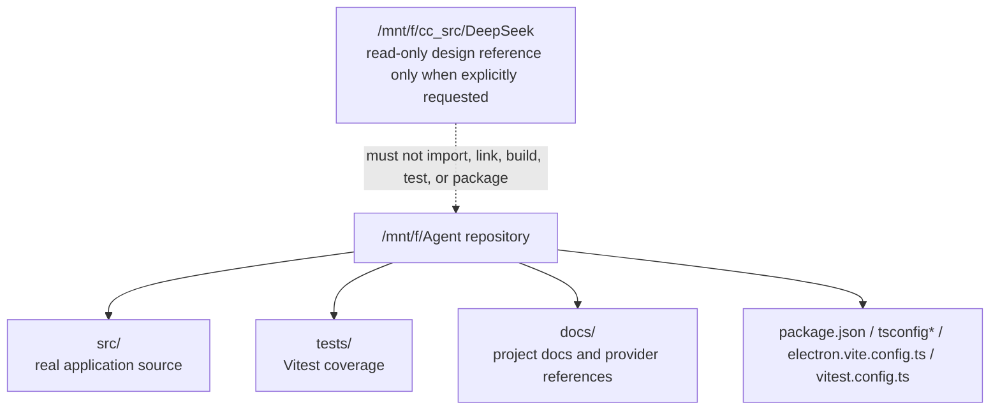
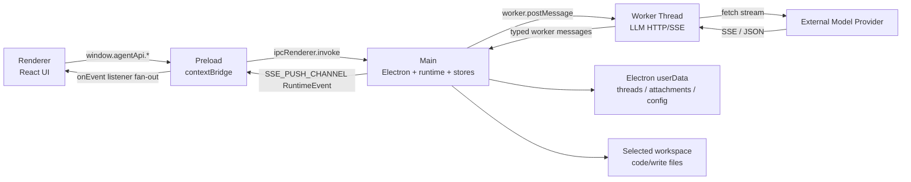
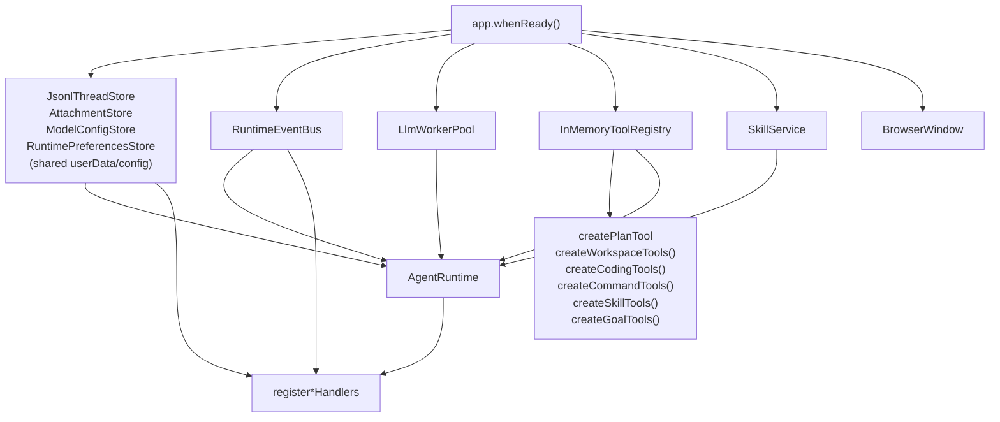

# Project Map

本文是给后续 Agent 和维护者使用的项目快速地图。它回答三个问题：

- 这个项目是什么。
- 代码从哪里进、沿哪些边界流动。
- 修改某类能力时必须先看哪些文件。

本文描述当前仓库真实实现，不描述目标态或外部参考项目。

## One-Page Summary

`agent-pyramid-desktop` 是一个 Electron + Vite + React + TypeScript 桌面 Agent Workbench。当前主路径是：

```text
renderer React
  -> window.agentApi
  -> preload contextBridge
  -> ipcMain handlers
  -> AgentRuntime / stores / event bus / tool registry
  -> LlmWorkerPool
  -> worker_threads
  -> MiniMaxGateway
  -> provider HTTP API
```

核心事实：

- 桌面进程边界是 `main / preload / renderer / worker` 四层。
- 跨进程契约统一出口是 `src/shared/agent-contracts.ts`；低层分组可拆在
  `src/shared/*-contracts.ts` 后由统一出口 re-export。
- `src/shared/agent-api.ts` 是 `window.agentApi` 的类型契约来源；renderer
  的全局类型从这里导入，而不是从 preload 反向取类型。
- IPC channel 权威来源是 `src/shared/ipc.ts`。
- Agent 运行时唯一主入口是 `src/main/application/agent-runtime.ts`。
- Electron 组合根是 `src/main/index.ts`。
- Renderer 状态中心是 `src/renderer/src/ui/store/WorkbenchContext.tsx`。
- Preload 只暴露 `window.agentApi`，renderer 不直接访问 Node 或 `src/main/`。
- 持久化写入 Electron `userData`，不是仓库目录。

## Repository Boundaries



允许作为当前项目实现依据的区域：

- `src/main/`
- `src/preload/`
- `src/renderer/`
- `src/shared/`
- `tests/`
- `docs/`
- 根目录构建与测试配置文件

禁止误判：

- `/mnt/f/cc_src/DeepSeek` 不是本项目源码、依赖或构建输入；仅在任务明确要求参考 DeepSeek GUI 时可只读查看。
- `docs/external-references/` 及其子目录不是本项目源码或项目文档，不纳入普通搜索、审计、构建、测试或文档维护范围。
- `out/`、`dist/`、`node_modules/` 是生成物或依赖目录，不应作为实现权威来源。

## Process Map



安全边界：

- `src/main/index.ts` 创建 `BrowserWindow` 时保持 `contextIsolation: true` 和 `nodeIntegration: false`。
- `src/preload/index.ts` 是 renderer 到 main 的唯一桥。
- 文件系统访问留在 main process handlers、stores 和 workspace tools。
- 外部 URL 导航由 main process 拦截并通过 `shell.openExternal()` 打开。

## Module Responsibility Map

| Area | Primary Files | Responsibility |
| --- | --- | --- |
| Main composition | `src/main/index.ts` | 创建 stores、event bus、worker pool、tool registry、AgentRuntime，注册 IPC handlers，创建窗口。 |
| Runtime orchestration | `src/main/application/agent-runtime.ts`、`src/main/application/tool-call-executor.ts`、`src/main/application/completion-evidence.ts`、`src/main/application/runtime-event-persist.ts` | 多 turn 编排、模型 profile 解析、附件注入、上下文预算、LLM worker 调用、工具循环、parent-turn 工具执行生命周期、completion evidence、approval gate、中断、item/event 持久化辅助和事件广播。 |
| Tool system | `src/main/application/tools/*`、`src/main/application/tool-catalog.ts`、`src/main/domain/agent/ports.ts` | 工具定义、注册、执行接口、内置工具、模型可见工具目录过滤、稳定排序和 catalog fingerprint。 |
| Skills system | `src/shared/skills/*`、`src/main/skills/skill-service.ts`、`src/main/application/tools/skill-tools.ts`、`src/main/ipc/skills-handlers.ts` | 发现 workspace skills、解析 `SKILL.md`、按 turn 匹配注入 inline 动态上下文，并通过只读 `list_skills` / `run_skill` 工具和 Settings `skills:list` IPC 暴露技能目录摘要、验证警告、inline 技能指令和 isolated read-only subagent 结果。 |
| MCP host | `src/main/infrastructure/mcp/*`、`src/main/ipc/mcp-handlers.ts` | stdio / Streamable HTTP MCP client lifecycle、动态工具注册、cache/lazy schema、startup stats、auth diagnostics、prompts/resources surface 和 MCP IPC。 |
| LLM worker | `src/main/infrastructure/llm-worker/*` | main 到 worker 的请求路由、流式 chunk 转发和取消。 |
| Provider gateway | `src/main/infrastructure/minimax/*` | `MiniMaxGateway` 负责 `LlmRequest.protocol` 路由；`openai-compatible-adapter.ts`、`anthropic-compatible-adapter.ts` 和 `gateway-common.ts` 分别承载协议请求体 / SSE 转换与共享 HTTP、endpoint、API key 解析。 |
| Persistence | `src/main/persistence/*` | 线程 JSONL、附件、模型配置 profiles、runtime preferences 的 userData 持久化。 |
| IPC handlers | `src/main/ipc/*-handlers.ts`、`src/main/ipc/ipc-result-handler.ts` | 将 renderer 调用映射到 runtime、stores 和文件服务，统一返回 `IpcResult<T>`；通用 handler helper 负责保留 envelope 和可追踪错误消息。 |
| Electron platform | `src/main/infrastructure/electron-window.ts`、`src/main/infrastructure/content-security-policy.ts`、`src/main/index.ts` | 窗口创建、外部导航拦截、renderer CSP 安装和 Electron app 生命周期注册；当前 `before-quit` 分别独立关闭 MCP host、清理命令会话与销毁 worker pool。 |
| Preload bridge | `src/preload/index.ts` | 暴露 `window.agentApi`，隐藏 Electron IPC 细节。 |
| Shared contracts | `src/shared/agent-contracts.ts`、`src/shared/agent-api.ts`、`src/shared/model-config-contracts.ts`、`src/shared/contract-primitives.ts`、`src/shared/ipc.ts`、`src/shared/ipc-errors.ts`、`src/shared/locale.ts` | 跨进程类型统一出口、preload bridge 类型契约、模型配置契约、基础 UUID/ISO guard、IPC channel 常量、IPC error code 和语言列表权威来源。 |
| Renderer shell | `src/renderer/src/ui/AppShell.tsx`、`src/renderer/src/ui/Workbench.tsx`、`src/renderer/src/ui/sidebar-resize-model.ts`、`src/renderer/src/ui/workbench-composer-payload.ts`、`src/renderer/src/ui/workbench-ipc.ts`、`src/renderer/src/ui/workbench-runtime-events.ts`、`src/renderer/src/ui/workbench-thread-model.ts`、`src/renderer/src/ui/settings-basic-preferences-model.ts`、`src/renderer/src/ui/settings-navigation-model.ts`、`src/renderer/src/ui/settings-model-config-model.ts`、`src/renderer/src/ui/settings-runtime-model.ts`、`src/renderer/src/ui/settings-runtime-preferences-model.ts`、`src/renderer/src/ui/settings-view-state-model.ts`、`src/renderer/src/ui/SettingsView.tsx`、`src/renderer/src/ui/components/settings/SettingsSkillsPanel.tsx`、`src/renderer/src/ui/components/settings/SettingsMcpServersPanel.tsx` | 路由、工作台、左侧栏 resize 规则、composer payload 规则、IPC 错误边界、RuntimeEvent 分发规则、线程选择规则、设置页 basic preferences 规则、设置页导航、模型配置表单规则、runtime preference 数据规则、设置页状态守卫、Skills/MCP 设置面板和主要交互流程。 |
| Renderer state | `src/renderer/src/ui/store/WorkbenchContext.tsx`、`src/renderer/src/ui/store/tool-progress-model.ts`、`src/renderer/src/ui/store/composer-model-model.ts`、`src/renderer/src/ui/store/basic-preferences-state.ts` | `useReducer` 状态中心、live tool progress 合并/截断规则、composer 模型/profile 选择规则和 basic preferences 持久化状态补丁，不使用外部状态库。 |
| Renderer hooks | `src/renderer/src/ui/hooks/*`、`src/renderer/src/ui/components/composer/use*.ts` | Workbench 局部状态副作用和 composer 交互状态 hooks。 |
| UI components | `src/renderer/src/ui/components/**` | sidebar、topbar、composer、timeline、inspector、write、settings 和 primitives。 |
| UI styles | `src/renderer/src/ui/styles/tokens.css`、`src/renderer/src/ui/styles/shell.css` | `--ds-*` design token 与 shell layout 样式入口。 |
| i18n | `src/renderer/src/i18n/**`、`src/shared/locale.ts` | 中英文资源、语言初始化和可选语言列表。 |
| Tests | `tests/**` | runtime、IPC、persistence、gateway、shared contracts、renderer reducer/components 的 Vitest 覆盖。 |

## Main Composition Root

`src/main/index.ts` 是应用对象图的组合根。



新增主进程能力时，先判断它属于哪一类：

- Agent turn 行为：优先看 `AgentRuntime`。
- 持久化格式：优先看 `src/shared/agent-contracts.ts` 和 `src/main/persistence/*`。
- renderer 可调用能力：必须经过 `src/shared/ipc.ts`、`src/shared/agent-api.ts` 中的 `AgentDesktopApi`、`src/main/ipc/*`、`src/preload/index.ts`、`src/renderer/src/global.d.ts`。
- LLM 请求协议：优先看 `src/main/domain/agent/types.ts`、`src/main/infrastructure/minimax/minimax-gateway.ts` 和对应 protocol adapter。
- UI 交互状态：优先看 `WorkbenchContext.tsx`，再看调用组件。

## Feature Entry Points

| Feature | Start Here | Then Check |
| --- | --- | --- |
| Start a turn | `src/renderer/src/ui/Workbench.tsx` | `src/preload/index.ts`、`src/main/ipc/turns-handlers.ts`、`src/main/application/turn-start-request.ts`、`src/main/application/plan-item-parser.ts`、`src/main/application/thread-goal-update.ts`、`src/main/application/agent-runtime.ts`、`ApprovalCoordinator` |
| Stream runtime events | `src/main/event-bus.ts` | `src/main/ipc/sse-handlers.ts`、`src/preload/index.ts`、`Workbench.tsx` |
| Add or change IPC | `src/shared/ipc.ts`、`src/shared/ipc-errors.ts` | `src/shared/agent-contracts.ts`、`src/main/ipc/*`、`src/preload/index.ts`、`src/renderer/src/global.d.ts` |
| Add tool | `src/main/domain/agent/types.ts` | `src/main/application/tools/*`、`src/main/index.ts`、choose the narrowest `Agent*Capability` context、`ToolCatalogService`、`ToolPolicyService` |
| Change skills | `src/shared/skills/*` | `src/main/skills/skill-service.ts`、`src/main/application/tools/skill-tools.ts`、`src/main/ipc/skills-handlers.ts`、`src/main/application/agent-runtime.ts`、`RuntimePreferences.skills`、Settings UI、runtime/IPC/renderer tests |
| Change MCP | `src/main/infrastructure/mcp/*` | `src/shared/agent-contracts.ts`、`src/shared/ipc.ts`、`src/main/ipc/mcp-handlers.ts`、`src/preload/index.ts`、`SettingsView.tsx`、`src/renderer/src/ui/mcp-input.ts` |
| Change thread data | `src/shared/agent-contracts.ts` | `src/main/persistence/index.ts`、IPC handlers、renderer state and tests |
| Change model config | `src/shared/model-config-contracts.ts` via `src/shared/agent-contracts.ts` | `src/main/persistence/model-config-store.ts`、`src/main/ipc/model-config-handlers.ts`、`SettingsView.tsx` |
| Change runtime preferences | `src/shared/agent-contracts.ts` | `src/main/persistence/runtime-preferences-store.ts`、`src/main/ipc/runtime-preferences-handlers.ts`、`src/preload/index.ts`、`AgentRuntime` |
| Change attachments | `src/shared/agent-contracts.ts` | `src/main/persistence/attachment-store.ts`、`src/main/ipc/attachments-handlers.ts`、composer/runtime attachment injection |
| Change write mode | `src/main/ipc/write-handlers.ts` | `src/renderer/src/ui/components/write/WriteWorkspaceView.tsx`、`src/renderer/src/ui/components/write/write-workspace-model.ts`、write IPC contracts |
| Change base UI layout | `docs/ui-design.md` | `docs/ui-layout-reference.md`、`tokens.css`、`shell.css`、component tests |
| Add i18n text | `src/renderer/src/i18n/locales/zh-CN/translation.json` | English translation file and any consuming component |

## Current Runtime Facts

- There is one primary Agent runtime path: `AgentRuntime`.
- `turns.start()` returns quickly with an in-flight `TurnRecord`.
- Completion, failure, streamed text and tool updates arrive through `RuntimeEvent`.
- `RuntimeEvent` values are emitted by `RuntimeEventBus` and forwarded through `SSE_PUSH_CHANNEL`.
- Live command stdout/stderr progress uses `RuntimeEvent.kind === "tool_progress"`;
  renderer state calls `src/renderer/src/ui/store/tool-progress-model.ts` to
  merge it into the active running tool card, and it is not persisted separately
  from the final `ToolItem.result`.
- Tools are exposed to the model through `ToolRegistry.listDefinitions()`.
- Parent-turn tool execution lifecycle goes through `ToolCallExecutor`, then
  approved calls reach `ToolRegistry.execute()`; direct tool bypass is not part
  of the architecture.
- Parent-turn all-read-only tool batches may run concurrently, but mixed or
  write-capable batches stay sequential; both paths still go through
  `ToolCallExecutor`.
- `ToolCallExecutor` also owns turn-scoped duplicate protection for read-only
  tool calls: the third identical tool name plus canonical arguments is recorded
  as a failed visible `ToolItem` and is not executed again in that turn.
- `AgentToolContext` remains the registry execution boundary, but tool
  implementations should depend on the narrowest read/write/command/skill
  capability context that covers their inputs.
- Skills are discovered from workspace convention roots (`.agent/skills`,
  `.agents/skills`, `.claude/skills`, `.codex/skills`, `.reasonix/skills`,
  `skills`) and configured `RuntimePreferences.skills.extraRoots`.
- Built-in skills (`explore`, `review`, `teach-me`, `interview`) are appended
  after filesystem discovery. Project skills override custom skills, and both
  override built-ins with the same normalized id.
- Matched skills are injected as dynamic system context next to plan/goal
  instructions; the stable base `systemPrompt` remains unchanged.
- `list_skills` and `run_skill` are read-only tools in both Code and Write
  modes. `list_skills` returns the workspace skills index, roots and validation
  warnings; `run_skill` returns inline skills' full `SKILL.md` body and
  `references/*.md` content. `runAs: subagent` skills run in an isolated child
  LLM loop with only their allowed read-only tools exposed; only the final
  answer returns to the parent turn.
- Settings uses `skills:list` through preload to show the same workspace catalog
  as summaries, scan roots and validation warnings without exposing full skill
  bodies or reference contents to the renderer settings panel.
- MCP servers are configured in `RuntimePreferences.mcpServers`, connected by
  `McpHost`, and their tools are registered as `mcp__<server>__<tool>` in the
  same `ToolRegistry`. Small catalogs use direct registration; large catalogs
  register progressive search/describe/call facade tools while the renderer MCP
  surface still lists the full remote catalog. Matching cached schema can expose
  lazy placeholders or facade tools while the live server reconnects.
- Read-only workspace tools skip approval.
- `create_edit_plan` is a read-only Code-mode coding tool that appends a
  visible `PlanItem` for multi-file coordination before separate sequential
  edit/write/delete calls.
- `edit_file` / `multi_edit` / `write_file` / `apply_patch` require approval, strict UTF-8 text, and fresh read-state before writing existing files.
- `rollback_file` uses in-memory runtime file history first, then falls back to
  the latest same-thread/workspace checkpoint file snapshot when the current
  file still matches the recorded post-write hash.
- `run_command`, `shell_command`, `git_bash_command`, `powershell_command`,
  `wsl_command`, package/task wrappers, Git commit, and command session write /
  stop tools run through the command approval boundary.
- `list_command_sessions` and `read_command_session` are read-only command
  session inspection tools; they still enforce same thread/workspace visibility.
- Shell and package-manager invocation construction lives in
  `src/main/application/tools/command-invocation.ts`; foreground process
  execution and shared process-tree kill behavior live in
  `src/main/application/tools/command-process-runner.ts`; spawn-time command
  sandbox profile generation lives in
  `src/main/application/tools/command-sandbox.ts`; command sessions,
  diagnostics and tool definitions remain in
  `src/main/application/tools/command-tools.ts`.
- Command child-process environment construction lives in
  `src/main/application/tools/command-environment.ts`; foreground commands and
  long-running sessions both use it to strip credential-like env vars while
  preserving shell/package-manager basics such as PATH, HOME and TEMP.
- Package manager detection, package.json script normalization, install/script
  argument construction and package script validation live in
  `src/main/application/tools/command-package.ts`.
- Git short-status parsing, plain pathspec argument construction and `git_log`
  revision validation live in `src/main/application/tools/command-git.ts`;
  shared quoted/C-style path decoding lives in
  `src/main/application/c-style-path.ts`.
- Command session output buffering, newest-byte retention and UTF-8-safe tail
  snapshots live in `src/main/application/tools/command-session-capture.ts`.
- One-shot command stdout/stderr capture and truncation live in
  `src/main/application/tools/command-output-capture.ts`.
- Live command progress batching and UTF-8 stream decoding live in
  `src/main/application/tools/command-progress-reporter.ts`; foreground
  commands and long-running command sessions both use it for `tool_progress`.
- Read-only developer tools include `rg_search`, `list_symbols`, `search_symbols`, `git_status`, `git_diff`,
  `git_log`, `git_branch`, `package_scripts`, `read_command_session`,
  `detect_shell_environment`, and `diagnose_file`.
- `diagnose_workspace` runs workspace TypeScript/typecheck diagnostics through
  command execution and therefore requires approval; `diagnose_file`,
  `list_symbols`, and `search_symbols` use a short-lived TypeScript Language
  Service for file-level diagnostics, single-file outlines, and bounded
  project-level symbol search/map output, and all three remain read-only.
  TypeScript diagnostic parsing and Language Service result shaping live in
  `src/main/application/tools/command-diagnostics.ts`.
- Write threads use `ToolCatalogService` tool access policy and persisted
  `RuntimePreferences.toolAvailability` to hide and reject Code-only
  coding/command tools by default; policy overrides can allow or deny
  individual tool names per thread mode before approval/sandbox checks run.
- `ToolCatalogService` sorts model-visible tool definitions by name and records
  `{ fingerprint, toolCount, toolNames }` on `TurnRecord.toolCatalog` for
  catalog/cache drift diagnostics.
- Per-call command/write/MCP permission rules live in
  `RuntimePreferences.permissionRules` and are evaluated by
  `src/main/application/permission-policy.ts` inside `ToolPolicyService`;
  hard read-only sandbox and `approvalPolicy: never` denials still run before
  session-scoped approval grants and rule-based allow/ask/deny decisions.
  Command `:*` prefix scopes match ordinary argument continuations but refuse
  appended shell operators or newline-separated follow-up commands; generated
  approval grants use exact matching so wildcard characters are not widened.
- `create_plan` is only available in plan mode.
- `update_goal` is only available in goal mode or when a thread has an active goal.
- Model configuration profiles are persisted by `ModelConfigStore`; runtime
  receives only the selected `ModelConfig`.
- Runtime preferences are persisted by `RuntimePreferencesStore` in the same
  `userData/config` file; runtime uses them for thread-mode default profile
  selection and known-tool availability.

## Data Ownership

| Concept | Authority | Persisted By |
| --- | --- | --- |
| Thread and turn contracts | `src/shared/agent-contracts.ts` | `JsonlThreadStore` |
| Timeline items | `src/shared/agent-contracts.ts` | `JsonlThreadStore.messages.jsonl` |
| Runtime events | `src/shared/agent-contracts.ts` | `JsonlThreadStore.events.jsonl` |
| Attachment metadata | `src/shared/agent-contracts.ts` | `AttachmentStore.index.json` |
| Attachment bytes | `AttachmentStore` | `attachments/<id>.bin` |
| Model config profiles | `src/shared/model-config-contracts.ts` via `src/shared/agent-contracts.ts` | `ModelConfigStore` via `userData/config` |
| Runtime preferences | `src/shared/agent-contracts.ts` | `RuntimePreferencesStore` via `userData/config` |
| IPC channel names | `src/shared/ipc.ts` | Not persisted |
| Renderer basic preferences | `src/renderer/src/ui/preferences.ts` + `src/renderer/src/ui/store/basic-preferences-state.ts` | `localStorage` |
| Supported locales | `src/shared/locale.ts` | Not persisted |

## Test Map

| Change Area | Relevant Tests |
| --- | --- |
| Shared contracts | `tests/shared/agent-contracts.test.ts` |
| Runtime turn loop | `tests/main/application/agent-runtime.test.ts` |
| Tools | `tests/main/application/tools.test.ts` |
| Event bus | `tests/main/event-bus.test.ts` |
| Worker pool | `tests/main/infrastructure/worker-pool.test.ts` |
| Provider gateway | `tests/main/infrastructure/minimax-gateway.test.ts`、`tests/main/infrastructure/minimax-types.test.ts` |
| MCP host/client | `tests/main/infrastructure/mcp-*.test.ts`、`tests/main/ipc/mcp-handlers.test.ts`、`tests/renderer/mcp-input.test.ts` |
| Skills | `tests/main/skills/skill-service.test.ts`、`tests/main/ipc/skills-handlers.test.ts`、`tests/main/application/tools.test.ts`、`tests/renderer/settings-view.test.ts` |
| Thread persistence | `tests/main/persistence/jsonl-thread-store.test.ts` |
| Attachments | `tests/main/persistence/attachment-store.test.ts` |
| Model config | `tests/main/persistence/model-config-store.test.ts` |
| Runtime preferences / shared config migration | `tests/main/persistence/runtime-preferences-store.test.ts` |
| IPC handlers | `tests/main/ipc/*-handlers.test.ts` |
| Renderer state/components | `tests/renderer/*.test.ts`、`tests/renderer/*.test.tsx` |

For code changes, the normal verification suite is:

```bash
npm run typecheck
npm run test
npm run build
```

For documentation-only changes, verify:

```bash
git diff --check -- docs/<changed-file>.md
```

and confirm referenced paths exist.

## Common Agent Mistakes To Avoid

- Do not reintroduce an old single-turn runtime path.
- Do not add renderer direct imports from `src/main/`.
- Do not add new renderer-callable IPC without updating `RENDERER_TO_MAIN_CHANNELS`.
- Do not change shared fields in only one layer.
- Do not swallow handler/runtime errors; return `IpcResult.err(code, message)` or emit a traceable `RuntimeEvent`.
- Do not write base64 attachment bytes into timeline item metadata.
- Do not use external reference directories as implementation inputs.
- Do not add UI copy without updating both `zh-CN` and `en`.
- Do not change design tokens/layout grammar without updating `docs/ui-design.md`.

## Recommended Reading Order For A New Agent

1. `AGENTS.md`
2. `docs/project-map.md`
3. `docs/architecture.md`
4. `docs/runtime-flow.md`
5. `docs/ipc-contracts.md`
6. `docs/data-model.md`
7. `docs/ui-layout-reference.md` when touching UI
8. `docs/ui-design.md` when touching design tokens, layout or component style
9. Relevant source files and tests for the target change
