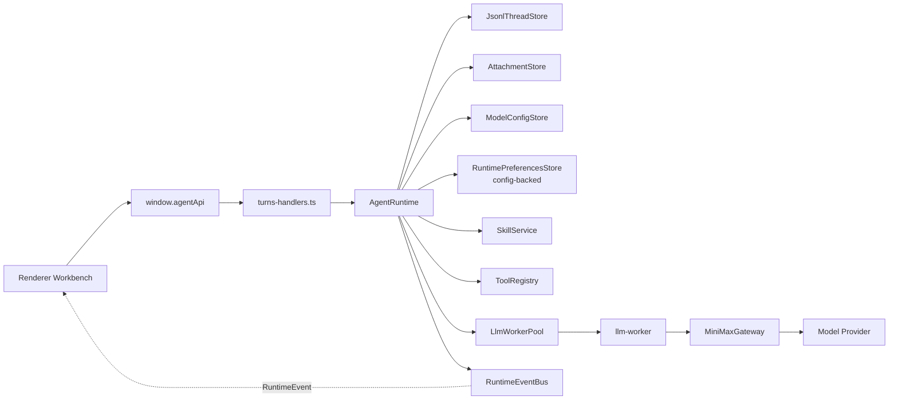
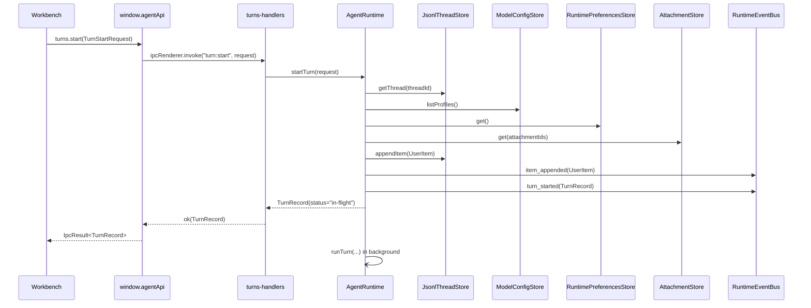
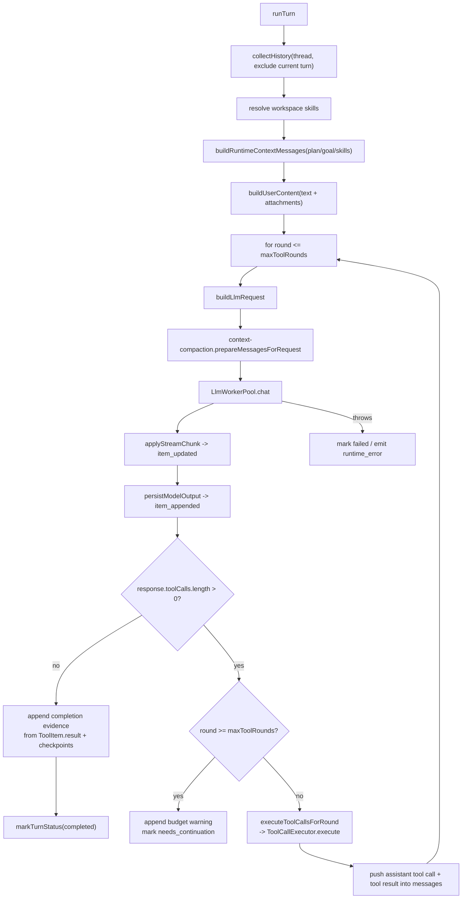
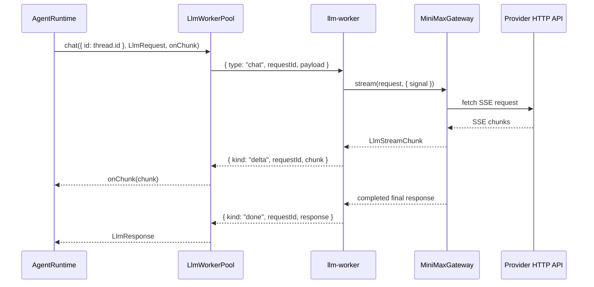
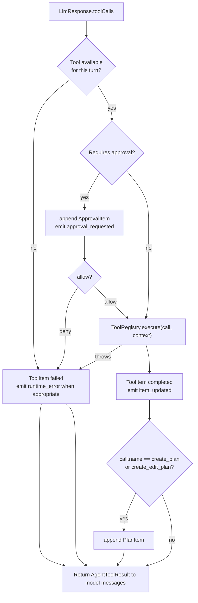
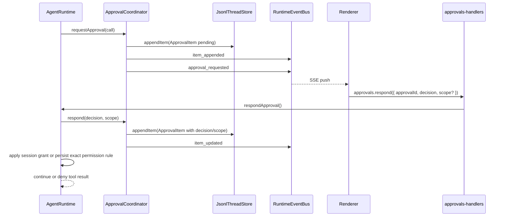
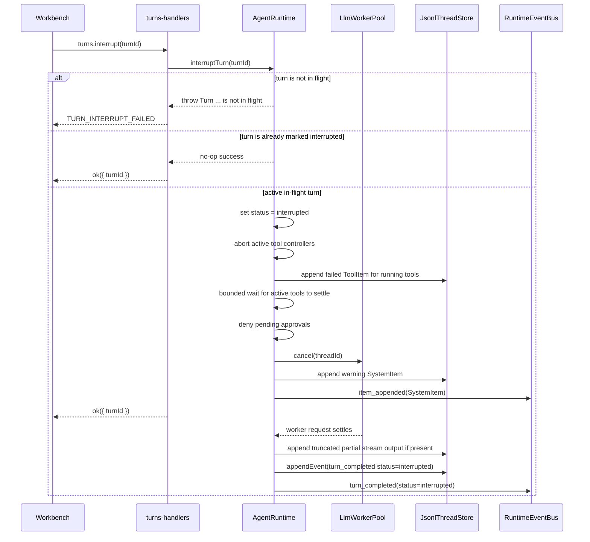

# Runtime Flow

本文说明当前 Agent turn 的真实运行链路、状态转换、事件流、工具循环、中断和失败路径。它用于帮助 Agent 修改 runtime 时先理解机制边界，避免只改同步调用而遗漏异步事件、持久化或 UI 状态。

## Scope

权威源码：

- `src/main/application/agent-runtime.ts`
- `src/main/domain/agent/types.ts`
- `src/main/domain/agent/ports.ts`
- `src/main/infrastructure/llm-worker/*`
- `src/main/infrastructure/minimax/*`
- `src/main/event-bus.ts`
- `src/main/ipc/turns-handlers.ts`
- `src/main/ipc/sse-handlers.ts`
- `src/renderer/src/ui/Workbench.tsx`
- `src/renderer/src/ui/store/WorkbenchContext.tsx`

非目标：

- 本文不定义新的 runtime 行为。
- 本文不描述外部参考项目。
- Provider HTTP 细节只保留 runtime 相关概览，详细协议以 gateway 代码、gateway 测试和任务提供的 provider 文档为准。

## Runtime Actors



`AgentRuntime` owns the turn state machine. IPC handlers only call it and package results into `IpcResult<T>`.

## Turn Start Sequence



Important behavior:

- `turns.start()` does not wait for the LLM response to finish.
- The synchronous return is an in-flight `TurnRecord`.
- The visible timeline receives the user item through `item_appended`; the
  persisted thread/index `updatedAt` is advanced by the item timestamp.
- Later assistant text, reasoning, tools, completion and failure arrive through runtime events.

## Start Preconditions

`AgentRuntime.startTurn()` checks:

- Thread exists via `JsonlThreadStore.getThread()`.
- Thread is not archived.
- Same thread does not already have an in-flight turn.
- Requested `modelProfileId`, when present, exists.
- Runtime preferences are readable; if no store is configured, runtime falls
  back to `DEFAULT_RUNTIME_PREFERENCES`. The configured store reads the
  `runtimePreferences` section from `userData/config`.
- Attachment ids, when present, resolve through `AttachmentStore.get()`.

Failure mapping:

- Same-thread concurrency throws `RUNTIME_TURN_BUSY`; runtime reserves the
  thread before async model/profile/attachment preparation so parallel start
  requests cannot both append user items.
- `turns-handlers.ts` maps same-thread concurrency to IPC error code
  `RUNTIME_TURN_BUSY`.
- Archived threads throw `RUNTIME_THREAD_ARCHIVED`; IPC maps them to
  `RUNTIME_THREAD_ARCHIVED` so renderer flows can distinguish archived-state
  failures from generic start failures.
- Other start failures are returned as `TURN_START_FAILED`.
- `AgentRuntime.startTurn()` validates public request field shapes before model
  profile resolution or item append: `text` must be string, `mode` must be
  `agent | plan`, `reasoningEffort` must be a supported effort,
  `attachmentIds` must be `string[]`, and `goalMode` must be boolean.

## Turn Record Construction

The created `TurnRecord` contains:

- `id`: generated UUID.
- `threadId`: request thread id.
- `status`: `"in-flight"`.
- `startedAt`: ISO timestamp.
- `model`: resolved selected profile model.
- `reasoningEffort`: request override or selected profile default.
- `modelProfileId`: selected profile id.
- `mode`: request mode or `"agent"`.
- `goalMode`: request goal mode or active thread goal state.

Shared runtime event replay requires `startedAt`, `completedAt`, `failedAt`,
and tool-budget `reachedAt` values to match `Date.prototype.toISOString()`.

Model profile resolution order:

1. Explicit `request.modelProfileId`.
2. Thread-mode default profile from `RuntimePreferences`
   (`codeDefaultModelProfileId` / `writeDefaultModelProfileId`) when it matches
   an existing profile. These defaults are stored in `userData/config` beside
   the model profiles they reference.
3. `request.model` matching a profile config model.
4. Active profile id.
5. First available profile.

Renderer composer state tracks whether the displayed model profile came from an
automatic active-profile sync or an explicit user picker choice. Workbench send
paths only include `request.modelProfileId` for explicit selections, so Code and
Write default profile preferences can take effect when the user has not chosen a
profile for that turn.

## Background Run Loop

After the user item is persisted, `AgentRuntime.runTurn()` builds the model messages and executes the LLM/tool loop.



Runtime context placement:

- Base `SYSTEM_PROMPT` stays stable.
- Plan and goal instructions are runtime context messages, not merged into the base prompt.
- Skills are also runtime context messages. When `RuntimePreferences.skills.enabled`
  is true, `SkillService` scans workspace convention roots
  (`.agent/skills`, `.agents/skills`, `.claude/skills`, `.codex/skills`,
  `.reasonix/skills`, `skills`) plus configured `skills.extraRoots`, matches
  the current prompt against filesystem and built-in skill triggers, and
  injects budgeted `Active Skill` instructions before the user message. Built-in
  `explore` / `review` are read-only subagent skills; `teach-me` / `interview`
  are inline guidance skills. Filesystem project/custom skills override built-in
  skills with the same normalized id. Slash-command triggers and explicit
  `$skill` / `@skill` / `/skill:id` mentions require token boundaries, so a
  longer command or identifier with the same prefix does not activate the skill.
- Skill load validation errors emit `runtime_error(code: "internal")` with the
  failing root in the message; missing convention roots are ignored, while
  missing configured extra roots are surfaced as validation errors.
- User attachments become `AgentContentBlock[]` in `AgentMessage.content`.
- Code composer MCP inputs are resolved before automatic new-thread creation
  and `turn:start`: a leading
  `/mcp__<server>__<prompt>` calls `agentApi.mcp.getPrompt()` and
  `@<server>:<uri>` references call `agentApi.mcp.readResource()`. Resource
  references treat the URI as a non-whitespace token and trim only surrounding
  prose punctuation, so URI punctuation inside the token is preserved. The
  resolved prompt/resource content is sent as `TurnStartRequest.text`, while the
  original command/reference remains in `displayText` for the timeline and
  checkpoint prompt.

LLM request construction:

- `LlmRequest.protocol` comes from the selected `ModelConfig.protocol`.
  `openai-compatible` and `anthropic-compatible` share the same runtime loop;
  `MiniMaxGateway` routes by protocol, while the OpenAI-compatible and
  Anthropic-compatible adapters own request body and SSE parsing differences.
- Tool definitions are filtered by turn mode, goal/plan mode and
  `RuntimePreferences.toolAvailability`, sorted by tool name, fingerprinted into
  `TurnRecord.toolCatalog`, and then passed to
  `context-compaction.prepareMessagesForRequest()` and the worker pool.
- `context-compaction.prepareMessagesForRequest()` first repairs the request-only
  model history by dropping orphan tool results, duplicate tool results and
  assistant tool calls that have no matching result. This keeps provider request
  history protocol-valid without rewriting persisted `messages.jsonl`. Runtime
  request-boundary tests cover both forked-thread first requests and resumed
  compacted requests so persisted/forked history cannot silently introduce
  malformed tool pairs.
- Context budget inputs still come from the selected model profile
  (`model_context_window`, `model_auto_compact_token_limit`, `max_tokens`),
  while automatic compaction enablement and strategy come from
  config-backed `RuntimePreferences.compaction`.
- When automatic compaction is disabled, runtime skips summary compaction but
  still applies the hard context safety limit before calling the worker.

## Streaming Semantics

Worker stream chunks are represented by `LlmStreamChunk` in `src/main/domain/agent/types.ts`.

Runtime currently reacts to:

- `text_delta`: lazily creates or updates a live `AssistantItem`, then emits `item_updated`.
- `reasoning_delta`: lazily creates or updates a live `ReasoningItem`, then emits `item_updated`.
- `usage`: updates `turn.usage`.

Final persistence:

- Reasoning and assistant live items are appended to `messages.jsonl` when the
  stream completes, is interrupted, or fails after partial deltas.
- Interrupted and failed partial assistant output is persisted with
  `truncated: true` before the terminal lifecycle event is emitted.
- The same item id may appear more than once in JSONL because updates are append-only.
- Renderer and `turns.get` dedupe by item id, keeping the latest item version.

## Worker Flow



Worker invariants:

- Same `threadId` maps to the same worker entry while the worker is alive.
- `AgentRuntime` enforces same-thread in-flight gating.
- `LlmWorkerPool.cancel(threadId)` posts a cancel message for the active request.
  Cancel post failures are logged and do not throw back into turn interruption.
- A worker request cleanup only clears the cancel handle it installed; this
  protects newer same-thread requests if an old request settles late.
- Worker replacement clears thread affinity for dead workers.
- If the initial `postMessage(chat)` to a worker fails, the request listeners and
  cancel handle are cleaned immediately and runtime sees `worker_crashed`.
- `LlmWorkerPool.destroy()` coalesces concurrent/repeated shutdown calls and
  clears worker affinity/cancel maps after the shared shutdown settles.
- Worker errors preserve protocol categories through the pool: provider HTTP
  failures become `provider_http`, provider SSE `event: error` frames become
  `provider_error`, provider/schema parse failures become `schema_invalid`,
  and worker process failures become `worker_crashed`.
- Worker `LlmResponse.raw` is a bounded stream summary rather than a full chunk
  transcript, so long text/reasoning/tool streams do not duplicate unbounded
  content in memory.

## Tool Loop

Tool definitions come from `ToolRegistry.listDefinitions()` and are filtered by turn context before being sent to the model.



Tool availability:

- `create_plan` is only enabled when `turn.mode === "plan"`.
- `create_edit_plan` is a read-only Code-mode coding tool for visible
  multi-file coordination before separate edit/write/delete calls. It validates
  at least two workspace-relative planned files, returns a structured plan
  payload, and appends a normal `PlanItem`; it does not replace the
  all-or-nothing write behavior of a single `apply_patch`.
- `update_goal` is enabled when `turn.goalMode` is true or the thread has an active goal.
- `list_skills` and `run_skill` are read-only skill tools. They are enabled by
  default in Code and Write threads through `RuntimePreferences.toolAvailability`
  and load skills from the active thread workspace. `list_skills` returns the
  skill catalog, roots and validation warnings; `run_skill` returns inline
  skills' `SKILL.md` body plus `references/*.md` content as a tool result.
  `runAs: subagent` skills run through an isolated child LLM loop with only
  allowed read-only tools exposed; child messages and tool calls are not written
  to parent JSONL, and only the final answer returns as the parent `run_skill`
  result.
- Other registered tools pass through `ToolCatalogService` tool access policy and
  persisted `RuntimePreferences.toolAvailability` before they are sent to the
  model or executed from a forced model tool call.
- `ToolCatalogService` returns model-visible tool definitions in stable name
  order and computes `TurnRecord.toolCatalog` from canonical tool definitions.
  The snapshot contains only `fingerprint`, `toolCount`, and `toolNames`, so it
  can diagnose catalog/cache drift without persisting full schemas.
- `ToolCallExecutor` tracks read-only tool calls by tool name plus canonical
  arguments within a single turn. From the third identical read-only call onward
  it does not call `ToolRegistry.execute()`: it appends a failed `ToolItem` with
  `reason: "repeat_read_only_tool_call"` and returns that visible tool result to
  the model. The repeat state is cleared when the turn reaches a terminal status.
- Parent-turn tool batches are parallelized only when every call in the model
  response resolves to a registered `metadata.isReadOnly` tool and the call is
  not `run_skill`. Mixed batches and write-capable tools stay sequential, so
  write/read ordering, approval prompts, checkpoint recording and command
  lifecycle stay deterministic. Parallel batches still execute through
  `ToolCallExecutor`, and their results are appended to the next model request
  in the original model tool-call order.
- MCP tools are registered dynamically by `McpHost` using the
  `mcp__<server>__<tool>` namespace. Code threads can see them through the same
  catalog path as built-ins; Write threads hide them by default with the
  mode-aware tool access policy. Small MCP catalogs register each remote tool
  directly. When a server exposes more than the progressive-discovery threshold,
  the model-visible catalog is reduced to MCP facade tools for searching,
  describing, read-only calling and write-capable calling; renderer MCP status
  and `mcp:tools:list` still expose the full remote tool list. The write-capable
  facade remains non-read-only and permission rules are evaluated against the
  selected target MCP tool (`server/tool`), not the facade tool name.
- The default tool access policy denies Code-only tools in Write threads:
  coding write tools, foreground shell tools, WSL / Git Bash / PowerShell
  tools, Git tools, package/task wrappers, command session tools, shell
  environment detection, and TypeScript diagnostics. `rg_search` remains
  available in Write threads alongside `list_files`, `read_file`, and
  `search_files`.
- Tool access policy is catalog-level control. It can be configured per thread
  mode to allow or deny individual tool names without changing persisted thread
  data. Approval and sandbox checks still run afterward.
- `RuntimePreferences.toolAvailability` is the main-process persisted catalog
  switch for known runtime tools, stored in `userData/config`. Disabled tools are omitted from
  `LlmRequest.tools`; if the model still returns a disabled tool call, runtime
  appends a failed `ToolItem` and emits `runtime_error(code: "tool_not_found")`.
- Constructor-injected `toolAccessPolicy` remains the highest-priority override
  for tests and composition-root policy, then persisted runtime preferences
  apply to known runtime tool names, then the default policy applies.
- Renderer read-only tool record visibility uses the shared
  `RUNTIME_READ_ONLY_TOOL_NAMES` list, and tests assert that list matches
  built-in `metadata.isReadOnly` tools so UI presentation cannot drift from
  runtime approval metadata.
- Once a tool is available for the turn, runtime validates the model-provided
  arguments against that tool's published `inputSchema` before repeat
  suppression, approval preview generation, approval requests, or
  `ToolRegistry.execute()`. The validator covers the JSON Schema subset used by
  built-in tools (`type`, `properties`, `required`, arrays, `enum`, and simple
  string/number bounds) and ignores unsupported schema keywords so wider MCP
  schema dialects remain callable. Invalid arguments append a failed `ToolItem`
  and emit `runtime_error(code: "tool_failed")` without asking for approval.
- Failed tool results use the shared `ToolFailureResult` payload
  `{ code, message, ...details }`. The code distinguishes catalog unavailability,
  registry misses, schema validation, repeat read-only suppression, policy or
  approval denial, interruption, sandbox unavailability, execution failure, and
  budget exhaustion while preserving existing detail flags such as `denied` and
  `suppressed`.

Approval policy resolved by `ToolPolicyService`:

- Tools marked `metadata.isReadOnly` default to approval-free `allow`, including
  `create_edit_plan`, but matching permission rules are evaluated first. Explicit
  `deny` rules deny read-only calls, and explicit `ask` rules request approval
  unless the thread policy is `never`, in which case the call is denied. This
  includes read-only MCP direct tools and read-only MCP facade calls.
- Enabled `create_plan` and `update_goal` skip approval.
- `create_plan` step statuses use shared `PLAN_STEP_STATUSES`; missing status
  defaults to `pending`, while unknown values fail instead of being silently
  downgraded.
- `sandboxMode: "read-only"` denies non-read-only tools before execution.
- `approvalPolicy: "never"` denies non-read-only tools before execution.
- Session-scoped approval grants and `RuntimePreferences.permissionRules` are
  evaluated together for per-call command text or write paths in command/write
  tool families, and for `server/tool` values in MCP tool names. Large-catalog
  MCP call facade tools derive this value from `tool_name`, so a persisted grant
  targets the selected remote tool rather than the facade. Persisted rules may
  carry `scope: { kind: "workspace", workspace }`; scoped rules only apply when
  the active thread workspace matches that path, while older rules without
  `scope` remain global for backward compatibility. Matching effects resolve
  across both scoped and persisted rules by `deny > ask > allow`; unmatched calls
  fall back to the thread approval policy. This means a later persisted deny or
  ask rule can override a previously granted session allow. Hard `read-only` and
  `never` denials run first for non-read-only tools, so scoped approval grants
  and persisted allow rules cannot bypass them. Shell-like command permission
  candidates include the public tool name, normalized `command="..."`, optional
  `cwd`, and shell selector context, so persisted exact approvals remain bound
  to the approved execution boundary. Older bare command rules still match the
  parsed command field for compatibility, but structured patterns such as
  `run_command command="npm test":* cwd=packages/app` are required to scope the
  tool or cwd. Glob command rules ending in `:*` are prefix scopes; they match
  ordinary argument continuations but refuse appended shell control,
  redirection, substitution, or newline-separated commands so scoped approvals
  do not widen into unrelated follow-up commands.
  `write_command_session` candidates include the session id, normalized stdin
  payload, and newline mode, so an exact scoped approval for one input does not
  authorize a different later input to the same session.
  For multi-value write candidates such as `apply_patch`, any target matched by
  `deny` denies the call, any target matched by `ask` requests approval, and
  `allow` skips approval only when the allow rule set covers every target path.
  Exact rules compare literal normalized candidates.
- `approvalPolicy: "untrusted"` keeps the approval gate closed for non-read-only
  tools: explicit deny/ask rules still apply, but allow rules do not skip the
  prompt.
- `approvalPolicy: "auto"` allows tools whose metadata sets `isDestructive: false`; shell-backed command tools must not use this bypass.
- All remaining non-read-only tools require approval.

`approvalPolicy` and `sandboxMode` are thread fields. Settings controls only
the defaults assigned to newly created threads; the Code topbar can update the
active thread through the existing `threads.update` IPC while no turn is
running. `ToolPolicyService` still reads the persisted thread values at each
tool call, so UI changes and runtime enforcement share the same source.

When a tool call is approved for execution, `ToolCallExecutor.execute()`
passes the full `AgentToolContext` through `ToolRegistry.execute()`, but that
context is composed from narrower capability interfaces. Tool
implementations should depend on the smallest context they need:
`AgentReadWorkspaceToolContext` for read-only workspace tools,
`AgentWriteWorkspaceToolContext` for coding writes,
`AgentCommandToolContext` for command execution/progress, and
`AgentSkillToolContext` for skill catalog access. Runtime injects
`AgentCommandToolContext.reportProgress` for tools that stream live
stdout/stderr chunks; those calls become live-only `tool_progress` events on
`RuntimeEventBus`. Progress emit failures are logged and do not fail the tool
call. Final tool success/failure still arrives as the normal `item_updated`
event with the completed `ToolItem.result`.

Workspace tools require an absolute thread workspace path before resolving file paths. The shared workspace policy trims the workspace root once, then uses that same normalized string for absolute-path validation and path resolution. `list_files.path` and `search_files.path` reject non-string values instead of treating them as omitted root-path requests, and workspace string parameters reject NUL bytes before path resolution or search execution. Write IPC Markdown request strings also reject NUL bytes at request parsing before path resolution, completion, or file writes. `create_edit_plan` applies the same lexical workspace boundary to each planned file path and rejects duplicate planned files with host path comparison semantics before it appends a visible `PlanItem` for multi-file coordination. `list_files.max_entries`, `read_file.max_bytes`, `read_file.offset_bytes`, `search_files.max_results`, `list_symbols.max_results`, and `search_symbols.max_results` are strict integer ranges; invalid or out-of-range values fail instead of being silently clamped to defaults. `read_file`, `search_files`, `rg_search`, `list_symbols`, `search_symbols`, `edit_file`, `multi_edit`, `write_file`, `apply_patch`, and `diagnose_file` operate on strict UTF-8 text and reject invalid byte sequences instead of replacing them. `edit_file`, `multi_edit`, `write_file`, `apply_patch`, and `rollback_file` are destructive workspace tools, so they request approval and can include structured diff previews. Before writing or deleting, coding tools re-check the workspace path policy and current file content so an external change between dry-run and commit cannot be overwritten silently. Destructive coding tools also reject target paths that contain existing symbolic-link components, keeping the workspace-relative path, read state, file history, and modified file object aligned. Final UTF-8 file writes for coding tools, Write IPC saves/creates, and checkpoint code restore use a no-follow open where supported, so a target replaced with a symbolic link after validation is rejected rather than followed; editable coding-tool reads and Write IPC Markdown reads/rename sources use the same no-follow final-component boundary before decoding source text, and close any opened handle if the post-open fallback guard rejects the target. Single-file coding tools restore the original file content if post-write metadata collection fails before file history and read state are updated, and discard the failed write's checkpoint file snapshot after cleanup. `multi_edit` applies ordered exact replacements to one file in memory and writes once only after every step succeeds, so a later missing or ambiguous `old_string` leaves the file unchanged. `apply_patch` returns a `multi_file_diff` preview when the patch touches more than one file, validates every hunk before writing, preserves `\ No newline at end of file` markers, and restores files already written in the same patch if a later write or post-write metadata step fails. `rollback_file` uses the current runtime's in-memory file history first; when that history is absent, it can fall back to the newest same-thread/workspace checkpoint file snapshot, but only if the current file state still matches the recorded post-write hash. Checkpoint code rewind builds a restore plan first, then re-checks the workspace path policy and symbolic-link boundary again immediately before each delete/write commit, including after parent directory creation. Session rewind first verifies the selected turn still exists in the current transcript before restoring code, then truncates messages/events and checkpoint records after code restore succeeds. Shell-backed command tools are treated as destructive because arbitrary shell commands can modify files or run workspace scripts; they request approval even when `approvalPolicy: "auto"` is set.

`apply_patch` applies a restricted unified diff format for UTF-8 create/update hunks. Runtime preview and execution both perform a dry-run first; if any file hunk cannot be applied, no file is written. A patch may include multiple hunks for one file under a single file header, but duplicate file sections for the same resolved target are rejected so successful writes and failure rollback both have one authoritative pre-write snapshot per file. If a write or post-write metadata step fails after checkpoint snapshots were recorded, the tool restores already-written files and discards that failed patch's checkpoint file snapshots so rewind and completion evidence only see committed writes. The parser treats `\ No newline at end of file` as part of the neighboring hunk line, so patches cannot silently add or remove the final newline. Existing lines keep their original LF or CRLF endings; added lines use the local file ending around the insertion point, falling back to LF for new files.

File history is currently held in memory by `AgentRuntime`. It covers writes made in the current app process by `edit_file`, `multi_edit`, `write_file`, `apply_patch`, and `rollback_file`; rollback is limited to the thread that produced the latest file history entry. Because checkpoint JSONL is persisted separately, `rollback_file` may use the latest matching checkpoint file snapshot after restart when no in-memory history entry exists. Checkpoints are turn/file snapshots rather than a full per-write stack, so this fallback is guarded by `afterSha256` and fails if the live file no longer matches the recorded post-write content.

`run_command` executes foreground shell commands inside the active workspace only. Its `cwd` is workspace-relative and goes through the shared realpath/path escape policy. `shell_command`, `git_bash_command`, `powershell_command`, and `wsl_command` use the same foreground execution boundary while selecting an explicit shell. `shell_command` can use a custom `shell_path` and `shell_args`; `powershell_command` defaults to `pwsh` and, on Windows, falls back to Windows PowerShell when `pwsh` is absent from PATH; `wsl_command` converts Windows drive paths to `/mnt/<drive>/...` before entering the WSL shell. Command optional string parameters reject NUL bytes before path resolution, shell selection, WSL distro selection, or environment diagnostics. Runtime injects config-backed `RuntimePreferences.command` as the default timeout and output limit; stricter tool-call overrides may reduce those limits. Tool policy still denies command tools in read-only sandbox before spawn. After approval, foreground command-backed tools and long-running command sessions share `command-sandbox.ts` as the spawn-time enforcement layer: workspace-realpath cwd, an explicit child environment with credential-like variables removed (`KEY`, `TOKEN`, `SECRET`, `PASSWORD`, `AUTH`, provider key prefixes, and related forms), `shell: false`, non-inherited stdio, hidden windows, and platform-specific process-tree cleanup. The spawn layer returns a full command spawn spec, so foreground commands and command sessions both enter the same sandbox seam. In `sandboxMode: "workspace-write"` on Windows, the default engine requires the configured Windows command sandbox helper and fails closed with `tool_sandbox_unavailable` when the helper is missing, invalid, or unavailable; `sandboxMode: "danger-full-access"` keeps direct host execution and reports `osJail.enabled: false`. Non-Windows command execution currently keeps the direct spawn boundary unless a platform-specific jail engine is explicitly added. Foreground commands report a startup failure if the child process errors before the OS accepts the spawn, while commands that start successfully but exit non-zero still return ordinary command results. `detect_shell_environment.sandbox` reports the active profile, including whether an OS jail is required, available, and enabled. Foreground command-backed tools report live stdout/stderr through `tool_progress`, throttled in the command process wrapper by time and byte thresholds before renderer updates. Results include exit code, signal, timeout state, duration, stdout/stderr, byte counts, and truncation flags; non-zero exit codes are returned as command results rather than runtime exceptions. When stdout or stderr reaches the byte output limit, the stored text is trimmed on a UTF-8 character boundary so truncation cannot introduce replacement characters into the tool result. Interrupt and timeout cancellation terminate the spawned shell process tree: POSIX uses the detached process group, and Windows uses `taskkill /T /F` with a `child.kill()` fallback if `taskkill` cannot start or exits unsuccessfully.

Structured developer command tools are registered independently from
`run_command`. `rg_search` performs ripgrep-style regular expression search
over UTF-8 workspace text files without depending on a host `rg` binary.
`git_status`, `git_diff`, `git_log`, and `git_branch` are read-only Git
wrappers; `git_diff` disables external diff and textconv execution before
using the read-only approval bypass. `git_commit` can stage all or selected
workspace paths and commit after approval. Git pathspecs use the workspace
lexical policy and must be plain workspace-relative paths, so deleted tracked
files can be diffed or staged while hidden, escaping, magic, and glob pathspecs
remain rejected; when a Git tool runs from a subdirectory `cwd`, validated
workspace-relative pathspecs are converted to Git's cwd-relative form before
spawn. `git_status` decodes Git's quoted/C-style short-status paths
before returning structured `path` and `originalPath` fields. `git_log.ref` is
separately limited to revision/range syntax:
Git options, pathspec magic, whitespace/control characters, and NUL bytes are
rejected before invoking Git. `package_scripts` detects package scripts and the
`npm`/`pnpm`/`yarn`/`bun` manager; `package_install`, `package_test`,
`package_build`, `run_lint`, `run_format`, `run_tests`, and `run_build` run
package-manager commands through the same timeout/output limits and approval
boundary as foreground commands. Model-provided package script overrides are
validated as script identifiers rather than package-manager options: option-like
names, whitespace/control characters, NUL bytes, and unsupported shell
metacharacters are rejected before spawning npm/pnpm/yarn/bun. When
`package_install` is called with `frozen_lockfile: true`, npm uses `npm ci` only
if `package-lock.json` or `npm-shrinkwrap.json` exists; otherwise it fails
instead of silently falling back to lockfile-mutating `npm install`.
`detect_shell_environment` reports PATH-based shell availability, Git Bash
candidates, PowerShell/pwsh, WSL, workspace path conversion facts, and the
active command sandbox profile.

Long-running command sessions are held in main-process memory by
`start_command_session`, `list_command_sessions`, `read_command_session`,
`write_command_session`, and `stop_command_session`. Starting a session waits
until the OS accepts the child process before returning a session id, while
stdout/stderr are retained in bounded per-stream buffers that keep the latest
bytes for long-running watcher/dev-server output and are emitted as live
`tool_progress` events on the original `start_command_session` tool call id.
List, read, write and stop calls are scoped to the same thread and workspace
that created the session. `list_command_sessions` is read-only and returns the
visible session ids/statuses, with optional UTF-8-safe stdout/stderr tails for
recovering context before deciding which session to read or stop.
`read_command_session` tail output is decoded on a UTF-8 character boundary, so
byte-limited reads cannot introduce replacement characters into the retained
stdout/stderr snapshot. `write_command_session` writes the provided input string
to stdin without trimming, waits for stdin to accept it, and surfaces a
write/closed-stdin error instead of reporting a best-effort success.
`stop_command_session` waits for the child process to reach a terminal state
before returning, so callers can safely clean up or reuse the workspace after a
stop result. `start_command_session` registers the child in the in-memory
manager before waiting for spawn, so application shutdown can still terminate a
process created during the startup window; shell spawn failures remove that
pending entry and surface as tool errors instead of successful failed-session
snapshots. A pre-aborted or interrupted startup kills the child process before a
session id is returned. Runtime errors after a successful spawn keep the session
in `failed` state with the captured error message even if the child later emits
a close event. `shutdownCommandSessions()` is a main-process-only lifecycle hook
registered from Electron `before-quit`; it uses the same process-tree kill path
as explicit stop, returns bounded diagnostic snapshots, marks shutdown-stopped
sessions with a traceable error message, and clears the in-memory owner. Session
state is not persisted across app restarts; callers should still stop sessions
explicitly during normal runtime.

`diagnose_workspace` runs the workspace typecheck command and returns parsed TypeScript diagnostics. Because it can execute `npm run typecheck` or local `npx --no-install tsc`, it uses the command approval boundary instead of the read-only bypass and receives the same runtime command defaults as `run_command`. When `cwd` points at a subproject, relative TypeScript diagnostic paths are resolved from that command cwd and then reported back as workspace-relative paths; diagnostics that resolve outside the active workspace are omitted instead of being surfaced as `../...` paths. A malformed package manifest is reported as a `diagnose_workspace package.json is invalid` tool error instead of a raw JSON parser failure. `diagnose_file` validates one workspace file and uses TypeScript Language Service to return syntactic, semantic, and suggestion diagnostics for that file, so it remains read-only and skips approval. `list_symbols` uses the same short-lived TypeScript Language Service boundary to return a single-file navigation outline with workspace-relative path, symbol kind, modifiers, start/end positions and nesting level. `search_symbols` uses a bounded on-demand Language Service extraction over TypeScript/JavaScript project files to search symbol name/kind/modifiers/path or return a project symbol map when no query is provided; candidates are filtered by the workspace skip policy and capped by file/result limits. Language-service diagnostics and symbols are also limited to files inside the active workspace. This is the current TypeScript diagnostics/symbol loop; it does not keep a persistent language server process alive.

Write-mode Markdown file operations remain renderer-invoked IPC services under
`window.agentApi.write.*`. They are not exposed to the model as coding tools;
future Write AI actions should add Write-specific contracts or tools instead
of reusing Code write/command tools.

## Tool Budget

Maximum automatic tool rounds are resolved by `agent_autonomy` and optional environment override.
The runtime values are defined by `AGENT_AUTONOMY_TOOL_ROUNDS`,
`MIN_MAX_TOOL_ROUNDS`, and `MAX_MAX_TOOL_ROUNDS` in
`src/main/application/constants.ts`:

- `conservative`: 12
- `balanced`: 32
- `deep`: 64
- Runtime clamp range: 1 to 128

If the model keeps requesting tools after the budget:

- Runtime appends failed `ToolItem` records for the unexecuted calls.
  Their result code is `tool_budget_exhausted`.
- Runtime appends a warning `SystemItem`.
- Runtime persists and emits `tool_budget_reached`; `maxToolRounds` and
  `attemptedToolCalls` are positive integer audit counts.
- Turn status becomes `needs_continuation`.

## Approval Lifecycle



Pending approvals are held in memory by `ApprovalCoordinator`. They are not
resumed across app restart.

Approval response `scope` defaults to `once`. A response to a still-pending
approval returns `accepted: true`; duplicate, stale, or unknown approval ids
return the same success-shaped response with `accepted: false` and
`reason: "not_pending"` rather than throwing. Runtime exceptions, invalid
payloads, and persistence failures still surface as real errors. `session`
creates an in-memory thread/workspace scoped exact permission grant for the
current app process; `persist_rule` writes a workspace-scoped exact
`RuntimePreferences.permissionRules` entry using the approved command/write/MCP
subject. Unsupported scoped subjects and persistence failures emit
`runtime_error` instead of silently degrading the decision. The renderer presents
separate allow-once, allow-for-session, persist allow-rule, and deny actions,
while the backend remains responsible for deriving the exact session grant or
persisted rule from the pending tool subject.

Approval items remain in the timeline for auditability. Renderer also shows
the active thread's unresolved approvals in a composer-adjacent pending
approval panel, reusing the same diff preview and scoped decision controls so
users do not have to scroll the timeline to unblock a turn.

Interrupting a turn denies pending approvals for that turn and aborts active tool controllers. Tool items that were already finalized as interrupted keep that interrupted result when the pending approval resolves to deny, so replay does not rewrite an interrupt as an ordinary user denial. Runtime waits briefly for already-started tool execution promises to settle before emitting the interrupted terminal event; if a tool ignores abort beyond that bounded wait, runtime emits a traceable `runtime_error` and continues the interrupt. Command tools receive the abort signal and terminate the child process/process group before the turn is marked interrupted.

## Interrupt Lifecycle



Notes:

- Running tools are finalized before the interrupted terminal event so replay and UI state do not leave a tool stuck in `running`.
- If stream content already arrived, runtime persists interrupted assistant output
  with `truncated: true`; if the worker returns normally after cancellation,
  runtime still ignores the final response and keeps the interrupted terminal
  state.
- The interrupted turn remains in the in-flight map until the background run loop
  has persisted partial output/tool cleanup and emitted the terminal event, so a
  new same-thread turn cannot start while the old stream cleanup is still active.
- `LlmWorkerPool.cancel(threadId)` sends cancel messages for every in-flight
  worker request registered to that thread. This covers nested read-only
  subagent/model requests without letting a later request overwrite the parent
  turn's cancel message.

## Turn Completion And Failure

`markTurnStatus()` is the important status boundary inside runtime.

Expected terminal statuses:

- `completed`
- `failed`
- `interrupted`
- `needs_continuation`

Completion persistence:

- For completed turns with coding or development command tools, runtime appends
  an info `SystemItem` before `turn_completed`. The text is built by
  `completion-evidence.ts` from the final same-turn `ToolItem.result` values and
  checkpoint metadata, including command-session result status when a session is
  still running or stopped. Session stdin writes are reported as interaction
  evidence rather than successful command completion. The summary can list
  changed files, commands, checkpoint availability and remaining risk without
  adding those audit details to future model history.
- Runtime appends `turn_completed` event to `events.jsonl`.
- Runtime emits `turn_completed` on `RuntimeEventBus`.
- Runtime removes the turn from `inFlight`.

Failure behavior:

- Runtime emits `runtime_error` for provider HTTP, provider stream error,
  schema, worker, internal, tool, and persistence categories where available.
- Runtime appends and emits `turn_failed` for top-level run loop failures.
- Runtime marks turn failed through `markTurnStatus("failed")`.

`RuntimeEventBus` carries live UI events such as `item_appended`, `item_updated`, `approval_requested`, and `goal_updated`. The bus validates emitted runtime event shapes and kind/name consistency before delivery, while preserving Node `EventEmitter` listener lifecycle meta events (`newListener` / `removeListener`) for diagnostics and cleanup hooks. The durable event log is narrower: terminal turn usage/failure and tool budget audit events live in `events.jsonl`, while item state lives in `messages.jsonl`.

## MCP Host Lifecycle

`McpHost` is created in the main composition root with the shared
`InMemoryToolRegistry` and `RuntimeEventBus`. Runtime preferences provide the
server config list:

```text
runtimePreferences.mcpServers
  -> McpHost.configure()
  -> McpCacheStore cached surface install when fingerprint matches
  -> connectEnabled() / connect(serverId)
  -> McpClient initialize + tools/list
  -> ToolRegistry.register(mcp__server__tool)
```

Lifecycle rules:

- `stdio` transport uses newline-delimited JSON-RPC over a child process.
  The child receives the same credential-filtered base environment as command
  tools, plus only the explicit `mcpServers[].env` overrides configured by the
  user.
- `streamable-http` transport posts JSON-RPC messages to an HTTP(S) endpoint,
  supports JSON or SSE responses, and reuses `Mcp-Session-Id` when a server
  returns one.
- Server failures are isolated. A failed connect unregisters only that server's
  MCP tools and emits `mcp_server_connection`; if a matching cached schema
  exists, the host keeps cached tools registered as lazy placeholders and
  reports `status: "lazy"` with `lastError`.
- Runtime preference updates await `McpHost.configure()` before reconnecting
  enabled servers, so a slow close from the previous server config cannot
  overwrite the status or tools from the new connection.
- Disconnect close failures stay visible to the caller, but the host clears its
  local client reference, registered tools and surface state before reporting
  `status: "disconnected"` with `lastError`.
- Reconfigure/removal uses the same local cleanup boundary, logs stale close
  failures, and continues applying the runtime preferences server list so old
  transports cannot keep removed tools or block a new server config.
- Reconfigure compares `env` and `headers` as key/value records and
  `readOnlyTools` as a set, so JSON key/list ordering changes do not disconnect
  an already connected server when the runtime semantics are unchanged.
- In-flight connects are invalidated by server disconnect/reconfigure. The host
  attaches a partially connected `McpClient` before handshake completion so a
  stale connect can be closed and cannot register old tools or startup stats
  after the config generation changes.
- `McpCacheStore` persists public tool schema, prompt/resource descriptors,
  server capability snapshots and startup stats under `userData/mcp/cache.json`.
  The cache is a pure optimization: corrupted files, missing records or
  fingerprint mismatches fall back to a live handshake. The fingerprint uses the
  same runtime semantics as reconfigure for `readOnlyTools`, so list ordering
  does not invalidate cache records. Cached tool descriptors are restored only
  when their names still match the `mcp__<server>__<tool>` namespace generated
  from the current server config; duplicate cached tool namespaces and duplicate
  cached prompt slash-command segments are collapsed before the surface is
  installed.
- Cache-backed tools are visible to Code threads before the live server
  finishes connecting. Their first execution forces a server connect, swaps the
  placeholder for a live `AgentTool`, then forwards the original call through
  the normal ToolRegistry and approval path. If the cached or live tool count is
  above the progressive-discovery threshold, the cache installs the same facade
  tools instead of one placeholder per remote tool; search/describe use cached
  descriptors, while call tools force the live connect before invoking the
  selected target.
- Cached prompt/resource surfaces can be listed immediately. Live prompt
  refresh rejects duplicate slash-command segments, and `getPrompt()` /
  `readResource()` force the same lazy connect before reading live content.
- Streamable HTTP 401/403 failures are rewritten as non-sensitive auth
  diagnostics that indicate whether auth material exists in headers, env or
  URL, without logging credential values or response bodies.
- `notifications/tools/list_changed` triggers a server-local tools refresh.
  Successful refreshes emit `mcp_tool_list_changed`; failures that clear live
  tools also emit `mcp_tool_list_changed` with the now-empty tool list.
- Prompts/resources are auxiliary surface. `connect()` refreshes them
  best-effort after tools connect, and manual `refreshSurface()` failures keep
  existing tools registered while reporting `lastError` and
  `mcp_surface_changed`.
- Prompt/resource list/get/read calls are exposed to renderer through MCP IPC;
  they are not model tools and do not pass through approval.

## Renderer Event Consumption

`Workbench.tsx` keeps SSE subscriptions for every thread opened in the window.
Switching sessions does not unsubscribe the previous thread, so background
turns can still complete, fail, or request approval without leaving renderer
state stale. When a thread is deleted or archived from the sidebar, the
renderer releases any retained subscription for that thread after the main
process confirms the operation.

SSE forwarding remains thread-scoped for normal runtime events. A
`runtime_error` without `threadId` is forwarded once per window with either a
thread subscription or an explicit global subscription as a global process-level
error, so renderer error handling can surface failures that are not tied to a
specific active thread without duplicating them across retained thread
subscriptions. Settings uses the explicit global subscription so MCP status and
surface events keep refreshing even when no thread is subscribed.

Renderer event handling:

- `turn_started`: `actions.turnStarted(event.turn)` keyed by `event.threadId`;
  the current window also advances the matching thread summary activity time
- `item_appended`: append only when the event belongs to the active thread
- `item_updated`: update only when the event belongs to the active thread
- `tool_progress`: batch live stdout/stderr by `threadId` / `turnId` /
  `toolCallId`, merge into the matching running tool card, and let the final
  `item_updated` result replace the temporary progress display
- `turn_completed`: `actions.turnEnded(event.threadId, event.status)`
- `turn_failed`: `actions.turnEnded(event.threadId, "failed")`; visible error only for the active thread
- `runtime_error`: visible error only for global errors or the active thread
- `goal_updated`: update active thread goal
- `mcp_server_connection`, `mcp_tool_list_changed`, `mcp_surface_changed`:
  ignored by the chat timeline; Settings listens for them and refreshes MCP
  server status through `agentApi.mcp.listServers()`
- `tool_budget_reached`: no UI error; warning item appears in timeline

State storage:

- `WorkbenchContext.tsx` stores current active-thread `items`, `inFlightTurnsByThreadId`, `activeTurnId`, active thread and composer state.
- `appendItem` and `updateItem` both upsert by item id.

## Runtime Event Types

Defined in `src/shared/agent-contracts.ts`:

- `turn_started`
- `turn_completed`
- `turn_failed`
- `item_appended`
- `item_updated`
- `approval_requested`
- `tool_budget_reached`
- `goal_updated`
- `runtime_error`

`turn_started` includes the complete `TurnRecord` as `event.turn`, so renderer
state uses runtime-created model/profile/mode metadata instead of inferring it
from the current composer state.

When adding an event:

1. Add the type in `src/shared/agent-contracts.ts`.
2. Add its kind to the shared `RUNTIME_EVENT_KINDS` contract so
   `RuntimeEventKind`, `isRuntimeEvent()`, and `RuntimeEventBus.onThread()`
   stay aligned.
3. Forward or consume it in `src/main/ipc/sse-handlers.ts` and renderer logic if needed.
4. Add tests around producer and consumer behavior.

## Change Checklist

Before changing runtime:

- Confirm whether the change affects turn status, item persistence, event emission, or worker protocol.
- Search all existing references with `rg`.
- Keep `src/shared/agent-contracts.ts` as the authority for cross-process shapes.
- Do not add a second runtime entry path.
- Preserve `startTurn()` asynchronous behavior unless explicitly redesigning the UI flow.
- If adding tool behavior, update tool availability and approval rules together.
- If changing events, update shared contracts, event bus, SSE forwarding and renderer reducer/handler.
- If changing persistence, update replay behavior and tests.

Recommended verification for runtime code changes:

```bash
npm run typecheck
npm run test
npm run build
```
