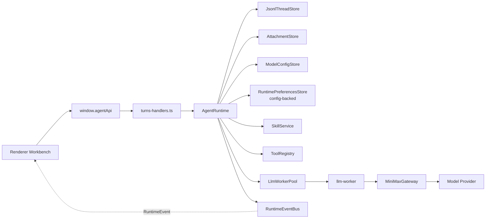
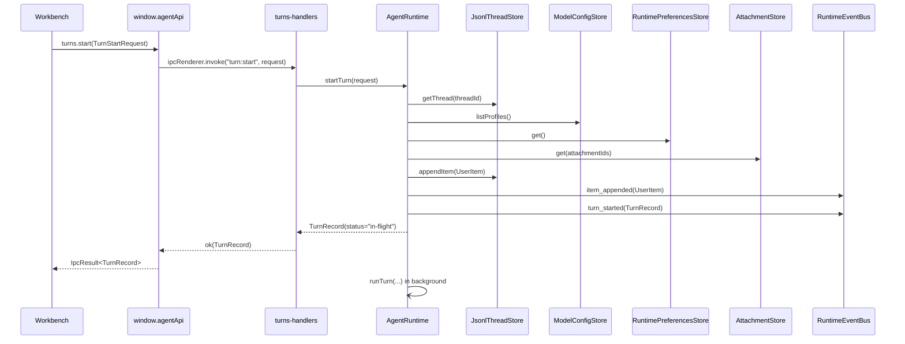
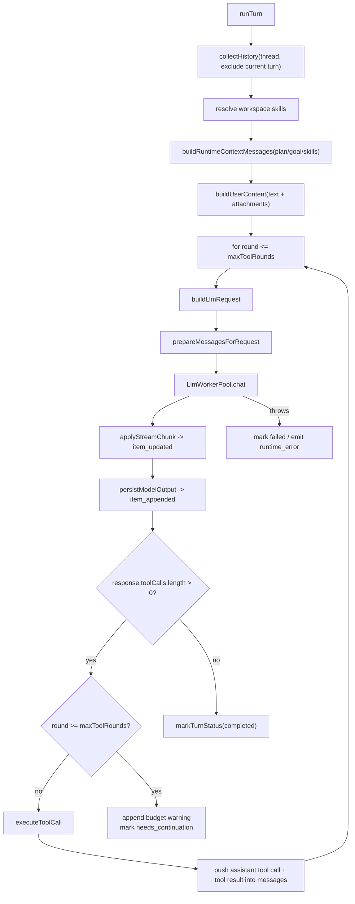
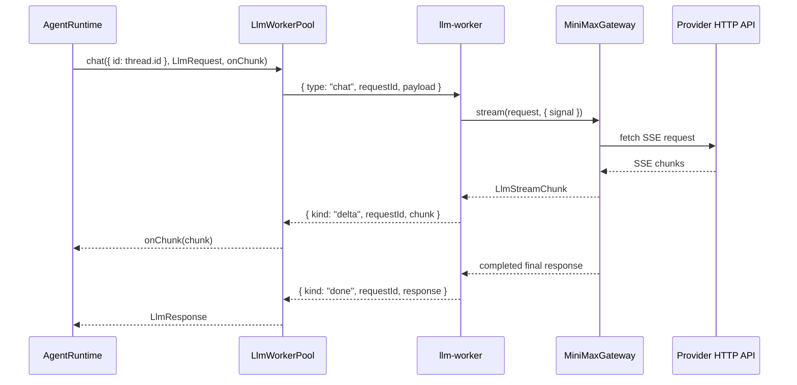
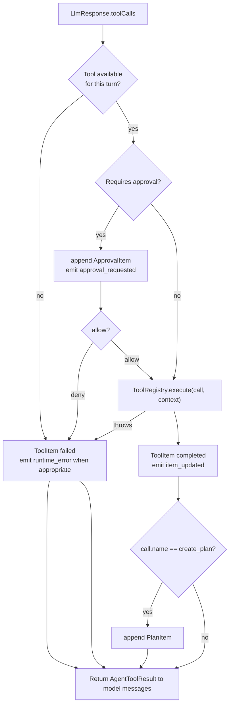
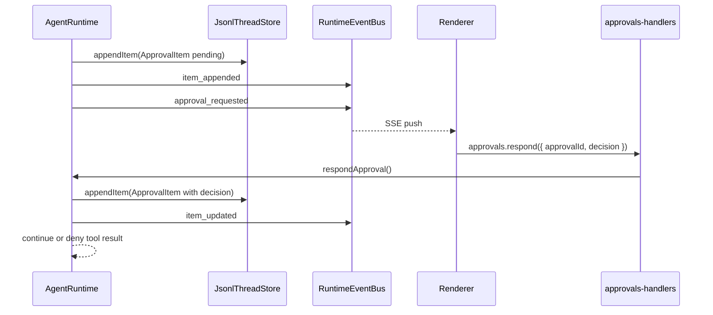
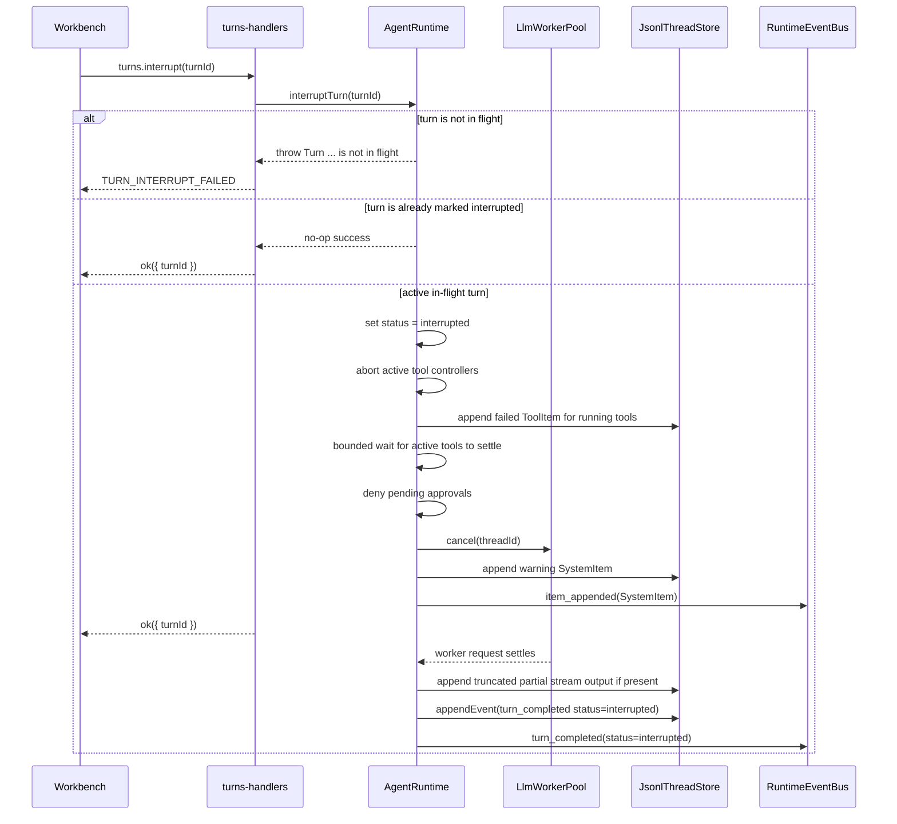

# Runtime Flow

本文说明当前 Agent turn 的真实运行链路、状态转换、事件流、工具循环、中断和失败路径。它用于帮助 Agent 修改 runtime 时先理解机制边界，避免只改同步调用而遗漏异步事件、持久化或 UI 状态。

## Scope

权威源码：

- `src/main/application/agent-runtime.ts`
- `src/main/domain/agent/types.ts`
- `src/main/domain/agent/ports.ts`
- `src/main/infrastructure/llm-worker/*`
- `src/main/infrastructure/minimax/minimax-gateway.ts`
- `src/main/event-bus.ts`
- `src/main/ipc/turns-handlers.ts`
- `src/main/ipc/sse-handlers.ts`
- `src/renderer/src/ui/Workbench.tsx`
- `src/renderer/src/ui/store/WorkbenchContext.tsx`

非目标：

- 本文不定义新的 runtime 行为。
- 本文不描述外部参考项目。
- Provider HTTP 细节只保留 runtime 相关概览，详细协议见 `docs/minimax/` 和 gateway 代码。

## Runtime Actors



`AgentRuntime` owns the turn state machine. IPC handlers only call it and package results into `IpcResult<T>`.

## Turn Start Sequence



Important behavior:

- `turns.start()` does not wait for the LLM response to finish.
- The synchronous return is an in-flight `TurnRecord`.
- The visible timeline receives the user item through `item_appended`; the
  persisted thread/index `updatedAt` is advanced by the item timestamp.
- Later assistant text, reasoning, tools, completion and failure arrive through runtime events.

## Start Preconditions

`AgentRuntime.startTurn()` checks:

- Thread exists via `JsonlThreadStore.getThread()`.
- Thread is not archived.
- Same thread does not already have an in-flight turn.
- Requested `modelProfileId`, when present, exists.
- Runtime preferences are readable; if no store is configured, runtime falls
  back to `DEFAULT_RUNTIME_PREFERENCES`. The configured store reads the
  `runtimePreferences` section from `userData/config`.
- Attachment ids, when present, resolve through `AttachmentStore.get()`.

Failure mapping:

- Same-thread concurrency throws `RUNTIME_TURN_BUSY`; `turns-handlers.ts` maps it to IPC error code `RUNTIME_TURN_BUSY`.
- Other start failures are returned as `TURN_START_FAILED`.
- Archived thread currently throws `RUNTIME_THREAD_ARCHIVED`; IPC maps it to `TURN_START_FAILED` with that message.
- `AgentRuntime.startTurn()` validates public request field shapes before model
  profile resolution or item append: `text` must be string, `mode` must be
  `agent | plan`, `reasoningEffort` must be a supported effort,
  `attachmentIds` must be `string[]`, and `goalMode` must be boolean.

## Turn Record Construction

The created `TurnRecord` contains:

- `id`: generated UUID.
- `threadId`: request thread id.
- `status`: `"in-flight"`.
- `startedAt`: ISO timestamp.
- `model`: resolved selected profile model.
- `reasoningEffort`: request override or selected profile default.
- `modelProfileId`: selected profile id.
- `mode`: request mode or `"agent"`.
- `goalMode`: request goal mode or active thread goal state.

Shared runtime event replay requires `startedAt`, `completedAt`, `failedAt`,
and tool-budget `reachedAt` values to match `Date.prototype.toISOString()`.

Model profile resolution order:

1. Explicit `request.modelProfileId`.
2. Thread-mode default profile from `RuntimePreferences`
   (`codeDefaultModelProfileId` / `writeDefaultModelProfileId`) when it matches
   an existing profile. These defaults are stored in `userData/config` beside
   the model profiles they reference.
3. `request.model` matching a profile config model.
4. Active profile id.
5. First available profile.

Renderer composer state tracks whether the displayed model profile came from an
automatic active-profile sync or an explicit user picker choice. Workbench send
paths only include `request.modelProfileId` for explicit selections, so Code and
Write default profile preferences can take effect when the user has not chosen a
profile for that turn.

## Background Run Loop

After the user item is persisted, `AgentRuntime.runTurn()` builds the model messages and executes the LLM/tool loop.



Runtime context placement:

- Base `SYSTEM_PROMPT` stays stable.
- Plan and goal instructions are runtime context messages, not merged into the base prompt.
- Skills are also runtime context messages. When `RuntimePreferences.skills.enabled`
  is true, `SkillService` scans workspace convention roots
  (`.agent/skills`, `.agents/skills`, `.claude/skills`, `.codex/skills`,
  `.reasonix/skills`, `skills`) plus configured `skills.extraRoots`, matches
  the current prompt against filesystem and built-in skill triggers, and
  injects budgeted `Active Skill` instructions before the user message. Built-in
  `explore` / `review` are read-only subagent skills; `teach-me` / `interview`
  are inline guidance skills. Filesystem project/custom skills override built-in
  skills with the same normalized id.
- Skill load validation errors emit `runtime_error(code: "internal")` with the
  failing root in the message; missing convention roots are ignored, while
  missing configured extra roots are surfaced as validation errors.
- User attachments become `AgentContentBlock[]` in `AgentMessage.content`.
- Code composer MCP inputs are resolved before `turn:start`: a leading
  `/mcp__<server>__<prompt>` calls `agentApi.mcp.getPrompt()` and
  `@<server>:<uri>` references call `agentApi.mcp.readResource()`. The resolved
  prompt/resource content is sent as `TurnStartRequest.text`, while the original
  command/reference remains in `displayText` for the timeline and checkpoint
  prompt.

LLM request construction:

- `LlmRequest.protocol` comes from the selected `ModelConfig.protocol`.
  `openai-compatible` and `anthropic-compatible` share the same runtime loop;
  `MiniMaxGateway` owns request body and SSE parsing differences.
- Tool definitions are filtered by turn mode, goal/plan mode and
  `RuntimePreferences.toolAvailability` before they are passed to
  `prepareMessagesForRequest()` and the worker pool.
- Context budget inputs still come from the selected model profile
  (`model_context_window`, `model_auto_compact_token_limit`, `max_tokens`),
  while automatic compaction enablement and strategy come from
  config-backed `RuntimePreferences.compaction`.
- When automatic compaction is disabled, runtime skips summary compaction but
  still applies the hard context safety limit before calling the worker.

## Streaming Semantics

Worker stream chunks are represented by `LlmStreamChunk` in `src/main/domain/agent/types.ts`.

Runtime currently reacts to:

- `text_delta`: lazily creates or updates a live `AssistantItem`, then emits `item_updated`.
- `reasoning_delta`: lazily creates or updates a live `ReasoningItem`, then emits `item_updated`.
- `usage`: updates `turn.usage`.

Final persistence:

- Reasoning and assistant live items are appended to `messages.jsonl` when the
  stream completes, is interrupted, or fails after partial deltas.
- Interrupted and failed partial assistant output is persisted with
  `truncated: true` before the terminal lifecycle event is emitted.
- The same item id may appear more than once in JSONL because updates are append-only.
- Renderer and `turns.get` dedupe by item id, keeping the latest item version.

## Worker Flow



Worker invariants:

- Same `threadId` maps to the same worker entry while the worker is alive.
- `AgentRuntime` enforces same-thread in-flight gating.
- `LlmWorkerPool.cancel(threadId)` posts a cancel message for the active request.
- A worker request cleanup only clears the cancel handle it installed; this
  protects newer same-thread requests if an old request settles late.
- Worker replacement clears thread affinity for dead workers.
- If the initial `postMessage(chat)` to a worker fails, the request listeners and
  cancel handle are cleaned immediately and runtime sees `worker_crashed`.
- Worker errors preserve protocol categories through the pool: provider HTTP
  failures become `provider_http`, provider SSE `event: error` frames become
  `provider_error`, provider/schema parse failures become `schema_invalid`,
  and worker process failures become `worker_crashed`.
- Worker `LlmResponse.raw` is a bounded stream summary rather than a full chunk
  transcript, so long text/reasoning/tool streams do not duplicate unbounded
  content in memory.

## Tool Loop

Tool definitions come from `ToolRegistry.listDefinitions()` and are filtered by turn context before being sent to the model.



Tool availability:

- `create_plan` is only enabled when `turn.mode === "plan"`.
- `update_goal` is enabled when `turn.goalMode` is true or the thread has an active goal.
- `list_skills` and `run_skill` are read-only skill tools. They are enabled by
  default in Code and Write threads through `RuntimePreferences.toolAvailability`
  and load skills from the active thread workspace. `list_skills` returns the
  skill catalog, roots and validation warnings; `run_skill` returns inline
  skills' `SKILL.md` body plus `references/*.md` content as a tool result.
  `runAs: subagent` skills run through an isolated child LLM loop with only
  allowed read-only tools exposed; child messages and tool calls are not written
  to parent JSONL, and only the final answer returns as the parent `run_skill`
  result.
- Other registered tools pass through `AgentRuntime` tool access policy and
  persisted `RuntimePreferences.toolAvailability` before they are sent to the
  model or executed from a forced model tool call.
- MCP tools are registered dynamically by `McpHost` using the
  `mcp__<server>__<tool>` namespace. Code threads can see them through the same
  catalog path as built-ins; Write threads hide them by default with the
  mode-aware tool access policy.
- The default tool access policy denies Code-only tools in Write threads:
  coding write tools, foreground shell tools, WSL / Git Bash / PowerShell
  tools, Git tools, package/task wrappers, command session tools, shell
  environment detection, and TypeScript diagnostics. `rg_search` remains
  available in Write threads alongside `list_files`, `read_file`, and
  `search_files`.
- Tool access policy is catalog-level control. It can be configured per thread
  mode to allow or deny individual tool names without changing persisted thread
  data. Approval and sandbox checks still run afterward.
- `RuntimePreferences.toolAvailability` is the main-process persisted catalog
  switch for known runtime tools, stored in `userData/config`. Disabled tools are omitted from
  `LlmRequest.tools`; if the model still returns a disabled tool call, runtime
  appends a failed `ToolItem` and emits `runtime_error(code: "tool_not_found")`.
- Constructor-injected `toolAccessPolicy` remains the highest-priority override
  for tests and composition-root policy, then persisted runtime preferences
  apply to known runtime tool names, then the default policy applies.
- Renderer read-only tool record visibility uses the shared
  `RUNTIME_READ_ONLY_TOOL_NAMES` list, and tests assert that list matches
  built-in `metadata.isReadOnly` tools so UI presentation cannot drift from
  runtime approval metadata.

Approval policy currently implemented in runtime:

- Tools marked `metadata.isReadOnly` skip approval.
- Enabled `create_plan` and `update_goal` skip approval.
- `create_plan` step statuses use shared `PLAN_STEP_STATUSES`; missing status
  defaults to `pending`, while unknown values fail instead of being silently
  downgraded.
- `sandboxMode: "read-only"` denies non-read-only tools before execution.
- `approvalPolicy: "never"` denies non-read-only tools before execution.
- `RuntimePreferences.permissionRules` then evaluates per-call command text or
  write paths for command/write tool families, and `server/tool` values for MCP
  tool names. Matching rules resolve by
  `deny > ask > allow`; unmatched calls fall back to the normal metadata-based
  policy. Hard `read-only` and `never` denials run first, so an allow rule
  cannot bypass them.
- `approvalPolicy: "auto"` allows tools whose metadata sets `isDestructive: false`; shell-backed command tools must not use this bypass.
- All remaining non-read-only tools require approval.

When a tool call is approved for execution, `AgentRuntime.executeToolCall()`
injects `AgentToolContext.reportProgress`. Tools may call it with live
stdout/stderr chunks; runtime converts those calls into live-only
`tool_progress` events on `RuntimeEventBus`. Progress emit failures are logged
and do not fail the tool call. Final tool success/failure still arrives as the
normal `item_updated` event with the completed `ToolItem.result`.

Workspace tools require an absolute thread workspace path before resolving file paths. `list_files.path` and `search_files.path` reject non-string values instead of treating them as omitted root-path requests, and workspace string parameters reject NUL bytes before path resolution or search execution. `list_files.max_entries`, `read_file.max_bytes`, `read_file.offset_bytes`, and `search_files.max_results` are strict integer ranges; invalid or out-of-range values fail instead of being silently clamped to defaults. `read_file`, `search_files`, `rg_search`, `edit_file`, `write_file`, `apply_patch`, and `diagnose_file` operate on strict UTF-8 text and reject invalid byte sequences instead of replacing them. `edit_file`, `write_file`, `apply_patch`, and `rollback_file` are destructive workspace tools, so they request approval and can include structured diff previews. Before writing or deleting, coding tools re-check the workspace path policy and current file content so an external change between dry-run and commit cannot be overwritten silently. Destructive coding tools also reject target paths that contain existing symbolic-link components, keeping the workspace-relative path, read state, file history, and modified file object aligned. Single-file coding tools restore the original file content if post-write metadata collection fails before file history and read state are updated. `apply_patch` returns a `multi_file_diff` preview when the patch touches more than one file, validates every hunk before writing, preserves `\ No newline at end of file` markers, and restores files already written in the same patch if a later write or post-write metadata step fails. `rollback_file` uses the current runtime's in-memory file history and refuses to run if the history entry belongs to another thread or the file no longer matches the latest agent-written content. Shell-backed command tools are treated as destructive because arbitrary shell commands can modify files or run workspace scripts; they request approval even when `approvalPolicy: "auto"` is set.

`apply_patch` applies a restricted unified diff format for UTF-8 create/update hunks. Runtime preview and execution both perform a dry-run first; if any file hunk cannot be applied, no file is written. A patch may include multiple hunks for one file under a single file header, but duplicate file sections for the same resolved target are rejected so successful writes and failure rollback both have one authoritative pre-write snapshot per file. The parser treats `\ No newline at end of file` as part of the neighboring hunk line, so patches cannot silently add or remove the final newline. Existing lines keep their original LF or CRLF endings; added lines use the local file ending around the insertion point, falling back to LF for new files.

File history is currently held in memory by `AgentRuntime`. It covers writes made in the current app process by `edit_file`, `write_file`, `apply_patch`, and `rollback_file`; rollback is limited to the thread that produced the latest file history entry, and history is not replayed from JSONL after restart.

`run_command` executes foreground shell commands inside the active workspace only. Its `cwd` is workspace-relative and goes through the shared realpath/path escape policy. `shell_command`, `git_bash_command`, `powershell_command`, and `wsl_command` use the same foreground execution boundary while selecting an explicit shell. `shell_command` can use a custom `shell_path` and `shell_args`; `wsl_command` converts Windows drive paths to `/mnt/<drive>/...` before entering the WSL shell. Runtime injects config-backed `RuntimePreferences.command` as the default timeout and output limit; stricter tool-call overrides may reduce those limits. Foreground command-backed tools report live stdout/stderr through `tool_progress`, throttled in the command process wrapper by time and byte thresholds before renderer updates. Results include exit code, signal, timeout state, duration, stdout/stderr, byte counts, and truncation flags; non-zero exit codes are returned as command results rather than runtime exceptions. When stdout or stderr reaches the byte output limit, the stored text is trimmed on a UTF-8 character boundary so truncation cannot introduce replacement characters into the tool result. Interrupt and timeout cancellation terminate the spawned shell process tree: POSIX uses the detached process group, and Windows uses `taskkill /T /F` with a `child.kill()` fallback if `taskkill` cannot start or exits unsuccessfully.

Structured developer command tools are registered independently from
`run_command`. `rg_search` performs ripgrep-style regular expression search
over UTF-8 workspace text files without depending on a host `rg` binary.
`git_status`, `git_diff`, `git_log`, and `git_branch` are read-only Git
wrappers; `git_diff` disables external diff and textconv execution before
using the read-only approval bypass. `git_commit` can stage all or selected
workspace paths and commit after approval. Git pathspecs use the workspace
lexical policy and must be plain workspace-relative paths, so deleted tracked
files can be diffed or staged while hidden, escaping, magic, and glob pathspecs
remain rejected. `git_log.ref` is separately limited to revision/range syntax:
Git options, pathspec magic, whitespace/control characters, and NUL bytes are
rejected before invoking Git. `package_scripts` detects package scripts and the
`npm`/`pnpm`/`yarn`/`bun` manager; `package_install`, `package_test`,
`package_build`, `run_lint`, `run_format`, `run_tests`, and `run_build` run
package-manager commands through the same timeout/output limits and approval
boundary as foreground commands. Model-provided package script overrides are
validated as script identifiers rather than package-manager options: option-like
names, whitespace/control characters, NUL bytes, and unsupported shell
metacharacters are rejected before spawning npm/pnpm/yarn/bun. When
`package_install` is called with `frozen_lockfile: true`, npm uses `npm ci` only
if `package-lock.json` or `npm-shrinkwrap.json` exists; otherwise it fails
instead of silently falling back to lockfile-mutating `npm install`.
`detect_shell_environment` reports PATH-based shell availability, Git Bash
candidates, PowerShell/pwsh, WSL, and workspace path conversion facts.

Long-running command sessions are held in main-process memory by
`start_command_session`, `read_command_session`, `write_command_session`, and
`stop_command_session`. Starting a session returns a session id immediately
while stdout/stderr are retained in bounded per-stream buffers that keep the
latest bytes for long-running watcher/dev-server output. Read, write and stop
calls must come from the same thread and workspace that created the session.
`read_command_session` tail output is decoded on a UTF-8 character boundary, so
byte-limited reads cannot introduce replacement characters into the retained
stdout/stderr snapshot. `write_command_session` writes the provided input string
to stdin without trimming, waits for stdin to accept it, and surfaces a
write/closed-stdin error instead of reporting a best-effort success.
`stop_command_session` waits for the child process to reach a terminal state
before returning, so callers can safely clean up or reuse the workspace after a
stop result. `start_command_session` waits for the child process to spawn before
returning a session id; shell spawn failures are surfaced as tool errors instead
of successful failed-session snapshots. Runtime errors after a successful spawn
keep the session in `failed` state with the captured error message even if the
child later emits a close event. Session state is not persisted across app
restarts; callers must stop sessions explicitly.

`diagnose_workspace` runs the workspace typecheck command and returns parsed TypeScript diagnostics. Because it can execute `npm run typecheck` or local `npx --no-install tsc`, it uses the command approval boundary instead of the read-only bypass and receives the same runtime command defaults as `run_command`. When `cwd` points at a subproject, relative TypeScript diagnostic paths are resolved from that command cwd and then reported back as workspace-relative paths; diagnostics that resolve outside the active workspace are omitted instead of being surfaced as `../...` paths. A malformed package manifest is reported as a `diagnose_workspace package.json is invalid` tool error instead of a raw JSON parser failure. `diagnose_file` validates one workspace file and uses TypeScript Language Service to return syntactic, semantic, and suggestion diagnostics for that file, so it remains read-only and skips approval. Language-service diagnostics are also limited to files inside the active workspace. This is the current TypeScript diagnostics loop; it does not keep a persistent language server process alive.

Write-mode Markdown file operations remain renderer-invoked IPC services under
`window.agentApi.write.*`. They are not exposed to the model as coding tools;
future Write AI actions should add Write-specific contracts or tools instead
of reusing Code write/command tools.

## Tool Budget

Maximum automatic tool rounds are resolved by `agent_autonomy` and optional environment override.
The runtime values are defined by `AGENT_AUTONOMY_TOOL_ROUNDS`,
`MIN_MAX_TOOL_ROUNDS`, and `MAX_MAX_TOOL_ROUNDS` in
`src/main/application/constants.ts`:

- `conservative`: 12
- `balanced`: 32
- `deep`: 64
- Runtime clamp range: 1 to 128

If the model keeps requesting tools after the budget:

- Runtime appends failed `ToolItem` records for the unexecuted calls.
- Runtime appends a warning `SystemItem`.
- Runtime persists and emits `tool_budget_reached`; `maxToolRounds` and
  `attemptedToolCalls` are positive integer audit counts.
- Turn status becomes `needs_continuation`.

## Approval Lifecycle



Pending approvals are held in memory in `AgentRuntime.pendingApprovals`. They are not resumed across app restart.

Approval items remain in the timeline for auditability. Renderer also shows
the active thread's unresolved approvals in a composer-adjacent pending
approval panel, reusing the same diff preview and allow/deny controls so users
do not have to scroll the timeline to unblock a turn.

Interrupting a turn denies pending approvals for that turn and aborts active tool controllers. Tool items that were already finalized as interrupted keep that interrupted result when the pending approval resolves to deny, so replay does not rewrite an interrupt as an ordinary user denial. Runtime waits briefly for already-started tool execution promises to settle before emitting the interrupted terminal event; if a tool ignores abort beyond that bounded wait, runtime emits a traceable `runtime_error` and continues the interrupt. Command tools receive the abort signal and terminate the child process/process group before the turn is marked interrupted.

## Interrupt Lifecycle



Notes:

- Running tools are finalized before the interrupted terminal event so replay and UI state do not leave a tool stuck in `running`.
- If stream content already arrived, runtime persists interrupted assistant output
  with `truncated: true`; if the worker returns normally after cancellation,
  runtime still ignores the final response and keeps the interrupted terminal
  state.
- The interrupted turn remains in the in-flight map until the background run loop
  has persisted partial output/tool cleanup and emitted the terminal event, so a
  new same-thread turn cannot start while the old stream cleanup is still active.

## Turn Completion And Failure

`markTurnStatus()` is the important status boundary inside runtime.

Expected terminal statuses:

- `completed`
- `failed`
- `interrupted`
- `needs_continuation`

Completion persistence:

- Runtime appends `turn_completed` event to `events.jsonl`.
- Runtime emits `turn_completed` on `RuntimeEventBus`.
- Runtime removes the turn from `inFlight`.

Failure behavior:

- Runtime emits `runtime_error` for provider HTTP, provider stream error,
  schema, worker, internal, tool, and persistence categories where available.
- Runtime appends and emits `turn_failed` for top-level run loop failures.
- Runtime marks turn failed through `markTurnStatus("failed")`.

`RuntimeEventBus` carries live UI events such as `item_appended`, `item_updated`, `approval_requested`, and `goal_updated`. The bus validates emitted runtime event shapes and kind/name consistency before delivery, while preserving Node `EventEmitter` listener lifecycle meta events (`newListener` / `removeListener`) for diagnostics and cleanup hooks. The durable event log is narrower: terminal turn usage/failure and tool budget audit events live in `events.jsonl`, while item state lives in `messages.jsonl`.

## MCP Host Lifecycle

`McpHost` is created in the main composition root with the shared
`InMemoryToolRegistry` and `RuntimeEventBus`. Runtime preferences provide the
server config list:

```text
runtimePreferences.mcpServers
  -> McpHost.configure()
  -> McpCacheStore cached surface install when fingerprint matches
  -> connectEnabled() / connect(serverId)
  -> McpClient initialize + tools/list
  -> ToolRegistry.register(mcp__server__tool)
```

Lifecycle rules:

- `stdio` transport uses newline-delimited JSON-RPC over a child process.
- `streamable-http` transport posts JSON-RPC messages to an HTTP(S) endpoint,
  supports JSON or SSE responses, and reuses `Mcp-Session-Id` when a server
  returns one.
- Server failures are isolated. A failed connect unregisters only that server's
  MCP tools and emits `mcp_server_connection`; if a matching cached schema
  exists, the host keeps cached tools registered as lazy placeholders and
  reports `status: "lazy"` with `lastError`.
- `McpCacheStore` persists public tool schema, prompt/resource descriptors,
  server capability snapshots and startup stats under `userData/mcp/cache.json`.
  The cache is a pure optimization: corrupted files, missing records or
  fingerprint mismatches fall back to a live handshake.
- Cache-backed tools are visible to Code threads before the live server
  finishes connecting. Their first execution forces a server connect, swaps the
  placeholder for a live `AgentTool`, then forwards the original call through
  the normal ToolRegistry and approval path.
- Cached prompt/resource surfaces can be listed immediately. `getPrompt()` and
  `readResource()` force the same lazy connect before reading live content.
- Streamable HTTP 401/403 failures are rewritten as non-sensitive auth
  diagnostics that indicate whether auth material exists in headers, env or
  URL, without logging credential values or response bodies.
- `notifications/tools/list_changed` triggers a server-local tools refresh and
  `mcp_tool_list_changed`.
- Prompts/resources are auxiliary surface. `connect()` refreshes them
  best-effort after tools connect, and manual `refreshSurface()` failures keep
  existing tools registered while reporting `lastError` and
  `mcp_surface_changed`.
- Prompt/resource list/get/read calls are exposed to renderer through MCP IPC;
  they are not model tools and do not pass through approval.

## Renderer Event Consumption

`Workbench.tsx` keeps SSE subscriptions for every thread opened in the window.
Switching sessions does not unsubscribe the previous thread, so background
turns can still complete, fail, or request approval without leaving renderer
state stale. When a thread is deleted or archived from the sidebar, the
renderer releases any retained subscription for that thread after the main
process confirms the operation.

SSE forwarding remains thread-scoped for normal runtime events. A
`runtime_error` without `threadId` is forwarded once per subscribed window as a
global process-level error, so renderer error handling can surface failures
that are not tied to a specific active thread without duplicating them across
retained thread subscriptions.

Renderer event handling:

- `turn_started`: `actions.turnStarted(event.turn)` keyed by `event.threadId`;
  the current window also advances the matching thread summary activity time
- `item_appended`: append only when the event belongs to the active thread
- `item_updated`: update only when the event belongs to the active thread
- `tool_progress`: batch live stdout/stderr by `toolCallId`, merge into the
  matching running tool card, and let the final `item_updated` result replace
  the temporary progress display
- `turn_completed`: `actions.turnEnded(event.threadId, event.status)`
- `turn_failed`: `actions.turnEnded(event.threadId, "failed")`; visible error only for the active thread
- `runtime_error`: visible error only for global errors or the active thread
- `goal_updated`: update active thread goal
- `mcp_server_connection`, `mcp_tool_list_changed`, `mcp_surface_changed`:
  ignored by the chat timeline; Settings listens for them and refreshes MCP
  server status through `agentApi.mcp.listServers()`
- `tool_budget_reached`: no UI error; warning item appears in timeline

State storage:

- `WorkbenchContext.tsx` stores current active-thread `items`, `inFlightTurnsByThreadId`, `activeTurnId`, active thread and composer state.
- `appendItem` and `updateItem` both upsert by item id.

## Runtime Event Types

Defined in `src/shared/agent-contracts.ts`:

- `turn_started`
- `turn_completed`
- `turn_failed`
- `item_appended`
- `item_updated`
- `approval_requested`
- `tool_budget_reached`
- `goal_updated`
- `runtime_error`

`turn_started` includes the complete `TurnRecord` as `event.turn`, so renderer
state uses runtime-created model/profile/mode metadata instead of inferring it
from the current composer state.

When adding an event:

1. Add the type in `src/shared/agent-contracts.ts`.
2. Add its kind to the shared `RUNTIME_EVENT_KINDS` contract so
   `RuntimeEventKind`, `isRuntimeEvent()`, and `RuntimeEventBus.onThread()`
   stay aligned.
3. Forward or consume it in `src/main/ipc/sse-handlers.ts` and renderer logic if needed.
4. Add tests around producer and consumer behavior.

## Change Checklist

Before changing runtime:

- Confirm whether the change affects turn status, item persistence, event emission, or worker protocol.
- Search all existing references with `rg`.
- Keep `src/shared/agent-contracts.ts` as the authority for cross-process shapes.
- Do not add a second runtime entry path.
- Preserve `startTurn()` asynchronous behavior unless explicitly redesigning the UI flow.
- If adding tool behavior, update tool availability and approval rules together.
- If changing events, update shared contracts, event bus, SSE forwarding and renderer reducer/handler.
- If changing persistence, update replay behavior and tests.

Recommended verification for runtime code changes:

```bash
npm run typecheck
npm run test
npm run build
```
