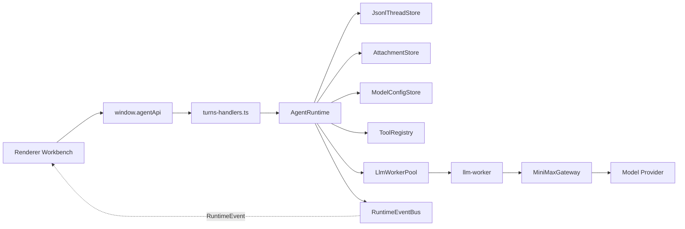
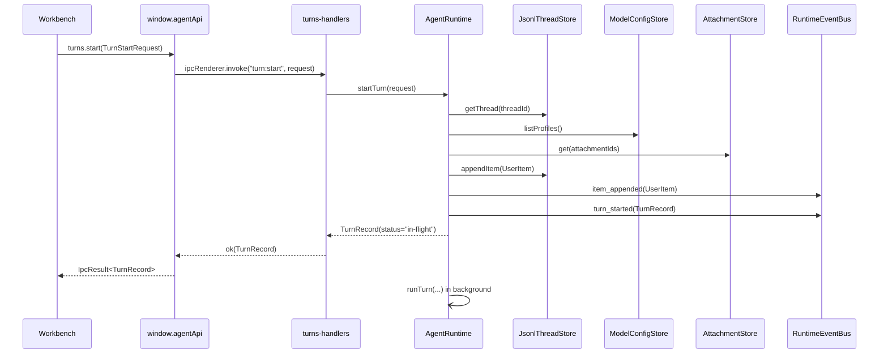
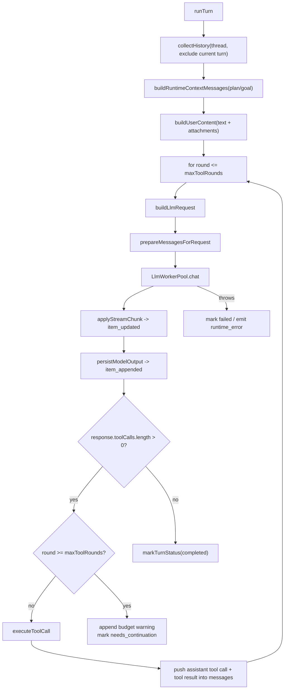
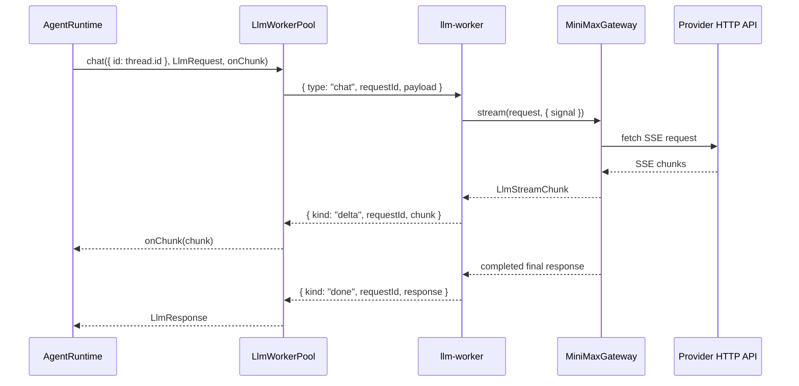
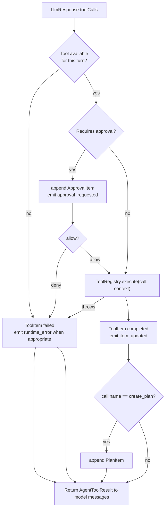
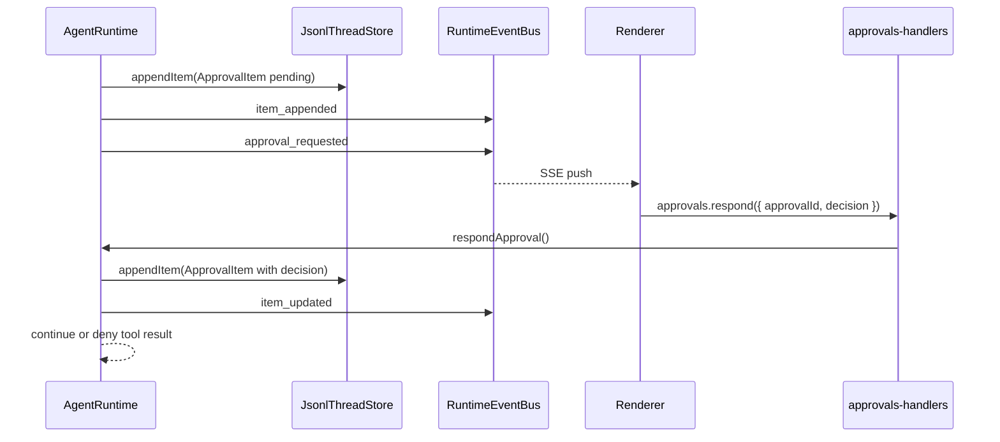
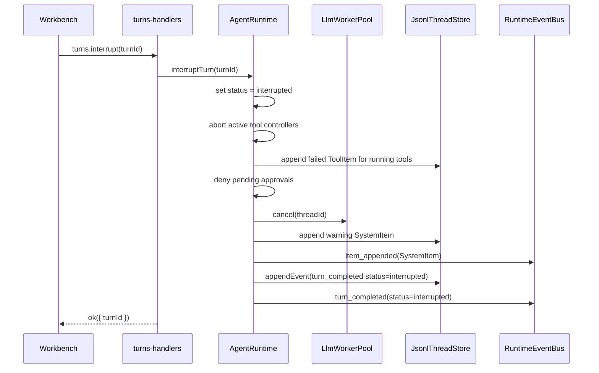

# Runtime Flow

本文说明当前 Agent turn 的真实运行链路、状态转换、事件流、工具循环、中断和失败路径。它用于帮助 Agent 修改 runtime 时先理解机制边界，避免只改同步调用而遗漏异步事件、持久化或 UI 状态。

## Scope

权威源码：

- `src/main/application/agent-runtime.ts`
- `src/main/domain/agent/types.ts`
- `src/main/domain/agent/ports.ts`
- `src/main/infrastructure/llm-worker/*`
- `src/main/infrastructure/minimax/minimax-gateway.ts`
- `src/main/event-bus.ts`
- `src/main/ipc/turns-handlers.ts`
- `src/main/ipc/sse-handlers.ts`
- `src/renderer/src/ui/Workbench.tsx`
- `src/renderer/src/ui/store/WorkbenchContext.tsx`

非目标：

- 本文不定义新的 runtime 行为。
- 本文不描述外部参考项目。
- Provider HTTP 细节只保留 runtime 相关概览，详细协议见 `docs/minimax/` 和 gateway 代码。

## Runtime Actors



`AgentRuntime` owns the turn state machine. IPC handlers only call it and package results into `IpcResult<T>`.

## Turn Start Sequence



Important behavior:

- `turns.start()` does not wait for the LLM response to finish.
- The synchronous return is an in-flight `TurnRecord`.
- The visible timeline receives the user item through `item_appended`; the
  persisted thread/index `updatedAt` is advanced by the item timestamp.
- Later assistant text, reasoning, tools, completion and failure arrive through runtime events.

## Start Preconditions

`AgentRuntime.startTurn()` checks:

- Thread exists via `JsonlThreadStore.getThread()`.
- Thread is not archived.
- Same thread does not already have an in-flight turn.
- Requested `modelProfileId`, when present, exists.
- Attachment ids, when present, resolve through `AttachmentStore.get()`.

Failure mapping:

- Same-thread concurrency throws `RUNTIME_TURN_BUSY`; `turns-handlers.ts` maps it to IPC error code `RUNTIME_TURN_BUSY`.
- Other start failures are returned as `TURN_START_FAILED`.
- Archived thread currently throws `RUNTIME_THREAD_ARCHIVED`; IPC maps it to `TURN_START_FAILED` with that message.
- `AgentRuntime.startTurn()` validates public request field shapes before model
  profile resolution or item append: `text` must be string, `mode` must be
  `agent | plan`, `reasoningEffort` must be a supported effort,
  `attachmentIds` must be `string[]`, and `goalMode` must be boolean.

## Turn Record Construction

The created `TurnRecord` contains:

- `id`: generated UUID.
- `threadId`: request thread id.
- `status`: `"in-flight"`.
- `startedAt`: ISO timestamp.
- `model`: resolved selected profile model.
- `reasoningEffort`: request override or selected profile default.
- `modelProfileId`: selected profile id.
- `mode`: request mode or `"agent"`.
- `goalMode`: request goal mode or active thread goal state.

Model profile resolution order:

1. Explicit `request.modelProfileId`.
2. `request.model` matching a profile config model.
3. Active profile id.
4. First available profile.

## Background Run Loop

After the user item is persisted, `AgentRuntime.runTurn()` builds the model messages and executes the LLM/tool loop.



Runtime context placement:

- Base `SYSTEM_PROMPT` stays stable.
- Plan and goal instructions are runtime context messages, not merged into the base prompt.
- User attachments become `AgentContentBlock[]` in `AgentMessage.content`.

## Streaming Semantics

Worker stream chunks are represented by `LlmStreamChunk` in `src/main/domain/agent/types.ts`.

Runtime currently reacts to:

- `text_delta`: lazily creates or updates a live `AssistantItem`, then emits `item_updated`.
- `reasoning_delta`: lazily creates or updates a live `ReasoningItem`, then emits `item_updated`.
- `usage`: updates `turn.usage`.

Final persistence:

- Reasoning and assistant live items are appended to `messages.jsonl` when the stream completes or is interrupted.
- The same item id may appear more than once in JSONL because updates are append-only.
- Renderer and `turns.get` dedupe by item id, keeping the latest item version.

## Worker Flow



Worker invariants:

- Same `threadId` maps to the same worker entry while the worker is alive.
- `AgentRuntime` enforces same-thread in-flight gating.
- `LlmWorkerPool.cancel(threadId)` posts a cancel message for the active request.
- Worker replacement clears thread affinity for dead workers.

## Tool Loop

Tool definitions come from `ToolRegistry.listDefinitions()` and are filtered by turn context before being sent to the model.



Tool availability:

- `create_plan` is only enabled when `turn.mode === "plan"`.
- `update_goal` is enabled when `turn.goalMode` is true or the thread has an active goal.
- Other registered tools pass through `AgentRuntime` tool access policy before
  they are sent to the model or executed from a forced model tool call.
- The default tool access policy denies Code-only tools in Write threads:
  `edit_file`, `write_file`, `apply_patch`, `rollback_file`, `run_command`,
  `diagnose_workspace`, and `diagnose_file`.
- Tool access policy is catalog-level control. It can be configured per thread
  mode to allow or deny individual tool names without changing persisted thread
  data. Approval and sandbox checks still run afterward.

Approval policy currently implemented in runtime:

- Tools marked `metadata.isReadOnly` skip approval.
- Enabled `create_plan` and `update_goal` skip approval.
- `sandboxMode: "read-only"` denies non-read-only tools before execution.
- `approvalPolicy: "never"` denies non-read-only tools before execution.
- `approvalPolicy: "auto"` allows tools whose metadata sets `isDestructive: false`; shell-backed command tools must not use this bypass.
- All remaining non-read-only tools require approval.

Workspace tools require an absolute thread workspace path before resolving file paths. `read_file`, `search_files`, `edit_file`, `write_file`, `apply_patch`, and `diagnose_file` operate on strict UTF-8 text and reject invalid byte sequences instead of replacing them. `edit_file`, `write_file`, `apply_patch`, and `rollback_file` are destructive workspace tools, so they request approval and can include structured diff previews. Before writing or deleting, coding tools re-check the workspace path policy and current file content so an external change between dry-run and commit cannot be overwritten silently. Write commits also re-check path policy before and after creating missing parent directories, so a parent path replaced with an external symlink cannot receive files or implicit directories. `apply_patch` returns a `multi_file_diff` preview when the patch touches more than one file, validates every hunk before writing, preserves `\ No newline at end of file` markers, and restores files already written in the same patch if a later write fails. `rollback_file` uses the current runtime's in-memory file history and refuses to run if the file no longer matches the latest agent-written content. `run_command` is also treated as destructive because arbitrary shell commands can modify files or run workspace scripts; it requests approval even when `approvalPolicy: "auto"` is set.

`apply_patch` applies a restricted unified diff format for UTF-8 create/update hunks. Runtime preview and execution both perform a dry-run first; if any file hunk cannot be applied, no file is written. A patch may include multiple hunks for one file under a single file header, but duplicate file sections for the same resolved target are rejected so successful writes and failure rollback both have one authoritative pre-write snapshot per file. Rename/copy/path-change patch sections are rejected explicitly; supported updates must keep the same old/new path, while creates must use `/dev/null` as the old path. The parser treats `\ No newline at end of file` as part of the neighboring hunk line, so patches cannot silently add or remove the final newline. Existing lines keep their original LF or CRLF endings; added lines use the local file ending around the insertion point, falling back to LF for new files.

File history is currently held in memory by `AgentRuntime`. It covers writes made in the current app process by `edit_file`, `write_file`, `apply_patch`, and `rollback_file`; it is not replayed from JSONL after restart.

`run_command` executes foreground shell commands inside the active workspace only. Its `cwd` is workspace-relative and goes through the shared realpath/path escape policy. Results include exit code, signal, timeout state, duration, stdout/stderr, byte counts, and truncation flags; truncated stdout/stderr text is cut only at complete UTF-8 character boundaries. Non-zero exit codes are returned as command results rather than runtime exceptions.

`diagnose_workspace` runs the workspace typecheck command and returns parsed TypeScript diagnostics. Because it can execute `npm run typecheck` or local `npx --no-install tsc`, it uses the command approval boundary instead of the read-only bypass. When `cwd` points at a subproject, relative TypeScript diagnostic paths are resolved from that command cwd and then reported back as workspace-relative paths. `diagnose_file` validates one workspace file and uses TypeScript Language Service to return syntactic, semantic, and suggestion diagnostics for that file, so it remains read-only and skips approval. This is the current TypeScript diagnostics loop; it does not keep a persistent language server process alive.

Write-mode Markdown file operations remain renderer-invoked IPC services under
`window.agentApi.write.*`. They are not exposed to the model as coding tools;
Write AI actions use `write:action` to parse dedicated `write:inline-complete`,
`write:inline-edit`, and `write:assistant-context` payloads instead of reusing
Code write/command tools. `write:action` validates the action path and inline
edit scope metadata but never writes files. The renderer displays inline edit
diffs first and re-checks that the current document slice still matches
`scope.originalText` before applying the replacement.

Write memory uses `write:memory` as a renderer-invoked local retrieval service.
It scans allowed Markdown files with the same Write path policy, returns scored
evidence snippets, and keeps the evidence visible in the Write assistant panel.
Assistant sends refresh this evidence and include the same snippets in
`write:assistant-context`, so retrieval is inspectable instead of hidden prompt
injection.

Write file lifecycle uses dedicated renderer-invoked IPC services:
`write:tree`, `write:create`, `write:rename`, `write:delete`, `write:export`,
`write:media`, and `write:watch`. These services reuse the Write workspace path
policy and stay outside the model tool registry. Large Markdown files are
listed but opened as read-only editor documents; the renderer disables editing
and save for those files. `write:watch` is polled by the active Write document
to surface external size/mtime changes, while `write:media` exposes Markdown
image reference evidence and small local image data URLs for preview. Export
returns Markdown and the renderer starts a local download from that response.

## Tool Budget

Maximum automatic tool rounds are resolved by `agent_autonomy` and optional environment override:

- `conservative`: 12
- `balanced`: 32
- `deep`: 64
- Runtime clamp range: 1 to 128

If the model keeps requesting tools after the budget:

- Runtime appends failed `ToolItem` records for the unexecuted calls.
- Runtime appends a warning `SystemItem`.
- Runtime persists and emits `tool_budget_reached`.
- Turn status becomes `needs_continuation`.

## Approval Lifecycle



Pending approvals are held in memory in `AgentRuntime.pendingApprovals`. They are not resumed across app restart.

Approval items remain in the timeline for auditability. Renderer also shows
the active thread's unresolved approvals in a composer-adjacent pending
approval panel, reusing the same diff preview and allow/deny controls so users
do not have to scroll the timeline to unblock a turn.

Interrupting a turn denies pending approvals for that turn and aborts active tool controllers. Command tools receive the abort signal and terminate the child process/process group before the turn is marked interrupted.

## Interrupt Lifecycle



Notes:

- Running tools are finalized before the interrupted terminal event so replay and UI state do not leave a tool stuck in `running`.
- If stream content already arrived, runtime persists interrupted assistant output
  with `truncated: true`; if the worker returns normally after cancellation,
  runtime still ignores the final response and keeps the interrupted terminal
  state.

## Turn Completion And Failure

`markTurnStatus()` is the important status boundary inside runtime.

Expected terminal statuses:

- `completed`
- `failed`
- `interrupted`
- `needs_continuation`

Completion persistence:

- Runtime appends `turn_completed` event to `events.jsonl`.
- Runtime emits `turn_completed` on `RuntimeEventBus`.
- Runtime removes the turn from `inFlight`.

Failure behavior:

- Runtime emits `runtime_error` for worker/internal/tool/persistence categories where available.
- Runtime appends and emits `turn_failed` for top-level run loop failures.
- Runtime marks turn failed through `markTurnStatus("failed")`.

`RuntimeEventBus` carries live UI events such as `item_appended`, `item_updated`, `approval_requested`, and `goal_updated`. The durable event log is narrower: terminal turn usage/failure and tool budget audit events live in `events.jsonl`, while item state lives in `messages.jsonl`.

## Renderer Event Consumption

`Workbench.tsx` keeps SSE subscriptions for every thread opened in the window.
Switching sessions does not unsubscribe the previous thread, so background
turns can still complete, fail, or request approval without leaving renderer
state stale. When a thread is deleted or archived from the sidebar, the
renderer releases any retained subscription for that thread after the main
process confirms the operation.

Renderer event handling:

- `turn_started`: `actions.turnStarted(event.turn)` keyed by `event.threadId`;
  the current window also advances the matching thread summary activity time
- `item_appended`: append only when the event belongs to the active thread
- `item_updated`: update only when the event belongs to the active thread
- `turn_completed`: `actions.turnEnded(event.threadId, event.status)`
- `turn_failed`: `actions.turnEnded(event.threadId, "failed")`; visible error only for the active thread
- `runtime_error`: visible error only for global errors or the active thread
- `goal_updated`: update active thread goal
- `tool_budget_reached`: no UI error; warning item appears in timeline

State storage:

- `WorkbenchContext.tsx` stores current active-thread `items`, `inFlightTurnsByThreadId`, `activeTurnId`, active thread, Code composer state, and the dedicated `writeWorkspace` state.
- Write assistant turns reuse the shared composer input surface for prompt entry
  and pending/interrupt behavior, but bind it to `writeWorkspace.assistantDraft`
  rather than global Code composer state.
- Write assistant turns use `TurnStartRequest.displayText` for the visible user prompt while `TurnStartRequest.text` carries a structured `write:assistant-context` block with active file, selection, cursor-near snippets, and recent edits. This keeps Write document content out of the global composer while still giving the Write thread scoped writing context.
- `appendItem` and `updateItem` both upsert by item id.

## Runtime Event Types

Defined in `src/shared/agent-contracts.ts`:

- `turn_started`
- `turn_completed`
- `turn_failed`
- `item_appended`
- `item_updated`
- `approval_requested`
- `tool_budget_reached`
- `goal_updated`
- `runtime_error`

`turn_started` includes the complete `TurnRecord` as `event.turn`, so renderer
state uses runtime-created model/profile/mode metadata instead of inferring it
from the current composer state.

When adding an event:

1. Add the type in `src/shared/agent-contracts.ts`.
2. Ensure `RuntimeEventKind` includes it.
3. Update `RuntimeEventBus.onThread()` event list.
4. Forward or consume it in `src/main/ipc/sse-handlers.ts` and renderer logic if needed.
5. Add tests around producer and consumer behavior.

## Change Checklist

Before changing runtime:

- Confirm whether the change affects turn status, item persistence, event emission, or worker protocol.
- Search all existing references with `rg`.
- Keep `src/shared/agent-contracts.ts` as the authority for cross-process shapes.
- Do not add a second runtime entry path.
- Preserve `startTurn()` asynchronous behavior unless explicitly redesigning the UI flow.
- If adding tool behavior, update tool availability and approval rules together.
- If changing events, update shared contracts, event bus, SSE forwarding and renderer reducer/handler.
- If changing persistence, update replay behavior and tests.

Recommended verification for runtime code changes:

```bash
npm run typecheck
npm run test
npm run build
```
