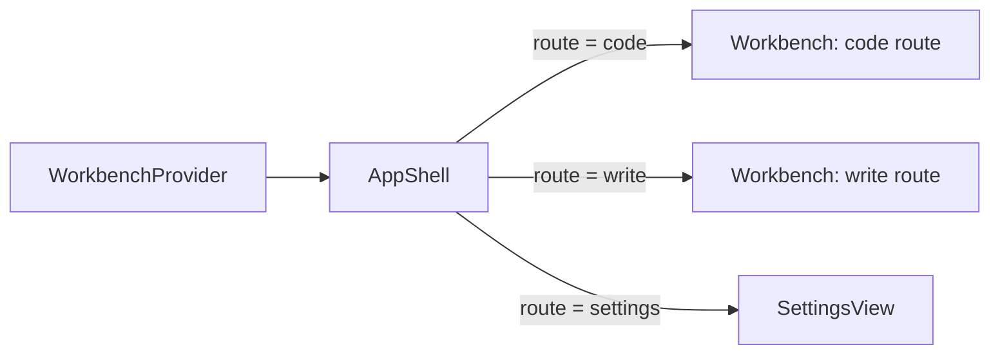
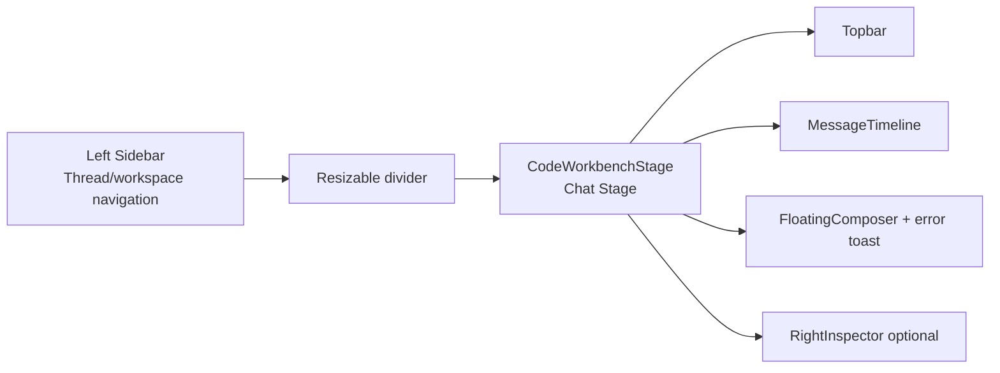
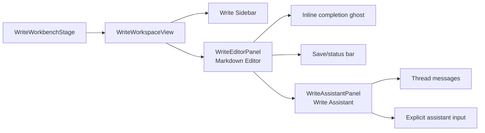
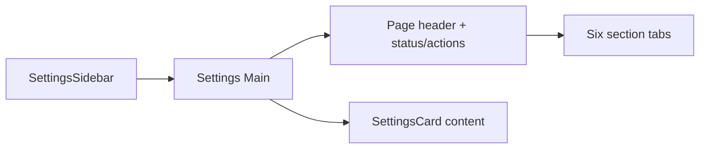
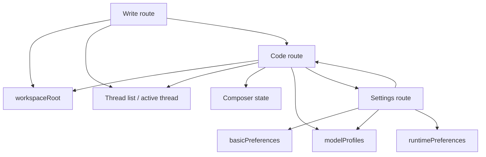

# UI Layout And Attributes Reference

This document describes the current pages, layout regions, state ownership,
interaction behavior, and visual attributes for the desktop workbench UI.

Primary implementation files:

- `src/renderer/src/ui/AppShell.tsx`
- `src/renderer/src/ui/Workbench.tsx`
- `src/renderer/src/ui/SettingsView.tsx`
- `src/renderer/src/ui/store/WorkbenchContext.tsx`
- `src/renderer/src/ui/components/**`
- `src/renderer/src/ui/preferences.ts`
- `src/renderer/src/ui/styles/tokens.css`
- `src/renderer/src/ui/styles/shell.css`

## Global UI Shell



Global root:

- Class: `ds-workbench-shell`.
- Route source: `WorkbenchContext.state.route`.
- Routes: `code`, `write`, `settings`.
- Lazy loaded route components: `Workbench`, `SettingsView`.
- Empty loading fallback: `ds-route-fallback`, a full-size surface using
  `var(--ds-bg-main)`.

Global visual system:

- Design tokens live in `tokens.css` and use `--ds-*`.
- Structural and component styles live in `shell.css`.
- Theme is controlled by `<html data-theme>` and `agent.theme` local storage
  logic in `src/renderer/src/i18n/index.ts`.
- Basic UI preferences live under `agent-pyramid.basicPreferences`.
- Last workspace lives under `agent-pyramid.lastWorkspaceRoot`.

## Shared State And Preferences

State owner: `WorkbenchContext`.

Important UI state:

| State | Purpose |
| --- | --- |
| `route` | Selects code, write, or settings page. |
| `workspaceRoot` | Current workspace path for code/write flows. |
| `threads` | Sidebar thread summaries. |
| `activeThread`, `activeThreadId` | Selected code thread. |
| `items` | Timeline items for selected thread. |
| `inFlightTurnsByThreadId` | Tracks running turns per thread, enabling background sessions without blocking the active composer. |
| `rightPanelMode` | Inspector panel mode or closed state; cleared when the active timeline is deselected. |
| `composer` | Draft text, model, reasoning effort, mode, goal mode, attachments. |
| `errorMessage` | Visible workbench error toast. |
| `leftSidebarWidth`, `rightSidebarWidth` | Resizable panel dimensions. |
| `basicPreferences` | Theme/startup/session/sidebar/inspector and message display defaults. |

Dimension constants from `preferences.ts`:

| Constant | Value | Usage |
| --- | ---: | --- |
| `LEFT_SIDEBAR_MIN_WIDTH` | 180 | Code/write left panel clamp. |
| `LEFT_SIDEBAR_DEFAULT_WIDTH` | 268 | Default left panel width. |
| `LEFT_SIDEBAR_MAX_WIDTH` | 420 | Code/write left panel clamp. |
| `RIGHT_INSPECTOR_MIN_WIDTH` | 280 | Inspector clamp. |
| `RIGHT_INSPECTOR_DEFAULT_WIDTH` | 360 | Default inspector width. |
| `RIGHT_INSPECTOR_MAX_WIDTH` | 760 | Inspector clamp. |

## Code Page

Implementation entry: `Workbench` when `state.route === "code"`.

### Layout



Top-level regions:

- Left sidebar container:
  - Class: `ds-sidebar`.
  - Width: `state.leftSidebarWidth`.
  - Clamp: `180..420`.
  - Resizable by pointer drag and keyboard separator.
- Divider:
  - Class: `ds-workbench-divider`.
  - Role: `separator`.
  - Keyboard: arrows adjust by `SIDEBAR_KEYBOARD_STEP = 16`.
  - Double click resets width to `LEFT_SIDEBAR_DEFAULT_WIDTH`.
- Main stage:
  - Class: `ds-stage-surface`.
  - Code route child component: `CodeWorkbenchStage`.
  - Code route child class: `ds-chat-stage`.
- Topbar frame:
  - Class: `ds-chat-topbar-frame`.
  - Padding: `--ds-space-3`.
- Stage body:
  - Class: `ds-chat-stage-body`.
  - Owns the horizontal chat column + optional inspector row.
- Chat column:
  - Classes: `ds-chat-column ds-chat-column-inset`.
- Composer dock:
  - Classes: `ds-chat-composer-dock` and `ds-chat-composer-frame`.
  - Composer frame max width shares `min(100%, --ds-chat-content-max-width)`
    with the timeline content column so model output and input stay aligned.
- Right inspector:
  - Class: `ds-right-inspector`.
  - Width: `state.rightSidebarWidth`.
  - Visible only when `rightPanelMode !== null`.
  - Rendered by `CodeWorkbenchStage`; `Workbench` keeps SSE, IPC, send,
    interrupt, approval and route orchestration.

### Sidebar

Component: `Sidebar`.

Purpose:

- Create new chat.
- Pick/change workspace.
- Display active workspace.
- Toggle archived thread visibility.
- Group Code threads by `workspace`; Write threads are managed inside the
  Write workspace route and are not shown in the Code sidebar.
- Select, archive, restore, and delete threads.
- Open Settings route.
- Switch quickly between Code and Write workbenches.

Key classes:

- `ds-sidebar-header`
- `ds-sidebar-workspace`
- `ds-sidebar-archive-toggle`
- `ds-sidebar-list`
- `ds-sidebar-project-group`
- `ds-sidebar-project-title`
- `ds-sidebar-row`
- `ds-sidebar-row-main`
- `ds-sidebar-row-actions`
- `ds-sidebar-delete-confirm`
- `ds-sidebar-footer`
- `ds-sidebar-workbench-switch`
- `ds-sidebar-workbench-button`

Thread row attributes:

- Active row: `is-active`.
- Archived row: `is-archived`.
- Pending delete confirmation: `is-confirming-delete`.
- Main button uses `aria-current="page"` when active.
- Delete always uses inline confirmation before calling the thread delete API.
- Pending delete confirmation is pruned when the backing thread disappears from
  the current list, such as after archive/delete/filter refreshes.
- Footer workbench switch uses the existing `WorkbenchContext.actions.setRoute`
  path for `code` / `write`; switching to a workbench route clears an active
  thread whose persisted `mode` does not match that route. Settings remains a
  separate button.
- The Code sidebar divider uses `ds-workbench-divider`; pointer resizing adds
  `is-dragging` so the handle stays highlighted while the pointer is down, not
  only during hover/focus.

### Topbar

Component: `WorkbenchTopBar`.

Purpose:

- Show active/no session status.
- Show short thread id.
- Show workspace path.
- Show running indicator.
- Open inspector modes: changes, todo, plan.
- Toggle inspector open/closed.

Key classes:

- `ds-topbar-surface`
- `ds-topbar-session`
- `ds-topbar-title`
- `ds-topbar-meta`
- `ds-topbar-workspace`
- `ds-topbar-actions`
- `ds-topbar-running`
- `ds-segmented-control`
- `ds-topbar-inspector-tabs`

Inspector controls:

- Modes: `changes`, `todo`, `plan`.
- Toggle label comes from `getInspectorToggleLabel()`.
- Mode buttons and the open/close toggle use `aria-controls` to target the
  shared `RightInspector` region; the open/close toggle also reflects
  `aria-expanded`.

### Timeline

Component: `MessageTimeline`.

Purpose:

- Group raw `Item[]` into turns via `groupTimelineTurns()`.
- Render user, pre-answer work process, assistant, and follow-up items without
  moving post-answer items ahead of the answer.
- Keep scroll pinned to bottom while user is near the bottom.
- Show `InitialSessionUsageHeatmap` when no items exist.
- Empty-session usage cells are exposed as one labeled `role="img"` heatmap;
  individual cells stay visual/tooltip-only and are hidden from assistive tech.

Key classes:

- `ds-message-timeline`
- `ds-message-timeline-content`
- `ds-message-jump-bottom`
- `ds-message-turn`
- `ds-work-process`
- `ds-work-process-summary`
- `ds-work-process-body`
- `ds-shiny-text`

Scroll behavior:

- Timeline content max width uses `min(100%, --ds-chat-content-max-width)`,
  the same outer width as the Code composer frame.
- Sticky threshold: `96px`.
- When the user scrolls away from latest output, `MessageTimeline` shows a
  localized `ds-message-jump-bottom` button. Activating it restores the scroll
  position to the latest item and re-enables bottom stickiness.
- Active turn work process opens by default.
- User toggles are stored by turn id and pruned when turns disappear. Controlled
  `details` updates that only mirror the active-turn default are ignored, so a
  programmatic live/completed state change does not become a user override.

### Chat Blocks

Component: `ChatBlock`.

Item rendering:

| Item kind | UI |
| --- | --- |
| `user` | Right-side user bubble with optional attachment names. |
| `assistant` | Markdown assistant bubble. Live output gets shiny styling. |
| `reasoning` | Collapsible process entry with reasoning label and markdown body. Live reasoning opens by default; completed reasoning follows `basicPreferences.openReasoningByDefault` until the user explicitly toggles it. |
| `tool` | Collapsible process entry with status/tone summary. Long details render as a bounded preview with an explicit full-detail toggle. |
| `approval` | Approval block with args JSON and allow/deny buttons. |
| `user_input` | System-style user input prompt. |
| `plan` | Plan block with ordered steps and per-step status class. |
| `compaction` | System-style compaction notice. |
| `system` | System bubble. |

Key classes:

- `ds-message-block`
- `ds-user-bubble`
- `ds-assistant-bubble`
- `ds-message-attachments`
- `ds-process-entry`
- `ds-process-reasoning-entry`
- `ds-process-entry-summary`
- `ds-process-entry-title`
- `ds-process-entry-status`
- `ds-process-entry-detail`
- `ds-process-entry-detail-frame`
- `ds-process-entry-detail-note`
- `ds-process-entry-detail-actions`
- `ds-process-tool`
- `ds-approval-block`
- `ds-approval-actions`
- `ds-plan-block`
- `ds-system-bubble`

Approval behavior:

- Buttons only render when `item.decision === undefined` and an approve handler
  exists.
- Pending decision is shared by `approvalId` across the timeline block and the
  composer-adjacent pending panel. Failed IPC responses release the pending
  state; successful responses stay disabled until the resolved `ApprovalItem`
  update reaches renderer state.
- File diff previews follow `showDiffByDefault` until the user manually opens or
  closes a preview; later re-renders do not overwrite that manual state.
- Unresolved approvals for the active thread also appear in a composer-adjacent
  pending approval panel, while the timeline block remains as the durable audit
  record.
- Pending approval auto-scroll is driven by the pending approval identity
  signature, not only by count, so replacing one pending approval with another
  still honors `autoScrollOnRequest`.

### Assistant Markdown

Component: `AssistantMarkdown`.

Renderer:

- Uses `react-markdown` and `remark-gfm`.
- Streaming text temporarily closes a dangling triple-backtick code fence so
  partial model output still renders as a code block while the turn is live.
- Links are normalized before render. `http(s)` links get `target="_blank"` and
  `rel="noreferrer"`; page anchors stay in-renderer; relative/local/unsafe
  protocols render as plain text instead of clickable anchors.
- Code blocks are wrapped in `ds-code-block`.
- Code language header is extracted from `language-*` class.
- Long code blocks start collapsed with expand/collapse controls while short code
  blocks remain open. The line threshold comes from
  `basicPreferences.codeBlockCollapseLineThreshold`, and the expand/collapse
  control owns the rendered `<pre>` via `aria-controls`.
- Collapsed long code blocks show a preview note with the total line count so the
  bounded code area is not mistaken for the full block.
- Code block copy controls keep a stable accessible label/title while the
  visible text can briefly show copied or failed state before returning to idle.
  Repeated copy attempts replace the previous feedback timer, and unmount clears
  any pending reset.
- Tables are wrapped in `ds-markdown-table-wrap`.
- Images are wrapped in `ds-markdown-image-frame`; only `http(s)` and supported
  image `data:` URLs are rendered, and rendered images use lazy loading plus
  async decoding.
- Task-list checkboxes use `ds-markdown-task-checkbox` and are disabled.

Key classes:

- `ds-markdown`
- `ds-shiny-markdown`
- `ds-code-block`
- `ds-code-block-header`
- `ds-code-block-actions`
- `ds-markdown-table-wrap`
- `ds-markdown-image-frame`
- `ds-markdown-task-checkbox`
- `ds-markdown-divider`

### Floating Composer

Component: `FloatingComposer`.

Purpose:

- Edit and send prompt text for Code and Write variants.
- Interrupt in-flight turn.
- In the Code variant, add image attachments when Workbench Settings allows
  picker uploads.
- Paste image attachments directly from the clipboard when Workbench Settings
  allows clipboard image paste.
- Preview image attachments as thumbnails with an overlaid remove button.
- Attachment remove uses stable visible text plus localized `aria-label` /
  `title`, matching the error-toast control.
- Toggle plan mode and goal mode.
- Select model profile and reasoning effort.

Key classes:

- `ds-composer-shell`
- `ds-composer-toolbar`
- `ds-composer-toolbar-actions`
- `ds-composer-shell.is-code`
- `ds-composer-shell.is-write`
- `ds-composer-attachments`
- `ds-composer-attachment`
- `ds-composer-attachment-remove`
- `ds-composer-attachment-fallback`
- `ds-composer-toolbar-left`
- `ds-composer-tool-button`
- `ds-composer-popover`
- `ds-composer-menu-row`
- `ds-composer-model-button`

States:

- `sendPending`: local send guard.
- `runtimeBusy`: derived from the active thread's entry in
  `state.inFlightTurnsByThreadId`.
- `attachments`: thumbnail display records in `state.composer.attachments`;
  generated thumbnail data URLs live on `thumbnailUrl`, with `previewUrl` used
  only as an object-URL fallback when thumbnail generation fails. Authoritative
  ids live in `state.composer.attachmentIds`.
- Attachment removal is disabled while a send is pending or the active thread is
  running, so runtime attachment reads cannot race with composer cleanup.
- `menuOpen`, `pickerOpen`: popovers close on outside pointer down or Escape.
  The `+` and model buttons expose `aria-controls` only while their respective
  popovers are mounted.
- The `+` popover is a `role="menu"` surface; the image action is a menu item
  and plan/goal toggles are menuitemcheckbox rows.
- The model picker popover is exposed as a dialog and marks active model profile
  / reasoning effort buttons with pressed state, matching the visual `is-active`
  state.
- When enabled, clipboard paste filters to PNG/JPEG/WebP/GIF files, creates the
  same renderer attachment records as the picker path, generates a bounded
  thumbnail for the composer preview, and keeps normal text paste behavior when
  clipboard text is present. When disabled, clipboard image files are ignored
  before attachment processing and normal text paste remains untouched.
- Backspace/Delete removes the newest attachment only when the textarea is empty
  and removal is not disabled.
- Plan mode and goal mode menu rows expose active state with `aria-checked`,
  matching the visual `is-active` state and on/off text.
- The Write variant hides attachment tray, image picker, `+` menu, plan/goal
  toggles and model picker. Its payload always uses `attachmentIds: []`,
  `mode: "agent"` and `goalMode: false`.

Send behavior:

- Enter sends, Shift+Enter inserts newline.
- Enter is ignored while IME composition is active, so confirming
  Chinese/Japanese/Korean candidates cannot submit the draft accidentally.
- The textarea resets to `auto` height and then syncs to its `scrollHeight`
  after draft changes; CSS min/max height keeps the control bounded.
- Empty text is blocked unless attachments are present through the composer
  payload builder.
- New thread is created automatically when no active thread exists.
- Goal mode can create/update thread goal before starting a turn.

### Right Inspector

Component: `RightInspector`.

Purpose:

- Show derived change/tool summaries.
- Show pending todos.
- Show latest plan progress.

Layout:

- Class: `ds-right-inspector`.
- Region id: `workbench-right-inspector`.
- Region label id: `workbench-right-inspector-title`.
- Width: `state.rightSidebarWidth`.
- Clamp: `280..760`.
- Resizer class: `ds-right-inspector-resizer`.
- Resizer keyboard:
  - ArrowLeft expands.
  - ArrowRight shrinks.
  - Home jumps to min.
  - End jumps to max.
- Double click resets width to `RIGHT_INSPECTOR_DEFAULT_WIDTH`.
- Pointer resizing adds `is-dragging` to the resizer so the active drag line
  remains visible until pointer up/cancel.

Panels:

| Mode | Component | Content source |
| --- | --- | --- |
| `changes` | `ChangesPanel` | Tool item summaries. |
| `todo` | `TodoPanel` | Pending approvals, failed tools, error system items, incomplete plan steps. |
| `plan` | `PlanPanel` | Latest `PlanItem`, progress meter, steps. |

Key classes:

- `ds-right-inspector-header`
- `ds-right-inspector-title`
- `ds-right-inspector-body`
- `ds-inspector-empty`
- `ds-inspector-change-list`
- `ds-inspector-todo-list`
- `ds-inspector-plan`
- `ds-inspector-plan-meter`
- `ds-inspector-plan-steps`

Close control:

- Uses stable visible ASCII text with localized `aria-label` and `title`.

### Error Toast

Location:

- Code route: bottom composer area.
- Write route: floating bottom-right toast over the Write stage.

Class: `ds-error-toast`.

Source:

- `state.errorMessage`.
- Workbench preload IPC `IpcResult.err` values and rejected invoke promises are
  normalized into this state before display.
- The copy button writes the full current error message to the clipboard and
  shows transient copied / failed feedback without replacing the toast message.
- The dismiss button uses stable visible text plus localized `aria-label` and
  `title`; it must not depend on glyphs that can degrade under encoding issues.

Behavior:

- Uses `role="status"`.
- Copy failures stay visible through the button feedback state and are logged by
  the renderer handler.
- Dismiss button clears `actions.setError(null)`.
- Runtime and IPC failures should be routed here when visible to the user.

## Write Page

Implementation entry: `Workbench` when `state.route === "write"`.

### Layout



Top-level:

- Shares `ds-stage-surface` from `Workbench`.
- `WriteWorkbenchStage` wraps `WriteWorkspaceView` and the floating error toast.
- `WriteWorkspaceView` renders its own sidebar inside the stage.
- `WriteWorkspaceView` owns file list, active file, dirty content, completion,
  save refs, autosave timers and Write IPC calls; `WriteEditorPanel` and
  `WriteAssistantPanel` receive controlled props and callbacks.
- Sidebar width uses the same `state.leftSidebarWidth`.
- Main area uses `ds-write-main`: editor remains the primary pane and the
  right assistant pane stays inside the Write route, not the Code composer.

### Write Sidebar

Purpose:

- Navigate back to Code route.
- Navigate to Settings.
- Pick/open workspace and select or create a `mode: "write"` thread for that
  workspace before file listing starts; if thread selection fails, the Write
  file list/editor state is not applied to that workspace and the Write status
  area surfaces the failure.
- Refresh markdown file list.
- Show active workspace.
- Search markdown files.
- Search clear uses stable visible text plus localized `aria-label` / `title`,
  so the control does not depend on glyphs that can degrade under encoding
  issues.
- Display file list and list states.

Key classes:

- `ds-write-route-actions`
- `ds-write-sidebar-actions`
- `ds-pill`
- `ds-sidebar-workspace ds-write-workspace-label`
- `ds-write-search`
- `ds-write-search-clear`
- `ds-sidebar-list`
- `ds-sidebar-empty`
- `ds-write-file-row`

List states from `getWriteListState()`:

| State | Condition |
| --- | --- |
| `loading` | File list request is in flight. |
| `no-workspace` | No workspace root selected. |
| `ready` | Files array has entries. |
| `empty-search` | No files match non-empty search. |
| `empty` | Workspace selected but no markdown files found. |

File row attributes:

- Active file: `is-active`.
- Active file button uses `aria-current="page"`.
- Title includes path and formatted file meta.
- Meta format: `formatWriteFileMeta()` => size + modified date.

### Editor Area

Purpose:

- Edit markdown content.
- Autosave changed file content.
- Request simple inline markdown completion.
- Accept completion with Tab, dismiss with Escape.

Key classes:

- `ds-write-workspace`
- `ds-write-sidebar`
- `ds-write-main`
- `ds-write-editor`
- `ds-write-editor-frame`
- `ds-write-ghost`
- `ds-write-status`
- `ds-write-save-button`

Behavior constants:

- Autosave delay: `800ms`.
- Completion delay: `650ms`.
- Completion requires at least `10` trailing content characters.
- Main Markdown textarea has an `aria-label` that matches its localized editor
  placeholder.
- Sidebar width/flex-basis remains a dynamic inline style sourced from
  `state.leftSidebarWidth`; static sidebar colors, borders, action spacing and
  status layout live in `shell.css`.
- Opening another file or refreshing/switching workspace first flushes the
  current dirty file through `write.put`; if that save fails, navigation stays
  on the current file and surfaces the error.
- Switching workspace clears the previous workspace file list and active file
  immediately, so a failed list request cannot leave stale file-relative state
  under the new workspace root.
- Open-file responses are request-id guarded, so a slower `write.get` response
  from an earlier click cannot overwrite the later active file.

### Write Assistant

Purpose:

- Send explicit writing requests from the Write route through the active
  `mode: "write"` thread.
- Display recent user, assistant, and system items for that Write thread.
- Include current Markdown file path and save state in the prompt context
  without mirroring the full document body into the global Code composer.

Key classes:

- `ds-write-assistant`
- `ds-write-assistant-header`
- `ds-write-assistant-messages`
- `ds-write-assistant-empty`
- `ds-write-assistant-composer`
- `ds-composer-shell.is-write`

Behavior:

- Submit is handled by `FloatingComposer variant="write"` and is enabled only
  when there is an open workspace, non-empty assistant input, and no active
  Write assistant turn.
- `Workbench` sends Write assistant turns with `attachmentIds: []`,
  `mode: "agent"`, and `goalMode: false`; it does not clear or read the global
  composer draft as the prompt source.
- The assistant may suggest text or guidance, but current Write IPC file
  services remain renderer-owned; model replies do not directly save Markdown
  files.
- `write.get`, `write.put`, and inline completion only accept Markdown file
  paths (`.md`, `.mdx`, `.markdown`), matching the file list.
- `write.get` returns only strict UTF-8 Markdown content; invalid local bytes
  surface as a visible load error instead of replacement-character text.
- Editing content or accepting inline completion only updates local Write
  document state. It does not overwrite global `composer.text`.

Save state:

| Status | Meaning |
| --- | --- |
| `idle` | No active load/save operation. |
| `loading` | Listing or opening content. |
| `saving` | `write.put` in flight. |
| `saved` | Save completed; status clears after 1500ms. |
| `error` | File operation or completion failed. |

Save button disabled when:

- No active file.
- No workspace root.
- Status is `loading` or `saving`.
- Content equals saved content.

## Settings Page

Implementation entry: `SettingsView` when `state.route === "settings"`.

### Layout



Top-level:

- Root class: `ds-settings-root`.
- Sidebar component: `SettingsSidebar`.
- Main form class: `ds-settings-main`.
- Content wrapper: `ds-settings-content`.
- Header class: `ds-settings-page-header`.

### Settings Navigation

Sections:

- `basic`
- `model`
- `agent`
- `tools`
- `workbench`
- `visibility`

Section tabs:

- Class: `ds-settings-section-tabs`.
- Buttons: `ds-settings-section-tab`.
- Active button gets `is-active` and `aria-pressed`.

Sidebar category nav:

- Class: `ds-settings-nav`.
- Buttons: `ds-settings-nav-item`.
- Active category gets `is-active` and `aria-current="page"`.
- The sidebar includes a `show advanced settings` switch. When it is off, core
  categories stay visible and advanced runtime/model/tool tuning categories are
  filtered out before text search is applied.

Search:

- The sidebar search is scoped to the active top-level section.
- Results remain category-level so the two-level Settings structure stays
  stable.
- Matching includes category label/description/id plus the labels,
  descriptions, and main option text for settings owned by that category.

Category ownership:

| Section | Categories | Persistence / consumer |
| --- | --- | --- |
| `basic` | `appearance` | Renderer `basicPreferences` localStorage, i18n and theme helpers. |
| `model` | `profiles`, `connection`, `context`, `reasoning` | Main `ModelConfigStore` through `modelConfig.*` IPC. |
| `agent` | `compaction` | Config-backed `RuntimePreferencesStore`; consumed by `AgentRuntime.prepareMessagesForRequest()`. |
| `tools` | `permissions`, `toolAccess`, `commandLimits` | Config-backed `RuntimePreferencesStore`; consumed by thread creation, tool catalog filtering and command-backed tools. |
| `workbench` | `startup`, `layout`, `session`, `modelDefaults`, `attachments` | Renderer `basicPreferences` for UI-only fields and composer attachment entry points; config-backed `RuntimePreferencesStore` for Code/Write default model profile ids. |
| `visibility` | `approvalPresentation` | Config-backed `RuntimePreferencesStore`; consumed by approval/timeline/toast presentation in renderer. |

Model categories:

- `profiles`
- `connection`
- `context`
- `reasoning`

Agent Behavior categories:

- `compaction`

Tools And Permissions categories:

- `permissions`
- `toolAccess`
- `commandLimits`

Workbench Settings categories:

- `startup`
- `layout`
- `session`
- `modelDefaults`
- `attachments`

Notifications And Visibility categories:

- `approvalPresentation`

Navigation guard:

- `ensureNoUnsavedProfileChanges()` blocks section/profile navigation while
  model profile state is dirty.
- Sidebar category navigation uses the same guard, so switching among model
  subcategories cannot discard unsaved profile edits.

### Basic Settings

Appearance:

- Locale selector.
- Theme segmented control: light/dark.
- Follow system theme toggle.

State sink:

- Basic settings update `basicPreferences` in `WorkbenchContext`.
- Persisted with `saveBasicPreferences()`.
- Locale and theme go through `i18n`, `persistLocale()`, `setTheme()`, and
  `setFollowSystemTheme()`.
- When follow-system theme is enabled, the renderer listens to
  `prefers-color-scheme` changes and keeps `<html data-theme>` in sync until a
  manual light/dark selection disables follow mode.

### Workbench Settings

Startup:

- Default startup view: `code | write`.

Layout:

- Remember left sidebar width.
- Remember right sidebar width.
- Default inspector mode: none, changes, todo, plan.
- Code block fold line count.
- Open completed reasoning by default.

Session:

- Show archived threads by default.
- Restore last workspace on startup.
- Thread deletion confirmation is not configurable here; the Sidebar always
  uses inline confirmation before calling the delete API.

Model defaults:

- Code default model profile id.
- Write default model profile id.
- Empty selection means "use active profile"; runtime falls back to active/first
  profile if a saved default profile id no longer exists.

Attachments:

- Allow composer image upload: controls whether the `+` menu shows the image
  picker row and whether stale file input changes can enter attachment
  processing.
- Allow composer image paste: controls whether clipboard image files can become
  composer attachments. Regular text paste behavior is not blocked.

State sinks:

- Startup, layout and session settings update renderer `basicPreferences` and
  localStorage.
- The code block fold line count is consumed by `ChatBlock` / `AssistantMarkdown`
  when rendering assistant and reasoning Markdown.
- The completed reasoning default-open preference is consumed by `ChatBlock`;
  live reasoning still opens while streaming.
- Attachment settings update renderer `basicPreferences` and are consumed by
  `FloatingComposer`.
- Model defaults update `runtimePreferences` through
  `window.agentApi.runtimePreferences.update()`.
- The composer keeps `modelProfileSelection: "auto" | "explicit"` so the model
  label can follow the active profile while turn requests omit `modelProfileId`
  unless the user explicitly picked a profile. This preserves config-backed
  Code/Write default model profiles.
- After deleting a model profile, Settings refreshes `runtimePreferences` so
  Code/Write default profile selects reflect main-process cleanup. If that
  refresh fails, the renderer locally clears defaults pointing at the deleted
  profile and surfaces the runtime preference error.
- After activating a model profile, Settings also refreshes `runtimePreferences`
  for UI freshness. If that refresh fails, the renderer keeps the current
  runtime preference object instead of applying the delete-profile fallback,
  because activation does not invalidate existing Code/Write default profile ids.
- Runtime preference controls are disabled while the runtime preference load or
  save state is `loading` / `saving`, and when the preload API is unavailable.
- Runtime preference saves are serialized in renderer: if another runtime
  preference change arrives while one save is in flight, Settings deep-merges it
  into a pending update and flushes it after the active save settles.

### Model Settings

Profiles:

- Profiles load through `modelConfig.listProfiles()` when Settings mounts.
- Profile loading is not tied to locale/theme preference changes; changing
  basic settings must not refresh the active model form or overwrite unsaved
  profile edits.
- Add MiniMax profile.
- Add DeepSeek profile.
- Add custom profile.
- Activate, duplicate, delete profiles.
- Two-step delete confirmation through `pendingDeleteProfileId`.
- Pending delete confirmation is pruned when the backing profile disappears from
  the current profile list.

Connection:

- Profile name.
- Provider name.
- Model id.
- Protocol: `openai-compatible | anthropic-compatible`.
- Base URL.
- API key via `SecretInput`.

Context:

- Model context window.
- Auto compact token limit.
- Max output tokens.

Reasoning:

- Thinking toggle.
- Reasoning effort select.
- Agent autonomy select.

Save state:

| State | UI meaning |
| --- | --- |
| `loading` | Initial profile load. |
| `idle` | Loaded and clean. |
| `dirty` | Unsaved model profile edits. |
| `saving` | Profile operation in flight. |
| `saved` | Last profile operation succeeded. |
| `error` | Handler returned error or local validation failed. |

Navigation guard treats `dirty` as unsaved, and also treats `error` as unsaved when the current form still differs from the active profile after a failed save. The guard applies to section tabs, sidebar categories, profile actions, and returning to the workbench.

Primary save button:

- Only visible for model section.
- Disabled when no preload API, loading, saving, idle, or saved.
- Submit calls `modelConfig.updateProfile` only from model configuration
  categories (`connection`, `context`, `reasoning`); the profile list category
  cannot submit the outer Settings form.
- Active model profile cards use `is-active`; the card's main button also uses
  `aria-current="true"` while it represents the active profile.
- Model profile input controls are disabled when the preload API is unavailable,
  while profile data is loading/saving, and while create/activate/duplicate/delete
  profile operations are busy. This prevents delayed profile responses from
  replacing newer unsaved edits in the form.

### Agent Behavior

Compaction:

- Automatic compaction toggle.
- Strategy select: `balanced`, `recent-only`, `preserve-tools`, `aggressive`.
- Disabling automatic compaction still keeps hard context-window enforcement in
  runtime.

### Tools And Permissions

Permissions:

- Default approval policy for newly created threads.
- Default sandbox mode for newly created threads.

Tool access:

- Per-tool switches for Code and Write runtime catalogs.
- Disabled tools are omitted from model tool definitions; forced calls are
  rejected by runtime.
- Write mode keeps Code-only tools disabled by default.

Command limits:

- Command timeout in milliseconds.
- Command output byte limit.
- Values are validated by shared runtime preference bounds before persistence.
- Number fields keep local draft text while the user edits. Blur or Enter
  validates and saves; Escape restores the current persisted value.

### Notifications And Visibility

Approval presentation:

- Open approval diffs by default.
- Scroll pending approvals into view.
- Show or hide successful read-only tool process records; failed read-only tool
  records remain visible so tool errors stay traceable in the timeline.
- Show or suppress runtime failure toasts.

### Settings Primitives

Components:

- `SettingsSidebar`
- `SettingsCard`
- `SettingRow`
- `StatusBadge`
- `Toggle`
- `SecretInput`

Common classes:

- `ds-settings-sidebar`
- `ds-settings-card`
- `ds-setting-row`
- `ds-status-badge`
- `ds-toggle`
- `ds-secret-input`

## UI Token Reference

Token source: `src/renderer/src/ui/styles/tokens.css`.

Common token groups:

- Backgrounds: `--ds-bg-main`, `--ds-bg-sidebar`, `--ds-bg-surface`,
  `--ds-bg-elevated`.
- Text: `--ds-text-primary`, `--ds-text-secondary`, `--ds-text-faint`,
  `--ds-text-placeholder`.
- Borders: `--ds-border-muted`, `--ds-border-strong`.
- Status: `--ds-danger`, `--ds-danger-soft`, success/warning tokens when
  available in CSS.
- Radius: `--ds-radius-sm`, `--ds-radius-md`, `--ds-radius-lg`.
- Type: `--ds-size-caption` and neighboring size tokens.

Styling rules:

- Prefer `--ds-*` variables over raw hex in component styles.
- Keep cards for repeated/framed content; route sections stay structural.
- Resizable fixed-format UI uses clamped dimensions from `preferences.ts`.
- Renderer must not access filesystem directly; UI file operations go through
  `window.agentApi.write` and `window.agentApi.workspace`.

## Route Interaction Summary



Cross-route coupling:

- Code and Write share `workspaceRoot` and left sidebar width.
- Code and Write share the thread list state, but route actions prefer threads
  whose `ThreadRecord.mode` matches the active route.
- Write document text is isolated from global composer draft state. Assistant
  prompts must come from explicit composer input, not implicit full-document
  mirroring.
- Settings model profile changes update `modelConfig`, `modelProfiles`, and
  composer model selection.
- Basic settings can change startup route, inspector default, sidebar width
  persistence, archived-thread visibility, and message display defaults.
- Runtime preference settings can change Code/Write default model profiles,
  approval/sandbox defaults for newly created threads, tool catalog visibility,
  command defaults, compaction strategy and approval presentation behavior.

## Documentation Maintenance Checklist

Update this document when changing:

- Route names or route ownership.
- `WorkbenchState`, `ComposerState`, or basic preference fields.
- Sidebar or inspector width constants.
- Page-level layout classes.
- Settings categories/sections.
- New renderer-visible IPC groups or page workflows.
- CSS token names used by core layout.

For documentation-only edits, verify:

```bash
rg "WorkbenchContext|SettingsView|WriteWorkspaceView|RightInspector" docs/ui-layout-reference.md
git diff --check
```
