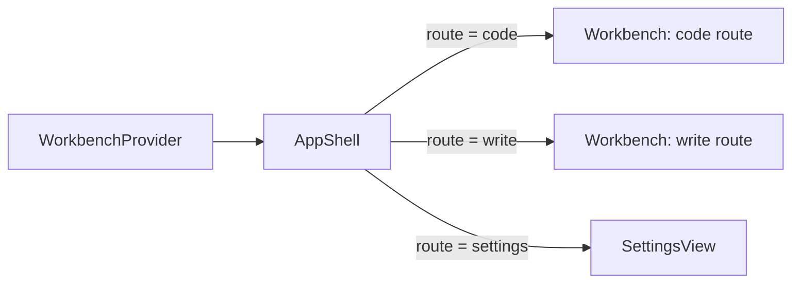
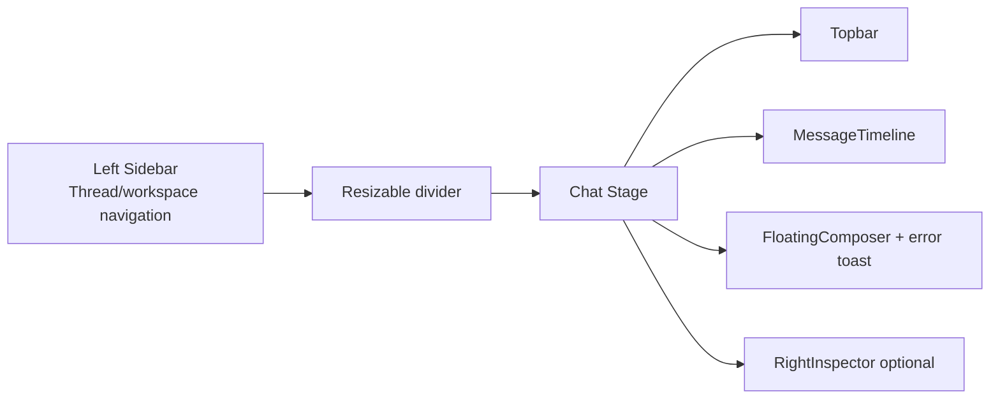
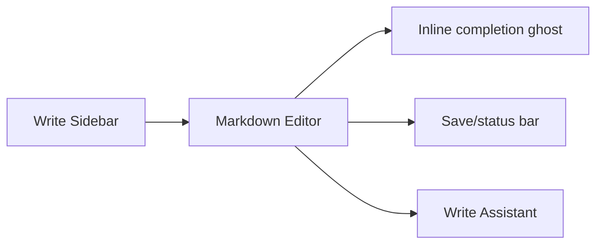
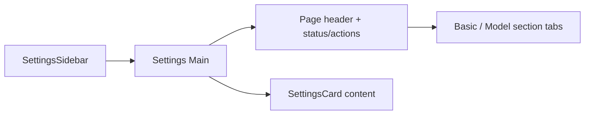
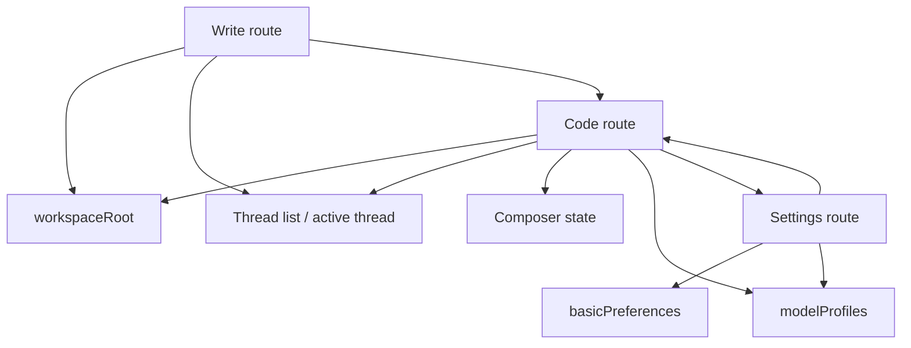

# UI Layout And Attributes Reference

This document describes the current pages, layout regions, state ownership,
interaction behavior, and visual attributes for the desktop workbench UI.

Primary implementation files:

- `src/renderer/src/ui/AppShell.tsx`
- `src/renderer/src/ui/Workbench.tsx`
- `src/renderer/src/ui/SettingsView.tsx`
- `src/renderer/src/ui/store/WorkbenchContext.tsx`
- `src/renderer/src/ui/components/**`
- `src/renderer/src/ui/preferences.ts`
- `src/renderer/src/ui/styles/tokens.css`
- `src/renderer/src/ui/styles/shell.css`

## Global UI Shell



Global root:

- Class: `ds-workbench-shell`.
- Route source: `WorkbenchContext.state.route`.
- Routes: `code`, `write`, `settings`.
- Lazy loaded route components: `Workbench`, `SettingsView`.
- Empty loading fallback: full-size surface with `var(--ds-bg-main)`.

Global visual system:

- Design tokens live in `tokens.css` and use `--ds-*`.
- Structural and component styles live in `shell.css`.
- Theme is controlled by `<html data-theme>` and `agent.theme` local storage
  logic in `src/renderer/src/i18n/index.ts`.
- Basic UI preferences live under `agent-pyramid.basicPreferences`.
- Last workspace lives under `agent-pyramid.lastWorkspaceRoot`.

## Shared State And Preferences

State owner: `WorkbenchContext`.

Important UI state:

| State | Purpose |
| --- | --- |
| `route` | Selects code, write, or settings page. |
| `workspaceRoot` | Current workspace path for code/write flows. |
| `threads` | Sidebar thread summaries. |
| `activeThread`, `activeThreadId` | Selected code thread. |
| `items` | Timeline items for selected thread. |
| `inFlightTurnsByThreadId` | Tracks running turns per thread, enabling background sessions without blocking the active composer. |
| `rightPanelMode` | Inspector panel mode or closed state. |
| `composer` | Draft text, model, reasoning effort, mode, goal mode, attachments. |
| `writeWorkspace` | Write route authority for workspace, active file, content, dirty/save/error state, selection, preview mode, assistant draft, recent edits, and inline completion state. |
| `errorMessage` | Visible workbench error toast. |
| `leftSidebarWidth`, `rightSidebarWidth` | Resizable panel dimensions. |
| `basicPreferences` | Theme/startup/session/sidebar/inspector defaults. |

Dimension constants from `preferences.ts`:

| Constant | Value | Usage |
| --- | ---: | --- |
| `LEFT_SIDEBAR_MIN_WIDTH` | 180 | Code/write left panel clamp. |
| `LEFT_SIDEBAR_DEFAULT_WIDTH` | 268 | Default left panel width. |
| `LEFT_SIDEBAR_MAX_WIDTH` | 420 | Code/write left panel clamp. |
| `RIGHT_INSPECTOR_MIN_WIDTH` | 280 | Inspector clamp. |
| `RIGHT_INSPECTOR_DEFAULT_WIDTH` | 360 | Default inspector width. |
| `RIGHT_INSPECTOR_MAX_WIDTH` | 760 | Inspector clamp. |

## Code Page

Implementation entry: `Workbench` when `state.route === "code"`.

### Layout



Top-level regions:

- Left sidebar container:
  - Class: `ds-sidebar`.
  - Width: `state.leftSidebarWidth`.
  - Clamp: `180..420`.
  - Resizable by pointer drag and keyboard separator.
- Divider:
  - Class: `ds-workbench-divider`.
  - Role: `separator`.
  - Keyboard: arrows adjust by `SIDEBAR_KEYBOARD_STEP = 16`.
- Main stage:
  - Class: `ds-stage-surface`.
  - Code route child: `ds-chat-stage`.
- Chat column:
  - Class: `ds-chat-column-inset`.
  - Composer max width: `min(100%, 720px)`.
- Right inspector:
  - Class: `ds-right-inspector`.
  - Width: `state.rightSidebarWidth`.
  - Visible only when `rightPanelMode !== null`.

### Sidebar

Component: `Sidebar`.

Purpose:

- Create new chat.
- Pick/change workspace.
- Display active workspace.
- Toggle archived thread visibility.
- Group threads by `workspace`.
- Select, archive, restore, and delete threads.
- Open Settings route.
- Switch quickly between Code and Write workbenches.

Key classes:

- `ds-sidebar-header`
- `ds-sidebar-workspace`
- `ds-sidebar-archive-toggle`
- `ds-sidebar-list`
- `ds-sidebar-project-group`
- `ds-sidebar-project-title`
- `ds-sidebar-row`
- `ds-sidebar-row-main`
- `ds-sidebar-row-actions`
- `ds-sidebar-delete-confirm`
- `ds-sidebar-footer`
- `ds-sidebar-workbench-switch`
- `ds-sidebar-workbench-button`

Thread row attributes:

- Active row: `is-active`.
- Archived row: `is-archived`.
- Pending delete confirmation: `is-confirming-delete`.
- Main button uses `aria-current="page"` when active.
- Delete behavior depends on `basicPreferences.confirmThreadDelete`.
- Footer workbench switch uses the existing `WorkbenchContext.actions.setRoute`
  path for `code` / `write`; Settings remains a separate button.

### Topbar

Component: `WorkbenchTopBar`.

Purpose:

- Show active/no session status.
- Show short thread id.
- Show workspace path.
- Show running indicator.
- Open inspector modes: changes, todo, plan.
- Toggle inspector open/closed.

Key classes:

- `ds-topbar-surface`
- `ds-topbar-session`
- `ds-topbar-title`
- `ds-topbar-meta`
- `ds-topbar-workspace`
- `ds-topbar-actions`
- `ds-topbar-running`
- `ds-segmented-control`
- `ds-topbar-inspector-tabs`

Inspector controls:

- Modes: `changes`, `todo`, `plan`.
- Toggle label comes from `getInspectorToggleLabel()`.

### Timeline

Component: `MessageTimeline`.

Purpose:

- Group raw `Item[]` into turns via `groupTimelineTurns()`.
- Render user, work process, assistant, and follow-up items.
- Keep scroll pinned to bottom while user is near the bottom.
- Show `InitialSessionUsageHeatmap` when no items exist.

Key classes:

- `ds-message-timeline`
- `ds-message-timeline-content`
- `ds-message-turn`
- `ds-work-process`
- `ds-work-process-summary`
- `ds-work-process-body`
- `ds-shiny-text`

Scroll behavior:

- Sticky threshold: `96px`.
- Active turn work process opens by default.
- User toggles are stored by turn id and pruned when turns disappear.

### Chat Blocks

Component: `ChatBlock`.

Item rendering:

| Item kind | UI |
| --- | --- |
| `user` | Right-side user bubble with optional attachment names. |
| `assistant` | Markdown assistant bubble. Live output gets shiny styling. |
| `reasoning` | Process entry with reasoning label and markdown body. |
| `tool` | Collapsible process entry with status/tone summary. |
| `approval` | Approval block with args JSON and allow/deny buttons. |
| `user_input` | System-style user input prompt. |
| `plan` | Plan block with ordered steps and per-step status class. |
| `compaction` | System-style compaction notice. |
| `system` | System bubble. |

Key classes:

- `ds-message-block`
- `ds-user-bubble`
- `ds-assistant-bubble`
- `ds-message-attachments`
- `ds-process-entry`
- `ds-process-entry-summary`
- `ds-process-entry-title`
- `ds-process-entry-status`
- `ds-process-entry-detail`
- `ds-process-tool`
- `ds-approval-block`
- `ds-approval-actions`
- `ds-plan-block`
- `ds-system-bubble`

Approval behavior:

- Buttons only render when `item.decision === undefined` and an approve handler
  exists.
- Pending decision disables further response until the handler returns.
- Unresolved approvals for the active thread also appear in a composer-adjacent
  pending approval panel, while the timeline block remains as the durable audit
  record.

### Assistant Markdown

Component: `AssistantMarkdown`.

Renderer:

- Uses `react-markdown` and `remark-gfm`.
- Streaming text temporarily closes a dangling triple-backtick code fence so
  partial model output still renders as a code block while the turn is live.
- Links are normalized before render. `http(s)` links get `target="_blank"` and
  `rel="noreferrer"`; page anchors stay in-renderer; relative/local/unsafe
  protocols render as plain text instead of clickable anchors.
- Code blocks are wrapped in `ds-code-block`.
- Code language header is extracted from `language-*` class.
- Tables are wrapped in `ds-markdown-table-wrap`.
- Images are wrapped in `ds-markdown-image-frame`; only `http(s)` and supported
  image `data:` URLs are rendered.
- Task-list checkboxes use `ds-markdown-task-checkbox` and are disabled.

Key classes:

- `ds-markdown`
- `ds-shiny-markdown`
- `ds-code-block`
- `ds-code-block-header`
- `ds-markdown-table-wrap`
- `ds-markdown-image-frame`
- `ds-markdown-task-checkbox`
- `ds-markdown-divider`

### Floating Composer

Component: `FloatingComposer`.

Purpose:

- Edit and send prompt text.
- Interrupt in-flight turn.
- Add image attachments.
- Paste image attachments directly from the clipboard.
- Preview image attachments as thumbnails with an overlaid remove button.
- Toggle plan mode and goal mode.
- Select model profile and reasoning effort.

Key classes:

- `ds-composer-shell`
- `ds-composer-attachments`
- `ds-composer-attachment`
- `ds-composer-attachment-remove`
- `ds-composer-attachment-fallback`
- `ds-composer-toolbar-left`
- `ds-composer-tool-button`
- `ds-composer-popover`
- `ds-composer-menu-row`
- `ds-composer-model-button`

States:

- `sendPending`: local send guard.
- `runtimeBusy`: derived from the active thread's entry in
  `state.inFlightTurnsByThreadId`.
- `attachments`: thumbnail display records in `state.composer.attachments`;
  generated thumbnail data URLs live on `thumbnailUrl`, with `previewUrl` used
  only as an object-URL fallback when thumbnail generation fails. Authoritative
  ids live in `state.composer.attachmentIds`.
- Attachment removal is disabled while a send is pending or the active thread is
  running, so runtime attachment reads cannot race with composer cleanup.
- `menuOpen`, `pickerOpen`: popovers close on outside pointer down or Escape.
- Clipboard paste filters to PNG/JPEG/WebP/GIF files, creates the same
  renderer attachment records as the picker path, generates a bounded thumbnail
  for the composer preview, and keeps normal text paste behavior when clipboard
  text is present.
- Backspace/Delete removes the newest attachment only when the textarea is empty
  and removal is not disabled.

Send behavior:

- Enter sends, Shift+Enter inserts newline.
- Empty text is blocked unless attachments are present through the composer
  payload builder.
- New thread is created automatically when no active thread exists.
- Goal mode can create/update thread goal before starting a turn.

### Right Inspector

Component: `RightInspector`.

Purpose:

- Show derived change/tool summaries.
- Show pending todos.
- Show latest plan progress.
- Reserve a future file panel mode.

Layout:

- Class: `ds-right-inspector`.
- Width: `state.rightSidebarWidth`.
- Clamp: `280..760`.
- Resizer class: `ds-right-inspector-resizer`.
- Resizer keyboard:
  - ArrowLeft expands.
  - ArrowRight shrinks.
  - Home jumps to min.
  - End jumps to max.

Panels:

| Mode | Component | Content source |
| --- | --- | --- |
| `changes` | `ChangesPanel` | Tool item summaries. |
| `todo` | `TodoPanel` | Pending approvals, failed tools, error system items, incomplete plan steps. |
| `plan` | `PlanPanel` | Latest `PlanItem`, progress meter, steps. |
| `file` | `FilePanel` | Empty placeholder. |

Key classes:

- `ds-right-inspector-header`
- `ds-right-inspector-title`
- `ds-right-inspector-body`
- `ds-inspector-empty`
- `ds-inspector-change-list`
- `ds-inspector-todo-list`
- `ds-inspector-plan`
- `ds-inspector-plan-meter`
- `ds-inspector-plan-steps`

### Error Toast

Location: bottom composer area in code route.

Class: `ds-error-toast`.

Source:

- `state.errorMessage`.

Behavior:

- Uses `role="status"`.
- Dismiss button clears `actions.setError(null)`.
- Runtime and IPC failures should be routed here when visible to the user.

## Write Page

Implementation entry: `Workbench` when `state.route === "write"`.

### Layout



Top-level:

- Shares `ds-stage-surface` from `Workbench`.
- `WriteWorkspaceView` renders its own sidebar inside the stage.
- Sidebar width uses the same `state.leftSidebarWidth`.

### Write Sidebar

Purpose:

- Navigate back to Code route.
- Navigate to Settings.
- Pick/open workspace and select or create a `mode: "write"` thread for that
  workspace before file listing starts; if thread selection fails, the Write
  file list/editor state is not applied to that workspace.
- Show a dedicated writing workspace block with primary open action, compact
  refresh action, and a shortened active workspace path with full path in the
  title.
- Refresh markdown file list without mixing refresh into file lifecycle actions.
- Search markdown files.
- Display file list and list states.
- Keep file lifecycle controls scoped: `New` is the primary file action, while
  rename/delete appear only after a file is selected.

Key classes:

- `ds-write-route-actions`
- `ds-write-sidebar`
- `ds-write-workspace-panel`
- `ds-write-workspace-heading`
- `ds-write-workspace-path`
- `ds-write-workspace-hint`
- `ds-pill`
- `ds-write-file-actions`
- `ds-write-search`
- `ds-write-search-clear`
- `ds-sidebar-list`
- `ds-sidebar-empty`
- `ds-write-file-row`

List states from `getWriteListState()`:

| State | Condition |
| --- | --- |
| `loading` | File list request is in flight. |
| `no-workspace` | No workspace root selected. |
| `ready` | Files array has entries. |
| `empty-search` | No files match non-empty search. |
| `empty` | Workspace selected but no markdown files found. |

File row attributes:

- Active file: `is-active`.
- Title includes path and formatted file meta.
- Meta format: `formatWriteFileMeta()` => size + modified date.
- Directory scans keep the workspace root strict, but skip unreadable or
  disappearing child paths (`EACCES`, `ENOENT`, `ENOTDIR`, `EPERM`) with a
  console warning instead of failing the whole Write workspace. Skipped
  directory names include hidden directories, `DeepSeek`, `__test_logs__`,
  `.pytest_cache`, build outputs, cache/log/temp folders, and dependencies.

### Editor Area

Purpose:

- Edit markdown content.
- Switch between source editing, split source/preview, and rendered preview
  modes without moving document state out of `state.writeWorkspace`.
- Render markdown preview through the same sanitized ReactMarkdown/GFM surface
  used for assistant messages, with Write-local media references resolved only
  to safe image `data:` previews.
- Autosave changed file content.
- Request simple inline markdown completion.
- Accept completion with Tab, dismiss with Escape.
- Keep document commands in the editor toolbar and reserve the footer for
  document state plus cursor/selection telemetry.

Key classes:

- `ds-write-main`
- `ds-write-editor`
- `ds-write-document-bar`
- `ds-write-document-title`
- `ds-write-document-actions`
- `ds-write-view-toggle`
- `ds-write-editor-frame`
- `ds-write-source-pane`
- `ds-write-codemirror`
- `ds-write-preview-pane`
- `ds-write-preview-document`
- `ds-write-ghost`
- `ds-write-status`
- `ds-write-status-message`
- `ds-write-context-meter`

Behavior constants:

- Autosave delay: `800ms`.
- Completion delay: `650ms`.
- Completion requires at least `10` trailing content characters.
- Markdown editing is backed by CodeMirror 6. CodeMirror document and
  selection updates are adapted back into `state.writeWorkspace`, which remains
  the authoritative Write state.
- Preview mode keeps the CodeMirror instance mounted but visually hides the
  source pane, so selection, autosave, local completion, and inline edit state
  are not reset by view switching.
- Opening another file or refreshing/switching workspace first flushes the
  current dirty file through `write.put`; if that save fails, navigation stays
  on the current file and surfaces the error.
- Switching workspace clears the previous workspace file list and active file
  immediately, so a failed list request cannot leave stale file-relative state
  under the new workspace root.
- Open-file responses are request-id guarded, so a slower `write.get` response
  from an earlier click cannot overwrite the later active file.
- `write.get`, `write.put`, and inline completion only accept Markdown file
  paths (`.md`, `.mdx`, `.markdown`), matching the file list.
- `write.get` returns only strict UTF-8 Markdown content; invalid local bytes
  surface as a visible load error instead of replacement-character text.
- Editing content or accepting inline completion only updates
  `state.writeWorkspace`. It does not overwrite global `composer.text`.
- Selection is tracked in `state.writeWorkspace.selection`; local completion
  requests send prefix and suffix around the current cursor instead of assuming
  the cursor is always at the end of the file.
- Accepted completion is inserted at the current cursor or selection end.

Save state:

| Status | Meaning |
| --- | --- |
| `idle` | No active load/save operation. |
| `loading` | Listing or opening content. |
| `saving` | `write.put` in flight. |
| `saved` | Save completed; status clears after 1500ms. |
| `error` | File operation or completion failed. |

Save button disabled when:

- No active file.
- No workspace root.
- Status is `loading` or `saving`.
- Content equals saved content.
- `Check changes`, `Export`, and `Save` live in `ds-write-document-actions`;
  `ds-write-status` does not render command buttons.

### Write Assistant

Purpose:

- Send explicit writing prompts through a `mode: "write"` thread.
- Keep assistant draft and document content separate from the global Code
  composer.
- Inject scoped writing context into the model-facing request while showing only
  the user's prompt in the timeline.

Key classes:

- `ds-write-assistant`
- `ds-write-assistant-resizer`
- `ds-write-assistant-header`
- `ds-write-context-strip`
- `ds-write-assistant-timeline`
- `ds-write-assistant-composer`
- `ds-composer-shell`

Context payload:

- Built by `buildWriteAssistantSendPayload()`.
- Uses `displayText` for the visible user prompt.
- Injects a structured `write:assistant-context` block into `TurnStartRequest.text`.
- Includes workspace, active file, dirty flag, preview mode, selection, selected
  text, cursor-near snippets, and recent edit summaries.
- Does not grant Code tools; Write threads still use runtime tool access policy
  to hide and reject Code-only tools.
- The prompt input reuses the shared `ComposerInputSurface` shell used by the
  Code composer, including rounded composer chrome, textarea behavior,
  Enter-to-send, send pending state, send button, and interrupt behavior. Write
  binds it to `state.writeWorkspace.assistantDraft`.
- Write reuses the Code composer model picker for quick model / reasoning
  effort selection, but supplies only Write-specific tool actions after that:
  memory evidence and action parsing. It does not expose Code-only attachment,
  plan, or goal controls.
- The assistant panel width uses `state.rightSidebarWidth` and the same clamp
  range as the right inspector (`280..760`). Its boundary is draggable and
  keyboard accessible via the `ds-write-assistant-resizer` separator.
- The assistant header exposes a Write action parse command. It sends the latest
  assistant message to `write.action`; valid `write:inline-edit` actions create
  `state.writeWorkspace.pendingInlineEdit` instead of mutating the document.
- The assistant header owns assistant panel controls such as hide and stop; the
  editor footer only shows a restore button when the assistant is hidden.
- Pending inline edits render an inline diff review below the editor kernel.
  Apply re-checks that the original scoped text still matches the current
  document before replacing it; cancel clears the pending edit.
- The context strip includes a writing memory evidence toggle. The expanded
  panel shows the latest local retrieval query, hit count, source files, scores,
  and snippets from `write.memory`. Assistant sends refresh this evidence before
  building `write:assistant-context`.
- The left rail renders `write.tree` nodes, with file lifecycle controls for
  create, rename, and delete. The editor document toolbar exposes export and
  external change checks. The lifecycle panel shows read-only large-file state, media
  reference summaries, local image previews, export previews/downloads, and
  watch-change warnings.

## Settings Page

Implementation entry: `SettingsView` when `state.route === "settings"`.

### Layout



Top-level:

- Root class: `ds-settings-root`.
- Sidebar component: `SettingsSidebar`.
- Main form class: `ds-settings-main`.
- Content wrapper: `ds-settings-content`.
- Header class: `ds-settings-page-header`.

### Settings Navigation

Sections:

- `basic`
- `model`

Section tabs:

- Class: `ds-settings-section-tabs`.
- Buttons: `ds-settings-section-tab`.
- Active button gets `is-active` and `aria-pressed`.

Basic categories:

- `appearance`
- `startup`
- `session`

Model categories:

- `profiles`
- `connection`
- `context`
- `reasoning`

Navigation guard:

- `ensureNoUnsavedProfileChanges()` blocks section/profile navigation while
  model profile state is dirty.

### Basic Settings

Appearance:

- Locale selector.
- Theme segmented control: light/dark.
- Follow system theme toggle.

Startup:

- Default startup view: `code | write`.
- Remember left sidebar width.
- Remember right sidebar width.
- Default inspector mode: none, changes, todo, plan.

Session:

- Show archived threads by default.
- Restore last workspace on startup.
- Confirm thread delete.

State sink:

- Basic settings update `basicPreferences` in `WorkbenchContext`.
- Persisted with `saveBasicPreferences()`.
- Locale and theme go through `i18n`, `persistLocale()`, `setTheme()`, and
  `setFollowSystemTheme()`.

### Model Settings

Profiles:

- Profiles load through `modelConfig.listProfiles()` when Settings mounts.
- Profile loading is not tied to locale/theme preference changes; changing
  basic settings must not refresh the active model form or overwrite unsaved
  profile edits.
- Add MiniMax profile.
- Add DeepSeek profile.
- Add custom profile.
- Activate, duplicate, delete profiles.
- Two-step delete confirmation through `pendingDeleteProfileId`.

Connection:

- Profile name.
- Provider name.
- Model id.
- Base URL.
- API key via `SecretInput`.

Context:

- Model context window.
- Auto compact token limit.
- Max output tokens.

Reasoning:

- Thinking toggle.
- Reasoning effort select.
- Agent autonomy select.

Save state:

| State | UI meaning |
| --- | --- |
| `loading` | Initial profile load. |
| `idle` | Loaded and clean. |
| `dirty` | Unsaved model profile edits. |
| `saving` | Profile operation in flight. |
| `saved` | Last profile operation succeeded. |
| `error` | Handler returned error or local validation failed. |

Navigation guard treats `dirty` as unsaved, and also treats `error` as unsaved when the current form still differs from the active profile after a failed save.

Primary save button:

- Only visible for model section.
- Disabled when no preload API, loading, saving, idle, or saved.
- Submit calls `modelConfig.updateProfile`.

### Settings Primitives

Components:

- `SettingsSidebar`
- `SettingsCard`
- `SettingRow`
- `StatusBadge`
- `Toggle`
- `SecretInput`

Common classes:

- `ds-settings-sidebar`
- `ds-settings-card`
- `ds-setting-row`
- `ds-status-badge`
- `ds-toggle`
- `ds-secret-input`

## UI Token Reference

Token source: `src/renderer/src/ui/styles/tokens.css`.

Common token groups:

- Backgrounds: `--ds-bg-main`, `--ds-bg-sidebar`, `--ds-bg-surface`,
  `--ds-bg-elevated`.
- Text: `--ds-text-primary`, `--ds-text-secondary`, `--ds-text-faint`,
  `--ds-text-placeholder`.
- Borders: `--ds-border-muted`, `--ds-border-strong`.
- Status: `--ds-danger`, `--ds-danger-soft`, success/warning tokens when
  available in CSS.
- Radius: `--ds-radius-sm`, `--ds-radius-md`, `--ds-radius-lg`.
- Type: `--ds-size-caption` and neighboring size tokens.

Styling rules:

- Prefer `--ds-*` variables over raw hex in component styles.
- Keep cards for repeated/framed content; route sections stay structural.
- Resizable fixed-format UI uses clamped dimensions from `preferences.ts`.
- Renderer must not access filesystem directly; UI file operations go through
  `window.agentApi.write` and `window.agentApi.workspace`.

## Route Interaction Summary



Cross-route coupling:

- Code and Write share `workspaceRoot` and left sidebar width.
- Code and Write share the thread list state, but route actions prefer threads
  whose `ThreadRecord.mode` matches the active route.
- Write document text and assistant draft live in `state.writeWorkspace`, not
  global composer draft state. Assistant prompts must come from explicit Write
  assistant input, not implicit full-document mirroring.
- Settings model profile changes update `modelConfig`, `modelProfiles`, and
  composer model selection.
- Basic settings can change startup route, inspector default, sidebar width
  persistence, archived-thread visibility, and delete confirmation behavior.

## Documentation Maintenance Checklist

Update this document when changing:

- Route names or route ownership.
- `WorkbenchState`, `ComposerState`, or basic preference fields.
- Sidebar or inspector width constants.
- Page-level layout classes.
- Settings categories/sections.
- New renderer-visible IPC groups or page workflows.
- CSS token names used by core layout.

For documentation-only edits, verify:

```bash
rg "WorkbenchContext|SettingsView|WriteWorkspaceView|RightInspector" docs/ui-layout-reference.md
git diff --check
```
